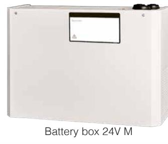
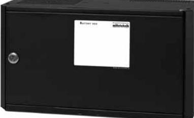
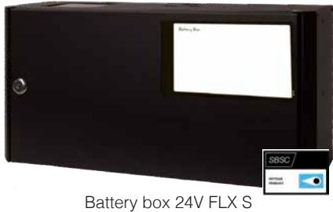
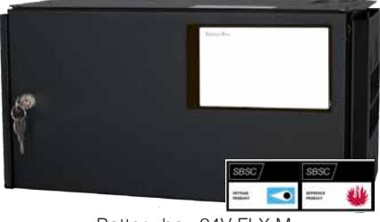

## **Batteriboxar**

Battery box 24V XM

Battery box 24V FLX M

| Produktinformation:                           |                                                                                                                                                                                                                                                                                                                                                                                 |                              |                                                                                                                                                             |                            |
|-----------------------------------------------|---------------------------------------------------------------------------------------------------------------------------------------------------------------------------------------------------------------------------------------------------------------------------------------------------------------------------------------------------------------------------------|------------------------------|-------------------------------------------------------------------------------------------------------------------------------------------------------------|----------------------------|
| Battery box 24V M                             | Batteribox med plats för; 4x 7,2Ah eller 4x 14Ah batterier. Levererar med färdigt kablage och säkringshållare emellan batterier. Kapslingen är avsedd för väggmontage.                                                                                                                                                                                                       |                              |                                                                                                                                                             |                            |
| Battery box 24V XM                            | Batteribox med plats för; 4x 7,2Ah, 4x 14Ah batterier eller 4x 20Ah batterier. Levererar med färdigt kablage och säkringshållare emellan batterier. Kapslingen är avsedd för väggmontage alternativt 19" rackmontage (vinklar medföljer).                                                                                                                                    |                              |                                                                                                                                                             |                            |
| Battery box 24V FLX S                         | Batteribox med plats för; 4x 7,2Ah eller 4x 14Ah batterier. Levererar med färdigt kablage och säkringshållare emellan batterier. Kapslingen är avsedd för väggmontage alternativt 19" rackmontage (vändbara vinklar medföljer). Sabotagekontakt som standard.                                                                                                                |                              |                                                                                                                                                             |                            |
| Battery box 24V FLX M                         | Batteribox med plats för; 2x 45Ah batterier. Levererar med färdig kabel med 9-polig kontakt för anslutning emot FLX M eller FLX L. Kapslingen är avsedd för väggmontage alternativt 19" rackmontage (vändbara vinklar medföljer). Sabotagekontakt som standard. Batteriboxen skjuts i underkant till Batteribackup FLX M & FLX L och ansluts emot färdig 9-polig kontakt. |                              |                                                                                                                                                             |                            |
| Rekommenderad miljö och kapslingsinformation: | Battery box 24V M                                                                                                                                                                                                                                                                                                                                                               | Battery box 24V XM           | Battery box 24V FLX S                                                                                                                                       | Battery box 24V FLX M      |
| Rekommenderad miljö:                          | Miljöklass 1, Inomhus, 20% ~ 90% relativ fuktighet                                                                                                                                                                                                                                                                                                                              |                              |                                                                                                                                                             |                            |
| Omgivningstemperatur:                         | +5 °C - 40 °C (För optimal batterilivslängd +15 °C - +25 °C)                                                                                                                                                                                                                                                                                                                    |                              |                                                                                                                                                             |                            |
| Skyddsklass:                                  | IP20                                                                                                                                                                                                                                                                                                                                                                            | IP20                         | IP32                                                                                                                                                        |                            |
| Rekommenderad montering:                      | Vägg                                                                                                                                                                                                                                                                                                                                                                            |                              | Vägg alt. Rack (vändbara vinklar medföljer).                                                                                                                |                            |
| Dimension (HxBxD):                            | 242x350x150mm                                                                                                                                                                                                                                                                                                                                                                   | 215x430x200mm (5HE)          | 222x437x145mm (5HE)                                                                                                                                         | 224x437x212mm (5HE)        |
| Nettovikt:                                    | 2kg                                                                                                                                                                                                                                                                                                                                                                             | 4 kg                         | 4kg                                                                                                                                                         | 5kg                        |
| Antal kabelgenomföringar:                     | 3 st                                                                                                                                                                                                                                                                                                                                                                            |                              | 3 st + möjlighet till 1x utslagshål i ryggen                                                                                                                |                            |
| Kapslingens färg:                             | Vit                                                                                                                                                                                                                                                                                                                                                                             |                              | Svart                                                                                                                                                       |                            |
| Elektrisk information:                        |                                                                                                                                                                                                                                                                                                                                                                                 |                              |                                                                                                                                                             |                            |
| Inspänning /Utspänning:                       | 27,3VDC / 27,3VDC                                                                                                                                                                                                                                                                                                                                                               |                              |                                                                                                                                                             |                            |
| Artikel information:                          |                                                                                                                                                                                                                                                                                                                                                                                 |                              |                                                                                                                                                             |                            |
| Artikelnamn:                                  | Battery box 24V M                                                                                                                                                                                                                                                                                                                                                               | Battery box 24V XM           | Battery box 24V FLX S                                                                                                                                       | Battery box 24V FLX M      |
| Artikelnummer:                                | ME010000024BB01                                                                                                                                                                                                                                                                                                                                                                 | XM010000024BBXM01            | FS010000024BB01                                                                                                                                             | FM010000024BB01            |
| E-nummer:                                     | 5213575                                                                                                                                                                                                                                                                                                                                                                         | 5213511                      | 5213574                                                                                                                                                     | 5213573                    |
| Produkten möter kraven enligt:                | EMC Direktiv 2014/30EU, Lågspännings direktivet: 2014/35/EU CE direktivet enligt:765/2008, Emission:EN61000-6-:2001, EN55022:1998:-A1:2000, A2:2003 Klass B, EN61000-3-2:2001. Immunity: EN61000-6-2:2005, EN61000-4-2, -3, 4, -5, -6, -11.                                                                                                                                  |                              |                                                                                                                                                             |                            |
| Produkten är certifierad enligt:              | -                                                                                                                                                                                                                                                                                                                                                                               | -                            | EN 54-4:1997, EN 54-4:1997/AC:1999, EN 54-4:1997/A1:2002 and EN 54-4:1997/A2:2006, SBF 110:8. SS-EN 50 130-4:2011 Edi tion 2 & SSF1014 Larmklass 1-4. |                            |
| Certifikatsnummer (SBSC):                     | -                                                                                                                                                                                                                                                                                                                                                                               | -                            | 18-243 / 20-117                                                                                                                                             |                            |
| Garantiperiod:                                | 2 år                                                                                                                                                                                                                                                                                                                                                                            |                              | 5 år                                                                                                                                                        |                            |
| Designad och producerad av:                   | Milleteknik AB                                                                                                                                                                                                                                                                                                                                                                  |                              |                                                                                                                                                             |                            |
| Ursprungsland:                                | Sverige                                                                                                                                                                                                                                                                                                                                                                         |                              |                                                                                                                                                             |                            |
| Information och val av batteri / batterier:   |                                                                                                                                                                                                                                                                                                                                                                                 |                              |                                                                                                                                                             |                            |
| Rekommenderad batterityp:                     | 12V Underhållsfria batterier, typ AGM                                                                                                                                                                                                                                                                                                                                           |                              |                                                                                                                                                             |                            |
| Möjliga batterier för montering i kapsling:   | 4x 7,2Ah / 4x 14Ah                                                                                                                                                                                                                                                                                                                                                              | 4x 7,2Ah / 4x 14Ah / 4x 20Ah | 4x 7,2Ah / 4x 14Ah                                                                                                                                          | 2x 45Ah                    |
| System certifierad tillsammans med:           | -                                                                                                                                                                                                                                                                                                                                                                               | -                            | UPLUS 10+ Design Life 14Ah                                                                                                                                  | UPLUS 10+ Design Life 45Ah |
| Artikelnummer rekommenderat batteri:          | MT113-12V14-01                                                                                                                                                                                                                                                                                                                                                                  | MT113-12V20-01               | MT113-12V14-01                                                                                                                                              | MT113-12V45-01             |
| Avsedd för montering tillsammans med:         |                                                                                                                                                                                                                                                                                                                                                                                 |                              |                                                                                                                                                             |                            |
| ECO Serien                                    | Medium                                                                                                                                                                                                                                                                                                                                                                          | XM                           | -                                                                                                                                                           | -                          |
| NEO Serien                                    | -                                                                                                                                                                                                                                                                                                                                                                               | -                            | FLX S                                                                                                                                                       | FLX M & FLX L              |
| NOVA Serien                                   | -                                                                                                                                                                                                                                                                                                                                                                               | -                            | FLX S                                                                                                                                                       | FLX M & FLX L              |

