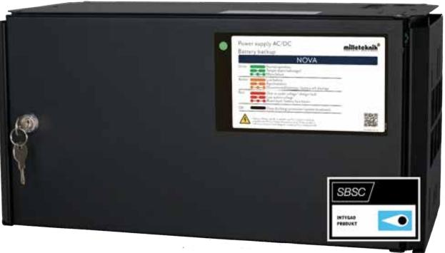

## **Batteribackup NOVA FLX M**

**SSF1014-certifierad batteribackup 24V, upp till 25A med plats för 2x 20Ah-batterier. Vägg eller 19 "rackmonteras. Möjligt att komplettera upp till 4x batteriboxar för upp till 180Ah batterikapacitet.**

**NOVA-serien** används främst i säkerhetssystem där en SSF 1014* godkänd batteribackup krävs eller där kraven är högre när det gäller; högre flexibilitet, fler larmfunktioner, längre drifttider eller när batteribackupen behöver hantera högre belastningar.

**NOVA-serien** är systemcertifierad enligt SSF1014 tillsammans med flera säkerhetssystem på den nordiska marknaden. Milleteknik har försäljningsrättigheter emot två olika system; **Sentrion & Integra**. NOVA-serien erbjuder kommunikation via RS485 mot Sentrion S4, S4 DUO & CISS. Via RS232-kommunikation (tillval: Moveo communication kit) erbjuder NOVA-serien kommunikation med Integra MOVEO & MOVEO XL.

**NOVA-serien** erbjuder *"INTELLIGENT CHARGING"*, vilket innebär att när batterierna är fulladdade kommer de att kopplas bort elektroniskt för standby-läge i upp till 20 dagar eller när batterierna har nått 26,7V (24V). Genom att ladda ur batterierna och ladda dem kontinuerligt (istället för att de aldrig används) förlänger systemet batteriets livslängd med upp till 50%. Batterierna ansluts automatiskt på mindre än 50 mikrosekunder vid behov. NOVA-serien ska användas med AGM-batterier.

**NOVA-serien** läser också den anslutna systembelastningen och laddar batterierna med tillgänglig restström från strömförsörjningen, dock laddas batterierna aldrig med mer än högst 6A (gäller FLX M) i laddningsström. Detta förhindrar att batterierna överladdas och förlänger deras livslängd avsevärt. NOVA-serien är också utrustad med interna effektmotstånd (anpassade för systemtestade batterier) för *"QUALIFIED BATTERY CAPACITY TESTING"*, som meddelar när batterierna måste bytas ut innan batterierna åldras.

NOVA-serien är systemcertifierad tillsammans med / och måste användas tillsammans med 10+ Design Life AGM-batterier enligt SSF1014.

**NOVA FLX M-serien** kan monteras på en vägg eller i ett 19 "rack (vändbara vinklar ingår). Systemet kan kompletteras med upp till 4 st batteriboxar vid behov. Batteriboxen ska placeras under batteribackupen och ansluts via en kabel som medföljer batteriboxen. Batteriboxen har plats för 2x 45Ah-batterier per varje batteribox.

*Observera att batteribackupen skall vara systemcertifierad med det överordnade systemet för att SSF1014 certifikatet skall vara giltigt. Kontakta gärna oss för information om vilka system som NOVA Serien är systemcertifierade tillsammans med (utöver Sentrion & Integra) och hur de säljs och marknadsförs eller om Ni är intresserade av kommunikation med NOVA Serien; sales@milleteknik.se

## Förväntad drifttid vid potentiellt strömavbrott (nya batterier): Vid nedan last:

| Systemspänning |    | Batterier    |                             | 2A  | 4A   | 8A   | 10A | 14A   | 18A   |
|----------------|----|--------------|-----------------------------|-----|------|------|-----|-------|-------|
| 24V            | 2x | 20Ah         |                             | 9h  | 3,5h | 1,5h | 1h  | 30min | 20min |
| 24V            | 2x | 45Ah         | (inkl. 1x FLX M batteribox) | 21h | 12h  | 4h   | 3h  | 2h    | 1,5h  |
| 24V            | 4x | 45Ah (90Ah)  | (inkl. 2x FLX M batteribox) | 42h | 20h  | 12h  | 8h  | 5h    | 3,5h  |
| 24V            | 6x | 45Ah (135Ah) | (inkl. 3x FLX M batteribox) | 64h | 30h  | 15h  | 12h | 9h    | 6h    |
| 24V            | 8x | 45Ah (180Ah) | (inkl. 4x FLX M batteribox) | 82h | 42h  | 20h  | 16h | 12h   | 10h   |

**Milleteknik AB** Ögärdesvägen 8B 433 30 Partille Sweden

## **Teknisk data**

**NOVA 24V 5A FLX M NOVA 24V 10A FLX M NOVA 24V 15A FLX M NOVA 24V 25A FLX M**

| Rekommenderad miljö och kapslingsinformation:          |                                                                                                                                                                                                                                                                                                                          |                                                                                                 |                         |                         |  |  |  |  |
|--------------------------------------------------------|--------------------------------------------------------------------------------------------------------------------------------------------------------------------------------------------------------------------------------------------------------------------------------------------------------------------------|-------------------------------------------------------------------------------------------------|-------------------------|-------------------------|--|--|--|--|
| Rekommenderad miljö:                                   | Miljöklass 1, Inomhus, 20% ~ 90% relativ fuktighet                                                                                                                                                                                                                                                                       |                                                                                                 |                         |                         |  |  |  |  |
| Omgivningstemperatur:                                  | +5 °C - 40 °C (För optimal batterilivslängd +15 °C - +25 °C)                                                                                                                                                                                                                                                             |                                                                                                 |                         |                         |  |  |  |  |
| Skyddsklass:                                           | IP32                                                                                                                                                                                                                                                                                                                     |                                                                                                 |                         |                         |  |  |  |  |
| Rekommenderad montering:                               | Vägg alt. Rack (vändbara vinklar medföljer). Vid väggmontage erhålls 20 mm distans emot väggen.                                                                                                                                                                                                                          |                                                                                                 |                         |                         |  |  |  |  |
| Dimension (HxBxD):                                     |                                                                                                                                                                                                                                                                                                                          | 224x437x212mm (5HE)                                                                             |                         |                         |  |  |  |  |
| Nettovikt:                                             | 8kg                                                                                                                                                                                                                                                                                                                      | 8,5kg                                                                                           | 9,5kg                   | 10,5kg                  |  |  |  |  |
| Antal kabelgenomföringar:                              | 3 st + möjlighet till 1x utslagshål i ryggen                                                                                                                                                                                                                                                                             |                                                                                                 |                         |                         |  |  |  |  |
| Kapslingens färg:                                      | Svart                                                                                                                                                                                                                                                                                                                    |                                                                                                 |                         |                         |  |  |  |  |
| Inbyggd fläkt för kylning:                             |                                                                                                                                                                                                                                                                                                                          | Ja                                                                                              |                         |                         |  |  |  |  |
| Elektrisk information:                                 |                                                                                                                                                                                                                                                                                                                          |                                                                                                 |                         |                         |  |  |  |  |
| Inspänning:                                            | 110V-264VAC/47-63Hz                                                                                                                                                                                                                                                                                                      |                                                                                                 |                         |                         |  |  |  |  |
| Utspänning:                                            | 27,3VDC                                                                                                                                                                                                                                                                                                                  |                                                                                                 |                         |                         |  |  |  |  |
| Max ström:                                             | 5A 10A 15A 25A                                                                                                                                                                                                                                                                                                  |                                                                                                 |                         |                         |  |  |  |  |
| Ladd ström:                                            | Beroende av strömuttag, dock max 6A                                                                                                                                                                                                                                                                                      |                                                                                                 |                         |                         |  |  |  |  |
| Nominell effekt:                                       | 150W                                                                                                                                                                                                                                                                                                                     | 240W                                                                                            | 336W                    | 648W                    |  |  |  |  |
| Rippel i normalläge:                                   | 200mVp-p                                                                                                                                                                                                                                                                                                                 | 200mVp-p                                                                                        | 150mVp-p                | 150mVp-p                |  |  |  |  |
| Effektivitet:                                          | 89%                                                                                                                                                                                                                                                                                                                      | 89%                                                                                             | 87%                     | 88%                     |  |  |  |  |
| Värmegenerering vid 50% / 80% av märkeffekten:         | 8,4W / 13,5W                                                                                                                                                                                                                                                                                                             | 17W / 27W                                                                                       | 31W / 49W               | 50W / 80W               |  |  |  |  |
| Ingångsström:                                          | 1,7A                                                                                                                                                                                                                                                                                                                     | 2A                                                                                              | 1,8A                    | 3,6A                    |  |  |  |  |
| Antal avsäkrade utgångar:                              | 2 st                                                                                                                                                                                                                                                                                                                     | 2 st                                                                                            | 2 st                    | 2 st                    |  |  |  |  |
| Typ av säkring på utgång:                              | 2xF5A (glas)                                                                                                                                                                                                                                                                                                             | 2xF10A (glas)                                                                                   | 2x 15A flatstiftsäkring | 2x 25A flatstiftsäkring |  |  |  |  |
| Djupurladdning av batterier sker vid:                  |                                                                                                                                                                                                                                                                                                                          | 21V                                                                                             |                         |                         |  |  |  |  |
| Möjlig att parallellkoppla:                            | Ja                                                                                                                                                                                                                                                                                                                       |                                                                                                 |                         |                         |  |  |  |  |
| Skydd mot:                                             | Överlast, Överspänning, Övertemperatur, Kortslutning & Djupurladdning av batterier                                                                                                                                                                                                                                       |                                                                                                 |                         |                         |  |  |  |  |
| Larmfunktioner:                                        | Fördröjt nätavbrottslarm (10 sek), låg batterispänning, över/underspänning, åldrade batterier, frånkopplade batterier (10 sek), säkringsfel, laddarfel, låg systemspänning, sabotage.                                                                                                                                 |                                                                                                 |                         |                         |  |  |  |  |
| Antal larmutgångar:                                    | 3 st                                                                                                                                                                                                                                                                                                                     | 3 st                                                                                            | 4 st                    | 4 st                    |  |  |  |  |
| Larm via:                                              |                                                                                                                                                                                                                                                                                                                          | Växlande relä alt. RS485 (OSDP alt. eget protokoll). Via tillval möjlighet till RS232 & TCP/IP. |                         |                         |  |  |  |  |
| Kommunicerar överordnat & systemcertifierad med:       |                                                                                                                                                                                                                                                                                                                          | Sentrion S4, S4-DUO & CISS. Via tillvalskort (RS232 Larmkort); Integra MOVEO & MOVEO-XL.        |                         |                         |  |  |  |  |
| Artikel information:                                   |                                                                                                                                                                                                                                                                                                                          |                                                                                                 |                         |                         |  |  |  |  |
| Artikelnamn:                                           | NOVA 24V 5A FLX M                                                                                                                                                                                                                                                                                                        | NOVA 24V 10A FLX M                                                                              | NOVA 24V 15A FLX M      | NOVA 24V 25A FLX M      |  |  |  |  |
| Artikelnummer:                                         | FM01P30024P050-SSF                                                                                                                                                                                                                                                                                                       | FM01P30024P100-SSF                                                                              | FM01P23024P150-SSF      | FM01P23024P250-SSF      |  |  |  |  |
| E-nummer:                                              | 5213565                                                                                                                                                                                                                                                                                                                  | 5213566                                                                                         | 5213639                 | 5213640                 |  |  |  |  |
| Artikelnummervariant (levereras exkl. reläkort):       | FM01P30024P050-DS1                                                                                                                                                                                                                                                                                                       | FM01P30024P100-DS1                                                                              | FM01P23024P150-DS1      | FM01P23024P250-DS1      |  |  |  |  |
| Produkten möter kraven och är certfierad enligt:       | EMC Direktiv 2014/30EU, Lågspännings direktivet: 2014/35/EU CE direktivet enligt:765/2008, Emission:EN61000-6-:2001, EN55022:1998:-A1:2000, A2:2003 Klass B, EN61000-3-2:2001. Immunity: EN61000-6-2:2005, EN61000-4-2, -3, 4, -5, -6, -11. SS-EN 50 130-4:2011 Edition 2 & SSF1014* Larmklass 1-4 (Inbrottslarm). |                                                                                                 |                         |                         |  |  |  |  |
| Certifikatsnummer (SBSC):                              | 20-117                                                                                                                                                                                                                                                                                                                   |                                                                                                 |                         |                         |  |  |  |  |
| Garantiperiod:                                         |                                                                                                                                                                                                                                                                                                                          | 5 år                                                                                            |                         |                         |  |  |  |  |
| Regler för garanti:                                    | 1. Omgivningstemperatur skall ej överstiga 32°. 2. Medellast får ej överstiga 80% av nätaggregatets märkkapacitet. 3. Batteribackupen skall användas tillsammans med UPLUS 10+ Design Life batterier. 4. Fläkten skall regöras årligen och bytas om nödvändigt.                                                 |                                                                                                 |                         |                         |  |  |  |  |
| Designad och producerad av:                            | Milleteknik AB                                                                                                                                                                                                                                                                                                           |                                                                                                 |                         |                         |  |  |  |  |
| Ursprungsland:                                         |                                                                                                                                                                                                                                                                                                                          | Sverige                                                                                         |                         |                         |  |  |  |  |
| Information och val av batteri / batterier:            |                                                                                                                                                                                                                                                                                                                          |                                                                                                 |                         |                         |  |  |  |  |
| Rekommenderad batterityp:                              |                                                                                                                                                                                                                                                                                                                          | 12V Underhållsfria batterier, typ AGM                                                           |                         |                         |  |  |  |  |
| Möjliga batterier för montering i kapsling:            | 2x 20Ah (2x 45Ah i respektive batteribox)                                                                                                                                                                                                                                                                                |                                                                                                 |                         |                         |  |  |  |  |
| System certifierad tillsammans med:                    | UPLUS 10+ Design Life 20Ah batteri (UPLUS 10+ Design Life 45Ah batteri i respektive batteribox)                                                                                                                                                                                                                          |                                                                                                 |                         |                         |  |  |  |  |
| Artikelnummer rekommenderat 20Ah batteri:              | MT113-12V20-01                                                                                                                                                                                                                                                                                                           |                                                                                                 |                         |                         |  |  |  |  |
| Artikelnummer rekommenderat 45Ah batteri:              | MT113-12V45-01                                                                                                                                                                                                                                                                                                           |                                                                                                 |                         |                         |  |  |  |  |
| Tillåten medellast enligt SSF1014 Larmklass 1-4:       |                                                                                                                                                                                                                                                                                                                          |                                                                                                 |                         |                         |  |  |  |  |
| Artikelnamn:                                           | NOVA 24V 5A FLX M                                                                                                                                                                                                                                                                                                        | NOVA 24V 10A FLX M                                                                              | NOVA 24V 15A FLX M      | NOVA 24V 25A FLX M      |  |  |  |  |
| exkl. Batteribox FLX M, enligt Larmklass 1-2 / 3-4:    | 1,6A / 0,55A                                                                                                                                                                                                                                                                                                             | 1,6A / 0,55A                                                                                    | 1,6A / 0,55A            | 1,6A / 0,55A            |  |  |  |  |
| inkl. 1x Batteribox FLX M, enligt Larmklass 1-2 / 3-4: | 3,7A / 1,5A                                                                                                                                                                                                                                                                                                              | 3,7A / 1,5A                                                                                     | 3,6A / 1,4A             | 3,6A / 1,4A             |  |  |  |  |
| inkl. 2x Batteribox FLX M, enligt Larmklass 1-2 / 3-4: | -                                                                                                                                                                                                                                                                                                                        | 7,4A / 3A                                                                                       | 7,3A / 2,9A             | 7,3A / 2,9A             |  |  |  |  |
| inkl. 3x Batteribox FLX M, enligt Larmklass 1-2 / 3-4: | -                                                                                                                                                                                                                                                                                                                        | -                                                                                               | 11,1A / 4,4A            | 11,1A / 4,4A            |  |  |  |  |
| inkl. 4x Batteribox FLX M, enligt Larmklass 1-2 / 3-4: | -                                                                                                                                                                                                                                                                                                                        | -                                                                                               | -                       | 14,8A / 5,9A            |  |  |  |  |

*Observera att produkten skall vara systemcertifierad med det överordnade systemet för att godkännande enligt SSF1014 skall vara giltigt.

