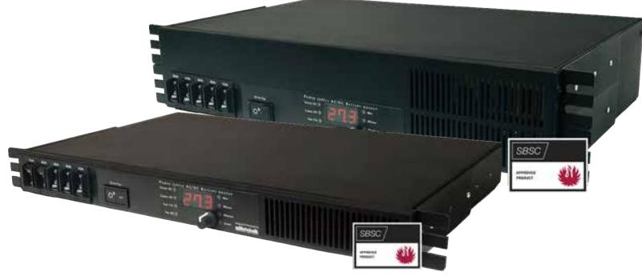

## **Batteribackup EN54 1U & 2U**

**EN54-4 / SBF110: 8 Certifierad batteribackup 24V upp till 25A, 48V upp till 13A. 19 "rackmonteras. Systemet måste kompletteras med batterihylla / batterihyllor.**

**EN54 1U & 2U a**nvänds främst för att driva externa larmdon i brandlarm eller talande utrymningslarm där en SBF110:8-godkänd eller EN54-4-certifierad batteribackup krävs eller där kraven är högre när det gäller; högre flexibilitet, fler larmfunktioner, längre drifttider eller när batteribackupen behöver hantera högre belastningar.

**EN54-serien** erbjuder **"INTELLIGENT CHARGING"**, vilket innebär att när batterierna är fulladdade kommer de att kopplas bort elektroniskt för standby-läge i upp till 20 dagar eller när batterierna har nått 26,7V (24V-system). Genom att ladda ur batterierna och ladda dem kontinuerligt (istället för att de aldrig används) förlänger systemet batteriets livslängd med upp till 50%. Batterierna ansluts automatiskt på mindre än 50 mikrosekunder vid behov. EN54-serien ska användas med AGM-batterier.

**EN54-serien** läser också av den anslutna systembelastningen och laddar batterierna med tillgänglig restström från strömförsörjningen, dock laddas batterierna aldrig med mer än högst 6A laddning. Detta förhindrar att batterierna överladdas och förlänger deras livslängd avsevärt. EN54-serien är också utrustade med interna effektmotstånd (anpassade för systemtestade batterier) för *"QUALIFIED BATTERY CAPACITY TESTING"*, som meddelar när batterierna måste bytas ut innan batterierna åldras. EN54-serien är systemcertifierad tillsammans med / & måste användas tillsammans med 10+ Design Life AGM-batterier enligt EN54-4 / SBF110:8.

## **Display**

Via displayen på framsidan av kapslingen,visas information om systemets; min / genomsnitt / max för; spänning, ström, temperatur. Det är också möjligt att läsa av den möjliga driftstiden i händelse av ett eventuellt strömavbrott.

## **Tillval**

- Batterihylla 24V Medium rymmer upp till 2x 45Ah per hylla (max. 4x hyllor).
- Batterihylla 24V Large rymmer upp till 2x 150Ah per hylla (max. 4x hyllor).

## **Teknisk data**

**EN54 24V 15A 1U EN54 48V 7A 1U EN54 24V 25A 2U EN54 48V 13A 2U**

| Rekommenderad miljö och kapslingsinformation:    |                                                                                                                                                                                                                                                                                                                                                   |                     |                     |                     |
|--------------------------------------------------|---------------------------------------------------------------------------------------------------------------------------------------------------------------------------------------------------------------------------------------------------------------------------------------------------------------------------------------------------|---------------------|---------------------|---------------------|
| Rekommenderad miljö:                             | Miljöklass 1, Inomhus, 20% ~ 90% relativ fuktighet                                                                                                                                                                                                                                                                                                |                     |                     |                     |
| Omgivningstemperatur:                            | +5 °C - 40 °C (För optimal batterilivslängd +15 °C - +25 °C)                                                                                                                                                                                                                                                                                      |                     |                     |                     |
| Skyddsklass:                                     | IP32                                                                                                                                                                                                                                                                                                                                              |                     |                     |                     |
| Rekommenderad montering:                         | 19" Rack                                                                                                                                                                                                                                                                                                                                          |                     |                     |                     |
| Dimension (HxBxD):                               | 44x444x280mm (1HE) 88x444x280mm (1HE)                                                                                                                                                                                                                                                                                                          |                     |                     |                     |
| Nettovikt:                                       | 5 kg                                                                                                                                                                                                                                                                                                                                              |                     | 8 kg                |                     |
| Kapslingens färg:                                | Svart                                                                                                                                                                                                                                                                                                                                             |                     |                     |                     |
| Inbyggd fläkt för kylning:                       | Ja                                                                                                                                                                                                                                                                                                                                                |                     |                     |                     |
| Elektrisk information:                           |                                                                                                                                                                                                                                                                                                                                                   |                     |                     |                     |
| Inspänning:                                      | 110V-264VAC/47-63Hz                                                                                                                                                                                                                                                                                                                               |                     |                     |                     |
| Utspänning:                                      | 27,3VDC                                                                                                                                                                                                                                                                                                                                           | 54,6VDC             | 27,3VDC             | 54,6VDC             |
| Max ström:                                       | 15A                                                                                                                                                                                                                                                                                                                                               | 7A                  | 25A                 | 13A                 |
| Ladd ström:                                      | Beroende av strömuttag, dock max 6A                                                                                                                                                                                                                                                                                                               |                     |                     |                     |
| Nominell effekt:                                 | 336W                                                                                                                                                                                                                                                                                                                                              | 336W                | 648W                | 648W                |
| Rippel i normalläge:                             | 150mVp-p                                                                                                                                                                                                                                                                                                                                          | 150mVp-p            | 150mVp-p            | 150mVp-p            |
| Effektivitet:                                    | 87%                                                                                                                                                                                                                                                                                                                                               | 87%                 | 88%                 | 88%                 |
| Värmegenerering vid 50% / 80% av märkeffekten:   | 31W / 49W                                                                                                                                                                                                                                                                                                                                         | 31W / 49W           | 50W / 80W           | 50W / 80W           |
| Ingångsström:                                    | 1,8A                                                                                                                                                                                                                                                                                                                                              | 1,8A                | 3,6A                | 3,6A                |
| Antal avsäkrade utgångar:                        | 2 st                                                                                                                                                                                                                                                                                                                                              | 2 st                | 2 st                | 2 st                |
| Typ av säkring på utgång:                        | 2xC15A                                                                                                                                                                                                                                                                                                                                            | 2xC15A              | 2xC25A              | 2xC25A              |
| Djupurladdning av batterier sker vid:            | 21V                                                                                                                                                                                                                                                                                                                                               | 41V                 | 21V                 | 41V                 |
| Möjlig att parallellkoppla:                      |                                                                                                                                                                                                                                                                                                                                                   | Ja                  |                     |                     |
| Skydd mot:                                       | Överlast, Överspänning, Övertemperatur, Kortslutning & Djupurladdning av batterier                                                                                                                                                                                                                                                                |                     |                     |                     |
| Larmfunktioner (3 utgångar):                     | Fördröjt nätavbrottslarm (10 sek) (utgång 1), låg batterispänning (utgång 2), över/underspänning, åldrade batterier, frånkopplade batterier (10 sek), säkringsfel, laddarfel, låg systemspänning (utgång 3).                                                                                                                                   |                     |                     |                     |
| Larm via:                                        | Växlande relä                                                                                                                                                                                                                                                                                                                                     |                     |                     |                     |
| Artikel information:                             |                                                                                                                                                                                                                                                                                                                                                   |                     |                     |                     |
| Artikelnamn:                                     | EN54 24V 15A 1U                                                                                                                                                                                                                                                                                                                                   | EN54 48V 7A 1U      | EN54 24V 25A 2U     | EN54 48V 13A 2U     |
| Artikelnummer:                                   | 1U01R10024P150-EN54                                                                                                                                                                                                                                                                                                                               | 1U01R10048P070-EN54 | 2U01R10024P250-EN54 | 2U01R10048P130-EN54 |
| E-nummer:                                        | 5213555                                                                                                                                                                                                                                                                                                                                           | 5213557             | 5213556             | 5213558             |
| Produkten möter kraven och är certfierad enligt: | EMC Direktivet 2014/30EU, Lågspännings direktivet: 2014/35/EU CE direktivet enligt:765/2008, Emission:EN61000-6-:2001, EN55022:1998:-A1:2000, A2:2003 Klass B, EN61000-3-2:2001. Immunity: EN61000-6-2:2005, EN61000-4-2, -3, 4, -5, -6, -11. EN 54-4:1997, EN 54-4:1997/AC:1999, EN 54-4:1997/A1:2002 and EN 54-4:1997/A2:2006, SBF 110:8. |                     |                     |                     |
| Certifikatsnummer (SBSC):                        | 18-243                                                                                                                                                                                                                                                                                                                                            |                     |                     |                     |
| Garantiperiod:                                   | 5 år                                                                                                                                                                                                                                                                                                                                              |                     |                     |                     |
| Regler för garanti:                              | 1. Omgivningstemperatur skall ej överstiga 32°. 2. Medellast får ej överstiga 80% av nätaggregatets märkkapacitet. 3. Batteribackupen skall användas tillsammans med UPLUS 10+ Design Life batterier.                                                                                                                                       |                     |                     |                     |
| Designad och producerad av:                      | Milleteknik AB                                                                                                                                                                                                                                                                                                                                    |                     |                     |                     |
| Ursprungsland:                                   | Sverige                                                                                                                                                                                                                                                                                                                                           |                     |                     |                     |
| Information och val av batteri / batterier:      |                                                                                                                                                                                                                                                                                                                                                   |                     |                     |                     |
| Rekommenderad batterityp:                        | 12V Underhållsfria batterier, typ AGM                                                                                                                                                                                                                                                                                                             |                     |                     |                     |
| Möjliga batterier för montering i kapsling:      | N/A                                                                                                                                                                                                                                                                                                                                               |                     |                     |                     |
| System certifierad tillsammans med:              | UPLUS 10+ Design Life batterier                                                                                                                                                                                                                                                                                                                   |                     |                     |                     |
|                                                  |                                                                                                                                                                                                                                                                                                                                                   |                     |                     |                     |

