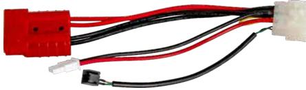
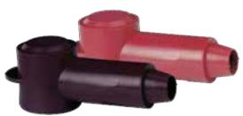
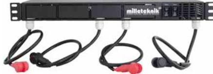
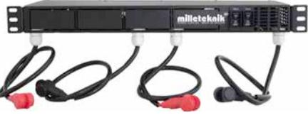

## **Tillbehör batterihyllor**

Adapter FLX to Battery shelf

Terminal cover M6 / M8

Battery connection panel 24V /48V

Battery connection panel 24V-125 / -200 / -300

| Produktbeskrvining:              |                                                                                                                                                                                                                                                                                                                                                                                                                                                                                                                       |                                 |                                                    |                                     |                                     |                                 |
|----------------------------------|-----------------------------------------------------------------------------------------------------------------------------------------------------------------------------------------------------------------------------------------------------------------------------------------------------------------------------------------------------------------------------------------------------------------------------------------------------------------------------------------------------------------------|---------------------------------|----------------------------------------------------|-------------------------------------|-------------------------------------|---------------------------------|
| Adapter FLX to Battery shelf     | Adpatern skall användas då man vill ansluta en batterihylla till våra NEO / NOVA / EN54 FLX M batteribackuper. Från batterihyllan erbjuds en "truck handske" för anslutning framförallt emot RACK Serien medans NEO / NOVA / EN54 FLX M erbjuder en 9-polig kontakt för anslutning emot batteribox som standard. Adaptern erbjuder en truckhandske på ena änden om kabeln och en 9-polig kontakt på andra änden om kabeln.                                                                                      |                                 |                                                    |                                     |                                     |                                 |
| Battery connection panel 24V     | Batterianslutningspanel 24V för anslutning av front terminal batterier. Färdiga kablar emot batterierna samt färdig kabel för anslutning emot batteriback upen.Kapslingen är avsedd för rackmontage. Observera att "Adapter FLX to Batteryshelfs" skall användas om produkten skall nyttjas tillsammans med NEO / NOVA / EN54 FLX M.                                                                                                                                                                            |                                 |                                                    |                                     |                                     |                                 |
| Battery connection panel 24V-125 | Batterianslutningspanel 24V för anslutning av front terminal batterier. Panelen levereras inkl. effektmotstånd avsett för ett batteripaket om totalt max 125Ah för veckotest av batterier och därmed kunna återkoppla larm för "åldrat batteri". Färdiga kablar emot batterierna samt färdig kabel för anslutning emot batteribackupen.Kapslingen är avsedd för rackmontage. Observera att "Adapter FLX to Batteryshelfs" skall användas om produkten skall nyttjas tillsammans med NEO / NOVA / EN54 FLX M. |                                 |                                                    |                                     |                                     |                                 |
| Battery connection panel 24V-200 | Batterianslutningspanel 24V för anslutning av front terminal batterier. Panelen levereras inkl. effektmotstånd avsett för ett batteripaket om totalt max 200Ah för veckotest av batterier och därmed kunna återkoppla larm för "åldrat batteri". Färdiga kablar emot batterierna samt färdig kabel för anslutning emot batteribackupen.Kapslingen är avsedd för rackmontage. Observera att "Adapter FLX to Batteryshelfs" skall användas om produkten skall nyttjas tillsammans med NEO / NOVA / EN54 FLX M. |                                 |                                                    |                                     |                                     |                                 |
| Battery connection panel 24V-300 | Batterianslutningspanel 24V för anslutning av front terminal batterier. Panelen levereras inkl. effektmotstånd avsett för ett batteripaket om totalt max 300Ah för veckotest av batterier och därmed kunna återkoppla larm för "åldrat batteri". Färdiga kablar emot batterierna samt färdig kabel för anslutning emot batteribackupen.Kapslingen är avsedd för rackmontage. Observera att "Adapter FLX to Batteryshelfs" skall användas om produkten skall nyttjas tillsammans med NEO / NOVA / EN54 FLX M. |                                 |                                                    |                                     |                                     |                                 |
| Battery connection panel 48V     | Batterianslutningspanel 48V för anslutning av front terminal batterier. Färdiga kablar emot batterierna samt färdig kabel för anslutning emot batteriback upen.Kapslingen är avsedd för rackmontage.                                                                                                                                                                                                                                                                                                               |                                 |                                                    |                                     |                                     |                                 |
| Terminal cover M6                | Våra batterihyllor är utrustade med polskydd. Om ni är i behov av polskydd för andra anläggningar kan vi erbjuda detta polskydd avsedd för M6 bult. Artikelnummer: A-0000000TM601. E-nummer: 5257461                                                                                                                                                                                                                                                                                                               |                                 |                                                    |                                     |                                     |                                 |
| Terminal cover M8                | Våra batterihyllor är utrustade med polskydd. Om ni är i behov av polskydd för andra anläggningar kan vi erbjuda detta polskydd avsedd för M8 bult. Artikelnummer: A-0000000TM801. E-nummer: 5257462                                                                                                                                                                                                                                                                                                               |                                 |                                                    |                                     |                                     |                                 |
| Rekommenderad miljö och mått:    | Adapter FLX to Battery shelf                                                                                                                                                                                                                                                                                                                                                                                                                                                                                       | Battery connection panel 24V | Battery connection panel 24V-125                | Battery connection panel 24V-200 | Battery connection panel 24V-300 | Battery connection panel 48V |
| Rekommenderad miljö:             |                                                                                                                                                                                                                                                                                                                                                                                                                                                                                                                       |                                 | Miljöklass 1, Inomhus, 20% ~ 90% relativ fuktighet |                                     |                                     |                                 |
| Omgivningstemperatur:            | +5 °C - 40 °C                                                                                                                                                                                                                                                                                                                                                                                                                                                                                                         |                                 |                                                    |                                     |                                     |                                 |
| Dimension (HxBxD):               | 66x438x                                                                                                                                                                                                                                                                                                                                                                                                                                                                                                               |                                 |                                                    |                                     |                                     |                                 |
| Artikelnamn:                     | Adapter FLX to Battery shelfs                                                                                                                                                                                                                                                                                                                                                                                                                                                                                      | Battery connection panel 24V | Battery connection panel 24V-125                | Battery connection panel 24V-200 | Battery connection panel 24V-300 | Battery connection panel 48V |
| Artikelnummer:                   | A-0000000ADP01                                                                                                                                                                                                                                                                                                                                                                                                                                                                                                        | 3U010000024BP01                 | 3U010000024BP01-125                                | 3U010000024BP01-200                 | 3U010000024BP01-300                 | 3U010000048BP01                 |
| E-nummer:                        | 5257447                                                                                                                                                                                                                                                                                                                                                                                                                                                                                                               | 5213524                         | 5213548                                            | 5213549                             | 5213550                             | 5213559                         |
| Produkten möter kraven enligt:   | EMC Directive 2014/30EU, Low Voltage directive: 2014/35/EU CE directive according to 765/2008, Emission: EN61000-6-:2001, EN55022:1998:-A1:2000, A2:2003 Klass B, EN61000-3-2:2001. Immunity: EN61000-6-2:2005, EN61000-4-2, -3, 4, -5, -6, -11.                                                                                                                                                                                                                                                                   |                                 |                                                    |                                     |                                     |                                 |
| Garantiperiod:                   | 2 år                                                                                                                                                                                                                                                                                                                                                                                                                                                                                                                  |                                 |                                                    |                                     |                                     |                                 |
| Designad och producerad av:      | Milleteknik AB                                                                                                                                                                                                                                                                                                                                                                                                                                                                                                        |                                 |                                                    |                                     |                                     |                                 |
| Ursprungsland:                   | Sverige                                                                                                                                                                                                                                                                                                                                                                                                                                                                                                               |                                 |                                                    |                                     |                                     |                                 |

