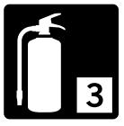
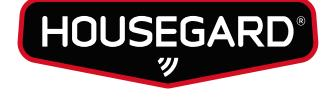
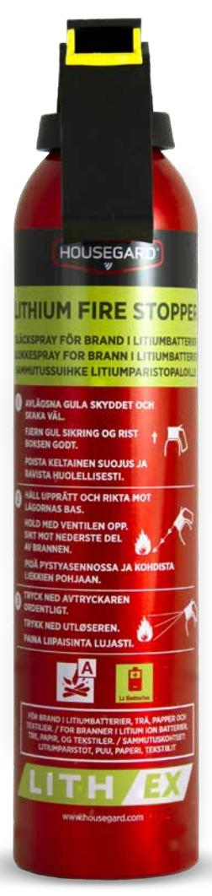

## DATABLAD - FDV DOKUMENTATION

# HOUSEGARD LITH-EX SLÄCKSPRAY

AVD aerosol 500 ml Släcker bränder i litiumjonbatterier

Housegard Lith-EX släckspray är lämplig att använda mot mindre bränder i litiumjonbatterier. Lith-EX innehåller AVD som är det enda tredjepartstestade och godkända släckmedlet mot bränder i litiumjonbatterier. Lith-EX släckspray är designad för att upprätthålla högsta prestanda och kvalitet. Produkten är ej påfyllningsbar.

## FUNKTION

Den höga halten vatten i AVD kyler ner föremålet effektivt. AVD lägger sig som ett täcke över branden vilket hindrar syretillförseln och kväver elden snabbt. AVD är en extremt god termisk isolator. Vid påläggning av AVD isoleras de intakta battericellerna från brandhärden där termisk rusning och propagering sker. På så sätt bryts kedjereaktionen av och värmeöverföringen från cell till cell avstannar snabbt och effektivt.

ANVÄNDNINGSOMRÅDEN Butiksverksamhet, offentlig verksamhet, mekanisk verkstad, bostäder, lagerlokaler, flygplatser, hamnar, återvinningsstationer, batteriinsamling, skolor, labb, kontor etc.

Bränder i organiska material t.ex trä, papper, textilier.

| Modell:           | LITH-EX SLÄCKSPRAY                | Vikt:                   | 680 g    |
|-------------------|-----------------------------------|-------------------------|----------|
| Brandklass:       | Litiumjonbatteribrand, A-brand | Cylinder dia/höjd (mm): | 65 x 300 |
| Temperaturområde: | +5°C/+50°C                        |                         |          |
| Drivgas:          | Nitrogen                          |                         |          |
| Släckmedel:       | AVD                               |                         |          |
| Mängd:            | 500 ml                            |                         |          |
| Tömningstid:      | <90 sek                           |                         |          |
| Arbetstryck:      | 21 BAR                            |                         |          |
| Cylindermaterial: | Stål                              | OBS: Ej påfyllningsbar  |          |
|                   |                                   |                         |          |

## Teknisk data Godkännanden

### Artikelinformation

Artnr: 600122 EAN: 7320896001220 Försäljningsenhet: st

GPBM Nordic AB | Argongatan 2b, SE-43153 Mölndal, Tel +46 31 799 16 00, mejl: kundservice@gpbmnordic.se