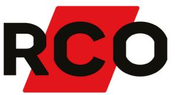
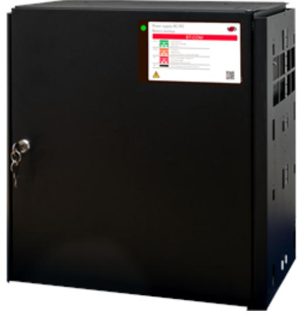

## BT-10 FLX LARGE COM

Artikelnummer: 28160154, E-nummer: 6310039

Batteribox BT-10 FLX L COM ur BT-COM-serien som används främst i säkerhetssystem där en SSF 1014 godkänd batteribackup krävs eller när kunden vill ha de bästa funktionerna i sina säkerhetsanläggningar. Denna batteribackup är godkänd enligt SSF1014 larmklass 4. Systemet är bland många andra funktioner utrustat med larm vid nätavbrott, låg batterispänning, frånkopplat batteri, cellkortslutning, åldrat batteri, utlöst lastsäkring, över/underspänning, låg systemspänning, sabotage.

- •5 avsäkrade utgångar
- •Larmklass 4

- •Kommunicerar via buss emot UC-50
BT-COM-serien kan kompletteras med en batterilåda. Batterilådan är ansluten via en snabbanslutningskabel. Batterilådan har plats för 2x 45Ah-batterier/box, **ingår ej.** 

För larmklass LK1/2 = 3,5A

För larmklass LK3/4 = 1,5A

| Utförande:                        | Svart                                              |
|-----------------------------------|----------------------------------------------------|
| Utgångar:                         | 5 st                                               |
| Miljöklass:                       | Klass 1                                            |
| Kapslingsklassning:               | IP32                                               |
| Temperaturområde:                 | 5 - 40 °C (Optimalt 15 - 2°C)                      |
| Montering:                        | Vägg eller hylla                                   |
| Mått (BxHxD):                     | 444x436x210 mm                                     |
| Vikt:                             | 13 kg                                              |
| Antal kabelgenomföringar:         | 4 st                                               |
| Inbygd fläkt:                     | Ja                                                 |
| Matningsspänning:                 | 10V-264VAC/47-63Hz                                 |
| Max. utgångsström:                | 12A                                                |
| Typ av försörjningsspänning:      | DC                                                 |
| Första utgångsspänning (min-max): | 21-27,3                                            |
| Matningsspänning:                 | 27,3VDC                                            |
| Möjlig batteri kombination:       | 2x 45Ah                                            |
| Batterityp:                       | 12V AGM-batteri                                    |
| Testad och godkänd med:           | UPLUS 10+ Design Life 45Ah batteries (up to 10x 45 |
| SBSC Certifierad:                 | SSF 1014 larmklass 4                               |
| Benämning producent (SBSC):       | NOVA 27 100-FLX_PRO1                               |