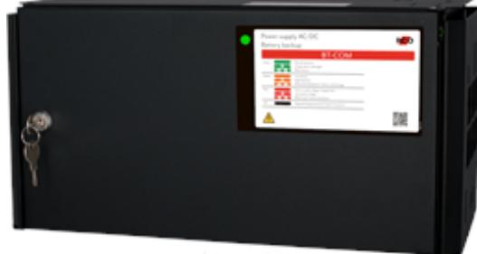

## BT-5 FLX MEDIUM COM

Artikelnummer: 28160142, E-nummer: 5257456

BT-5 FLX MEDIUM COM ur FLX-serien som används främst i säkerhetssystem där en SSF 1014 godkänd batteribackup krävs eller när kunden vill ha de bästa funktionerna i sina säkerhetsanläggningar. Denna batteribackup är godkänd enligt SSF1014, larmklass 4.

- 2 avsäkrade utgångar
- Larmklass 4

- Kommunicerar via buss emot UC-50
Systemet är bland många andra funktioner utrustat med larm vid nätavbrott, låg batterispänning, frånkopplat batteri, cellkortslutning, åldrat batteri, utlöst lastsäkring, över/underspänning, låg systemspänning, sabotage.

Plats för 2x 20Ah batterier, godkänd för 45Ah (via 1x batteribox), batteri ingår ej.

BT-COM-serien kan kompletteras med en batterilåda. Batterilådan är ansluten via en snabbanslutningskabel.

Med tillval, 1x (max 1) BT-Box FLX M/L erbjuds en medellast om;

LK1-2=3,5A,

LK3-4=1,5A.

| Utförande:                        | Svart                                             |
|-----------------------------------|---------------------------------------------------|
| Utgångar:                         | 2 st                                              |
| Miljöklass:                       | Klass 1                                           |
| Kapslingsklassning:               | IP32                                              |
| Temperaturområde:                 | 5 till 40°C (optimalt 15 till 25 °C)              |
| Montering:                        | Vägg eller hylla                                  |
| Mått (BxHxD):                     | 222x436x210mm                                     |
| Vikt:                             | 8 kg                                              |
| Antal kabelgenomföringar:         | 4 st                                              |
| Inbygd fläkt:                     | Ja                                                |
| Matningsspänning:                 | 110V-264VAC/47-63Hz                               |
| Max. utgångsström:                | 5A                                                |
| Typ av försörjningsspänning:      | DC                                                |
| Första utgångsspänning (min-max): | 21-27,3                                           |
| Matningsspänning:                 | 27,3VDC                                           |
| Möjlig batteri kombination:       | 2x 20Ah (2x 45Ah med batteribox)                  |
| Batterityp:                       | 12V AGM-batteri                                   |
| Testad och godkänd med:           | UPLUS 10+ Design Life 20Ah and 45Ah batteries (up |
| SBSC Certifierad:                 | SSF 1014, Larmklass 4                             |
| Benämning producent (SBSC):       | NOVA 27 50-FLX_PRO1                               |