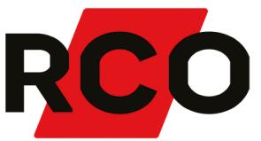
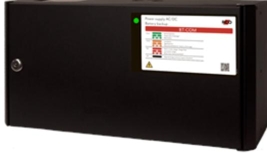

## BT-5 FLX SMALL COM

Artikelnummer: 28160120, E-nummer: 5257454

BT-5 FLX SMALL COM ur BT-COM-serien som används främst i säkerhetssystem där en SSF 1014 godkänd batteribackup krävs eller när kunden vill ha de bästa funktionerna i sina säkerhetsanläggningar. Denna batteribackup är godkänd enligt SSF1014, larmklass 3

- 2 avsäkrade utgångar
- Larmklass 3

- Kommunicerar via buss emot UC-50
Systemet är bland många andra funktioner utrustat med larm vid nätavbrott, låg batterispänning, frånkopplat batteri, cellkortslutning, åldrat batteri, utlöst lastsäkring, över/underspänning, låg systemspänning, sabotage.

För larmklass 1-2: 1,1A

För larmklass 3: 0,45A

BT-COM-serien kan kompletteras med en batterilåda, som ansluts via en snabbanslutningskabel.

| Utförande:                        | Svart                                             |
|-----------------------------------|---------------------------------------------------|
| Utgångar:                         | 2 st                                              |
| Miljöklass:                       | Klass 1                                           |
| Kapslingsklassning:               | IP32                                              |
| Temperaturområde:                 | 5 till 40°C (optimalt 15 till 25 °C)              |
| Montering:                        | Vägg                                              |
| Mått (BxHxD):                     | 215x430x220mm                                     |
| Vikt:                             | 6,5 kg                                            |
| Antal kabelgenomföringar:         | 9 st                                              |
| Inbygd fläkt:                     | Ja                                                |
| Matningsspänning:                 | 110V-264VAC/47-63Hz                               |
| Max. utgångsström:                | 5                                                 |
| Typ av försörjningsspänning:      | DC                                                |
| Första utgångsspänning (min-max): | 21-27,3                                           |
| Matningsspänning:                 | 27,3VDC                                           |
| Möjlig batteri kombination:       | 2x 7,2Ah / 2x 14Ah                                |
| Batterityp:                       | 12V AGM-batteri                                   |
| Testad och godkänd med:           | UPLUS 10+ Design Life 20Ah and 45Ah batteries (up |
| SBSC Certifierad:                 | SSF1014 Larmklass 3                               |
| Benämning producent (SBSC):       | NOVA 27 50-XS2_PRO1                               |