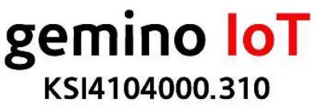
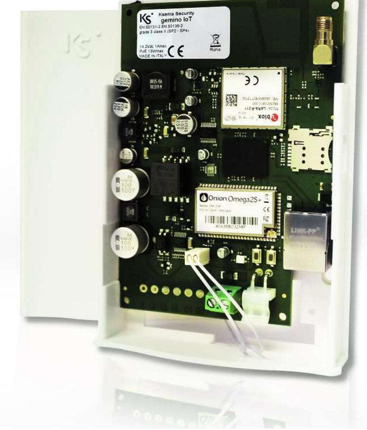
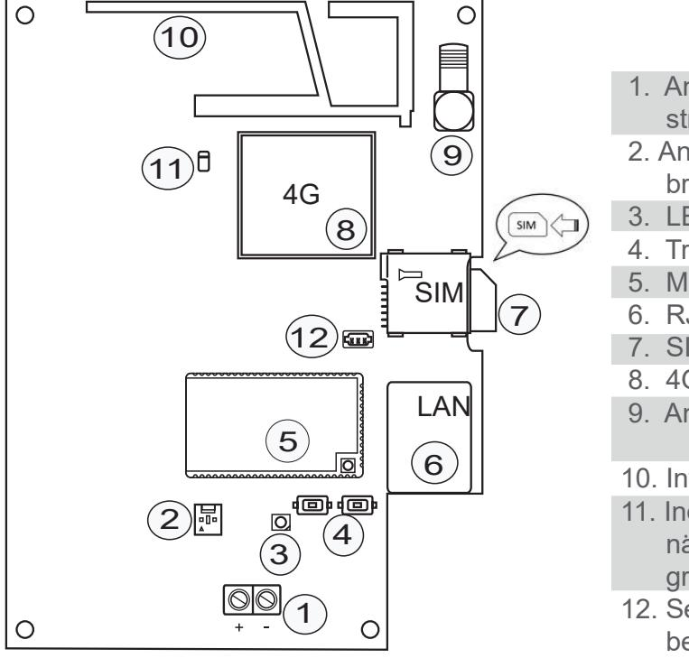
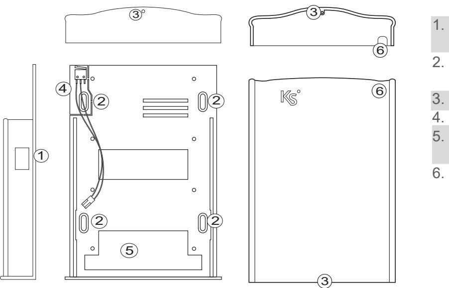

## Larmsändare gemino IoT - Installationsmanual

www.kseniasecurity.com

# INNEHÅLLSFÖRTECKNING

| Introduktion Huvudfunktioner |  |
|---------------------------------|--|
| Produktöversikt                 |  |
| Tekniska data                   |  |
| Kommunikationstyp               |  |
| Installation                    |  |
| Programmering                   |  |
| LED-Indikering                  |  |

### INTRODUKTION

gemino IoT är en IP-larmsändare som ökar kommunikationskapaciteten för centralaparat lares 4.0 till två larmöverföringskanaler: Ethernet/IP och 4G datanätverk (med mottagning även på 2G/GPRS banden). gemino IoT gör att centralapparater i lares 4.0 serien, installerade på platser som saknar tillräcklig GSM- täckning kan nås från 4G datanätverk eller via Internet på ett helt transparent sätt för installatören och slutanvändaren. Den tillhandahåller även en höghastighetsdatakanal (upp till 10Mbit/s i nedladdningshastighet) som kan erbjuda en komplett back-up av kommunikationsnätverket vid fel eller tillfällig brist på täckning från 4Gnätverket till IP-LAN nätverket och vice versa, vilket säkerställer en total säkerhet för data och kommunikation. • Programmering och hantering av lares 4.0 med gemino IoT

### HUVUDFUNKTIONER

- 
- Pushmeddelanden när händelser inträffar
- Sändning av signaler via det digitala protokollet SIA DC09, med övervakning av kanal och mottagare (dual-path)
- Videoverifiering av IP-kameror anslutna till det lokala nätverket där lares 4.0 är ansluten till
- Enkelt handhavande och snabb synkronisering av talmeddelanden (TTS Loquendo® di Nuance Communication®)
- Övervakning och sändning av tal, SMS och Contact ID rapporter när någon av de programmerade händelserna inträffar
- Fjärrstyrning av systemet genom röstmenystyrning
- Spänningsmatning PoE 13W eller 12 VDC

| Artikelnummer | Beskrivning                                            |
|---------------|--------------------------------------------------------|
| 12224         | Larmsändare gemino IoT - IP/4G                         |
| 12226         | Antenn 4G med väggfäste, anslutningar och 10m kabel |

#### PRODUKTÖVERSIKT

#### Kretskort

- 1. Anslutning för extern strömförsörjning
- 2. Anslutning för extern sabotagebrytare
- 3. LED-indikering
- 4. Tryckknapp 1 och 2
- 5. Microprocessor
- 7 6. RJ45 Port
	- 7. SIM kortshållare
	- 8. 4G modul
	- 9. Anslutning för extern antenn
	- 10. Integrerad antenn
	- 11. Indikerings-LED (RGB) för GSM nätverksanslutning (normal = fast grön)
	- 12. Seriell anslutning, endast för behörig personal

#### Plastkapsling

- 6 1. Öppning för installation av SIM-kort
	- 2. Fästhål (kompatibel med DIN 503 kapsling)
- 6 3. Låsskruv (medföljer)
	- 4. Sabotagebrytare
	- 5. Öppning för kabelgenomföring
	- 6. Öppning för anslutning av extern antenn

### TEKNISKA DATA

| Tekniska data                                                                                                                                         | Beskrivning                                                      |
|-------------------------------------------------------------------------------------------------------------------------------------------------------|------------------------------------------------------------------|
| Spänningsmatning                                                                                                                                      | PoE 13W eller 12VDC                                              |
| Strömförbrukning                                                                                                                                      | PoE klass 3 (12.95W)                                             |
| GSM-band                                                                                                                                              | GSM 4G Modul Ublox                                               |
| Maximal datahastighet                                                                                                                                 | 10 Mbit/s nedladdning, 5 Mbit/s uppladdning                      |
| Maximal sändningstid med talat                                                                                                                        | 10 sec.                                                          |
| larmmeddelande                                                                                                                                        |                                                                  |
| Larmöverföringssystem                                                                                                                                 | SP2 - SP4 - DP3                                                  |
| Temperaturområde                                                                                                                                      | -10 till +55°C                                                   |
| Luftfuktighet                                                                                                                                         | 95%                                                              |
| Anslutningstyp för extern antenn                                                                                                                      | SMA                                                              |
| Mått på kretskort (BxHxD)                                                                                                                             | 113x92x20 mm                                                     |
| Mått totalt (BxHxD)                                                                                                                                   | 102x140x30 mm                                                    |
| Vikt                                                                                                                                                  | 190 gram                                                         |
| KOMMUNIKATIONSTYP                                                                                                                                     |                                                                  |
| kommunikationstyper: • Förinspelade röstmeddelanden • SMS • Contact ID med SIA-DC03 protokoll • GPRS SIA-DC09 protokoll med kryptering | Enheten kan programmeras för att skicka meddelanden med följande |

#### KOMMUNIKATIONSTYP

- Förinspelade röstmeddelanden
- 
- Contact ID med SIA-DC03 protokoll
- GPRS SIA-DC09 protokoll med kryptering

#### INSTALLATION

#### VIKTIGT!

 Larmsändare gemino IoT skall endast installeras av KVALIFICERAD PERSONAL, inomhus på en säker, torr plats, borta från radiosändare. Välj noga installationsplatsen för larmsändare gemino IoT för att säkerställa en god GSM-signaltäckning.

- 1. Öppna plasthöljet genom att skjuta locket uppåt.
- 2. Ta bort kretskortet genom att skjuta det uppåt.
- 3. Fäst bottendelen på plastkapslingen på väggen med skruvar eller montera den i en DIN503 kapsling.
- 4. Trä igenom PoE Ethernet kabeln genom öppningen i bottendelen (se produktöversiktbilden på sidan 4), Om Ethernet kabeln ej är PoE, dra även igenom kabel för extern strömförsörjning.
- 5. Sätt tillbaka kretskortet i kapslingen och skjut det nedåt.
- 6. Anslut nätverkskabeln till RJ45 porten (se produktöversiktsbilden på sidan 4).
- 7. Om du inte använder PoE, anslut i så fall kabeln från den externa strömförsörjningen till kortet.
- 8. Sätt i SIM-kortet i "SIM-kortshållaren".
- 9. Om en extern antenn skall användas så ska den anslutas till antennanslutningen på kortet.
- 10. Kontrollera följande efter driftsättning:
	- i) Grön indikerings-LED (RGB) för GSM nätverksanslutning: Fast LEDindikering, koppling till mobilt nätverk har upprättats. Blinkande LEDindikering, letar fortfarande efter mobilt nätverk.
	- ii) Att LED-indikeringen på ethernetporten är tänd
- 12. Sätt tillbaka locket och stäng kapslingen

För ytterliggare information, se installationsanvisningen för "lares 4.0".

gemino IoT programmeras via centralapparat lares 4.0. För ytterliggare information, se installationsanvisningen för lares 4.0

### LED-indikering (RGB)

- Blinkande grön: Initializering och normal drift. __________________________________________________________
Installation av dessa system måste utföras strikt i enlighet med instruktionerna som beskrivs i denna handbok och i enlighet med gällande lokala lagar och stadgar. Denna produkt har designats och tillverkats med de högsta standarderna för kvalitet och prestanda som antagits av Ksenia Security. Det rekommenderas att det installerade systemet testas helt minst en gång i månaden. Testförfaranden beror på systemkonfigurationen. Be installatören om de procedurer som ska följas. Ksenia Security srl ansvarar inte för skador som uppstår till följd av felaktig installation eller underhåll av obehörig personal. Innehållet i denna guide kan ändras utan föregående meddelande från KSENIA SECURITY.

#### Information för användare: Avfallshantering (WEEE-RAEE-direktivet)

Varning! Använd inte en vanlig soptunna för att kasta denna utrustning. Begagnad elektrisk och elektronisk utrustning måste behandlas separat i enlighet med den relativa lagstiftningen som kräver korrekt behandling, återvinning och återvinning av begagnad elektrisk och elektronisk utrustning. Efter genomförandet av direktiv i medlemsländerna kan privata hushåll inom EU återlämna sin använda elektriska och elektroniska utrustning till utsedda insamlingsanläggningar *. Lokala återförsäljare tar i vissa fall även emot begagnade produkter gratis om en liknande produkt köps från dem. Om använd elektrisk eller elektronisk utrustning har batterier eller ackumulatorer måste dessa kasseras separat enligt lokala bestämmelser. Korrekt bortskaffande av denna produkt garanterar att den genomgår nödvändig behandling, återvinning och återvinning. Detta förhindrar eventuella negativa effekter på både miljön och folkhälsan som kan uppstå genom olämplig hantering av avfall. * Kontakta din lokala myndighet för mer information.

ÖVERENSSTÄMMELSE

- EN50131-1
- EN50136-1
- Grade 3 / Miljöklass II

All information i detta dokument kan ändras utan föregående meddelande och representerar inte ett åtagande från Ksenia Security.

#### MILJÖVÅRD

gemino IoT har utformats och tillverkats för hänsyn till miljön enligt följande:

- 1. Ingen PVC
- 2. Halogen- och blyfria kretskort
- 3. Låg förbrukning
- 4. Förpackning av mestadels återvunnet material

code R30037.100 ed. November 2019