## Folded Size : 57 x125 mm

## Read the instruction manual thoroughly before use
Keep the manual for future reference.

## Operating instructions

$$
\mathbb{Q}^{\mathbb{Q}}
$$

lnscrew the tail cap (A)
insure Li-ion 18650 battery inserted correctly in battery holder
tug the Micro USB end into the flashight. Plug the USB end into a power source
uch

- charger
LED indicator light:
Green LED: Charging
- completed
- 
- Red LED: Charging in progress
5. Disoonned the USB cable when fully charged and some of the thanklight
6. In the event you want to battery unscrew the charging base (B) an
- and replace charging base (E
Screw on tail cap securely

## Operation:

- e Poll pross witch on tail cap for On/Off
 Full pross switch -> High -> Half press switch -> Medium -> Half press switch -> Low
 > Half press switch -> Eco -> Half press
Safety Instructions and Warnings
Use the device in a temperature range between 0 and 40°C and avoid exposure to direct heat and constant sunlight.
This appliancely s upersided por use by yourset the they have they have
a andred it supersed y a responsible person to ensure that they can user p

### ் Batteries

Use 1 x GP Li-ion 18650 battery with integrated overcharge and over-dicentarge Protectio
Cicuit Module (PCM) Fallure to use dedicated GP Li-ion 18650 batteries for the may
ex bisportelio notalism of one of one of one of our and anothious and one 40°C, or incinerate
Risk of fire and burns. Do not recharge, disassemble, heat above 40°C, or incinerat

lstruzioni per l'uso

Caricare / sostituire la batteria:

LED verde: ricarica completata

Precauzioni e istruzioni di sicurrezza
Utilizzare il dispositivo in un intervallo di temperatura con

/\ Batterie

Replacing battery
 When changing batteries tirst switch of flashlight before removing tall cap (A) and install
 new batteries in the appropriate battery tholer on the battle

Do not dispose of electical applances as unorited municipal in separas a called. It perior sollios.
Contax your boal gremment for information magacting the counciler. In esta

Folded Size : 57 x125 mm

re attentamente il manuale di istruzioni prima dell'uso.
gerisce di conservare il manuale per consultazione futura

Před použitím si pozorně přečtěte návod k použití.
Ponechte si návod pro budoucí použití Návod k obsluze

GB

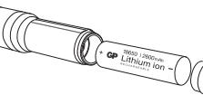

- Nabilent/urimina baterias.
- 
- 
- 
- 7

## Ovládání:

- Brazení v vypínač na koncové krytce pro vypnutízapnuť.
 Úně stlačení spínače -> vysoké -> poloviční stlačení střední -> poloviční stlačení 
 stlačení spínač -> nízké -> pol
## ečnostní poky ny a výstrahy
používejte při teplotách od 0 do 40 °C a vyhněte se vystavení přímým zdrojů
prolómu olunožnímu záření

zařizou používejto od 0 do 40 °C a vyhlete se vystaveni primym zdrojim
Teplu zatíval ny sluneční málo deli ani nemokucí sebyu bolu zařejovali.
Dostatočným zočověti zálovič, k

### // Baterie

Použite 1 x GP Li-kon 18650 paterio in nodulem ochrany proti proti proti proti proti proti proti proti proti proti proti prodiction in one more
 ziratovani morbal as vyskytou

Gebruiksaanwijzing

A Batterijen

installeerd.

Výměna baterií vý měria běterii.
Před výměnou baterií nejprve svitilnu vypněte a pak teprve sejmětní podou krytku (A) se ne víku (A) se ne víku (A) se ne víku (A) se nově krytku. Při
vklá

Elektrická zařizení neikidely jeko nebiolicí komunáhí odpadu záskáru micíních orbíní britieňeho sbění títieňeho sbění.
 správy. Pokud jsou elektrosotítekičovány z মু

Lees de instructiehandleiding grondig alvorens het toestel te

De batterij oppladen/vervangen:
1. Draai de dop achteraan (A) los
2. Draai de dop achteraan (A) los
2. Zorg evoor dat de Li-ion 1865 atterij juist in de batterijhoude

4 LED-indicatielampe:

Veiligheidsinstruction on waarsohuuving en oor on vermijd bostelling
aan desell samaan somaaliyada kantarana mindana keessaling
Dit toestel samat banneen kantuken on minderen

ebruik 1 x GP Livin 18650-batterij met geinuken van speciale GP Liet en over ontlading
rotection Circuit Module (PCM). Het niet gebruiken van speciale GP Lire en allentatan e

genissalleet.
Risioo op brand en brandwonden, Niet opladen, demonten boven 40 ° C of
verbranden. Houde batterij buiten het bereik van kinderen en in de originele verpakking
t

Batterij vervangen
Wanneru de kerijen vervangt, schakel dan eerst de zaklampung de dop
achteran var no plaats de nieuwe batterijan in de passenda batterijana manas anali org

inzanelitische Nester weg as niet gescription

# Lesen Sie die Bedienungsanleitung vor Gebrauch gründlich

- Die Batterie Iaden / austauschen:
- 
- டும்புக் கிருவதற்கு
 கல்வி காண்டு கூடி மக்கள் கிராவின் கிராவிக்கு கொண்டிகள்
 விகாலத் திருக்கான கிரிக்க கொண்டி கில கலக்கு (B) herauben 
 இவற்கு இணைவில் மாவட்டர் (Coavinstimun
- 
- 

CZ)

- Bedienung:
### icherheitshinweise und Warnungen

Western Sie Ille Germanny Coll Innerelier of Contraction Ourceler Sie sies also sies also sie sie sie sie sie sie sie sie sie sie sie sie sie sie sierische seriation word wer

22 - Battleri op
 Download onlines onlinessoner with Man Rin Man Salam Carlon Capital Carlos Crison
 Tangland (1983-Applies (1994) Man Sin Man Salam Manus (1987) Men (1987)

ve Brandlille Batterian internet ausschallen, bevor die Verschlusskappe (A
Bent Britlewochsen in den entsprehenden Batteriorlier ennescene (Area Marierene Essol
Merchitessapp

## Les bruksanvisningen nøye før bruk. Ta vare på
bruksanvisningen til framtidige referanser

### Bruksinstrukser

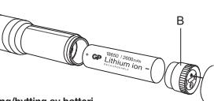

- Lading/bytting av batteri
1 Skru av bakdekselet (A)
(NO)

- San av satuskoari og batterial er riktig plassert i batteriholdera.
 Korg Marc Ligari Moshu Moshu Most Anteriholdera.
 Leo Million Moscur Mosmulykon, US-vegadanter Merus Bren
- 
- 
- lommelykten
Før du ønsker å bytte batteriet, skrur du av ladebasen (B) og fjerner det utladede
- battenlet
Erstatt det med et oppladet batteri, sørg for at det plasseres riktig i henhold til
polaritetsmarkeringene +/-, og erstatt ladebasen (B)
Skru bakdekselet ordentlig
- 
- øl tirk.
 Fullt trykk på bryteren på bakdekselet for å skru den av/på
 Trykk ble bryteren -> Høy -> Trykk halve bryteren -> Medium -> Trykk hele bryteren
 -> Lav -> Trykk ha
- a gjenta)
 Alternativt fullt trykk på Av og På -> syklusen gjentar seg

## ikkerhetsinstrukser og advarsle

kkerhetsinstrukser og advarsle
k enheten i temperaturer mellom 0 og 40°C, og unngå å bli utsatt for direkte varme og
stant sollys.

nne enheten er ikke ment for små barn eller uegnede personer, med mindre en
svarlig person holder oversyn for å sikre trygg bruk av enheten. Små barn bør passer
. for å sikr

## A Batterier

Bruk 1 x GP Lion 18650 batterimed integret overbrings- og
 operadores eli mopiles in topical de li deductions- og
 describere tintopliessions missioner and estations and coll

Erstatninggsbatteri
år du løder batterinder Skru på barekselet når batteriene er satt inn ikke f
innyt batterit rinklig batteriholder Skrupå batterinne er satt inn ikke er e

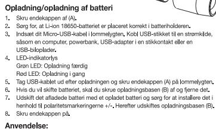

Læs instruktionerne grundigt før brug.
Gem dem til senere brug

Anvendelse

്ച് Batterier

Udskiftning af batteri

nstrukcia obsługi

Ładowanie / wymiana akumulatora:
1 - Odkręt zakrętkę (A)
2 - Upewnij się, że akumulator Li-ion 18650 został praw

samochlodowa z wyjsciem OSB
Wskaźniki diodowe LED:
Zielona dioda LED: ładowanie zakończone
Czerwona dioda LED: ładowanie zakończone
Czerwona dioda LED: ładowanie trwa

akumulatora
 Podłącz końcówkę microUSB kabla do latarki Podłącz końońwkę USB kabla do źród
 zasilania, takiego jak komputer, powerbank, zasilacz USB lub ładowarka
 samochodn

Czerwonia dioda LED. Iadowalne u wa
 Odłącz kabel USB po pełnym naładowaniu akumulatora i zakrętkę (A) latarki
 Jeżeli chcesz wymienić akumulator, odkręć podstawę ładującą (B

akumulator
 Wymień na naładowany akumulator zwracając przy instalacji uwagę na oznaczenia
 biegunowości +/-, następnie zakręć podstawę ładującą (B).
 Zakręć dobrze zakrętkę (

nvendelse: Tryk på endekappen for On/Off
Fuldt kontakttryk -> Høj -> Høj -> Høj -> Halvt kontakttryk -> Lalvt kontakttryk -> La
-> Halvt kontakttryk -> Eco -> Halvt kontakttryk -> SOS (

Cyklusser)
 Alternativt fuldt tryk på On og Off -> Cyklussen gentages

Sikkerhedsinstruktioner og advarsler

Offikiemiedan istransforler og advan sielle den for direkte
 vannelygten it ikke anvenda af andre personer med en for direkte
 vannelygte målike anvende on anvallig personer Undlad at dække forlygten eller placere med forsiden nedad på en overflade, når lyset

ed opladning af batterierne skallommelygten først slukkes, og herefter skal endekappe
A) flemes, og nye batterinderen i batterindderen, Skru endekappen på, når barberen, Vær

Skil dig ikka af med elektriske apparater som usorteret kommunalt affeld. Brug et separater om de separater
 opsamlingsanlæg. Kontakt din kkale

## No cubra el faro ni lo coloque boca abajo sobre una superficie cuando la luz esté encendida.

Funcionamiento:

A Pilas 7-1 Brug 1 x GP Li-ion 18650 batteri med integret overladningsbeskyttelsesmodu (PCM).
Manglende brug af dedikerede GP Li-ion 18650 batterier til applikationsenheden kan medfor
be beskadigede eller kortslutne celler.
 Risko for brand og forbrændinger Lad ikke oplades, dernonteres, varme over 40 ° C eller
 forbrændes. Hold batteriet utilgængeligt for b

DK

Sustitución de la pila

Citiți cu atenție manualul de utilizare înainte de a începe 
utilizarea Ianternei. Păstrați manualul pentru referințe ulterioare Przed rozpoczęciem korzystania z latarki przeczytaj dokładnie
instrukcję obsługi. Instrukcję zachowaj do użytku w przyszłości

## Manual de utilizare

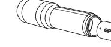

ncărcarea / înlocuirea acumulatorului:
 Deșurubați capacul (A)
 Asigurați-vă că acumulatorul Li-ion 18650 este introdus coreca
 Conectați capătul Micro-USB la lantemă. Conectați capătul USB la o sursă de
alimentare, cum ar fi calculator, încărcător pentru power bank, adaptor USB pentru
priză de peret

- ea este finalizată verue: încarcarea este finalizată
 roșu: încărcare în curs
onectați cabiul USB după încărcarea completă a acumulatorului și înșurubați
acul (A) al Janternei
- capacul (A) al lanternei
G. În care dorii ai înhouiți aumulatorul deșurubați baza de încăreare (B) și
 Scoateji coumonol încărcat.
 Înșurubații baza de încărcat ținând con

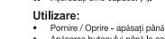

- Użytkowanie:
 Nacizanie prykszanie naciłnię o poru przejcznik w zakędo się się się się się się się się się się się się się się się się się sięcie sięcie sięcie sięcie Othreare: 
 ﺍﻟﻤﺘﺎﺳﺎﺕ ﺍﻟﻤﺮﺍﺳﺎﺕ ﺍﻟﻤﺮﺍﺳﻢ ﺍﻟﻤﺴﺎﺣﺔ ﺍﻟﻤﺴﺎﻋﺪﺓ ﺍﻟﻤﺴﺘﺸﺮﻳﻦ ﺍﻟﻤﺴﺘﺸﻔﻰ ﺍﻟﻤﺴﺘﺸﻔﻰ ﺍﻟﻤﺴﺘﺸﻔﻰ ﺍﻟﻤﺴﺘﻌﺪﺩ ﺍﻟﻤﺴﺘﻤﺮ ﺍﻟﻤﺴﺘﻘﺪﻣﺎﺕ
ﺍﻟﺘﺠﺎﺭﻳﺔ ﺍﻟﻤﺘﺼﺼﺼﺼﺼﺼﺼﺼﺼﺼﺼﺼﺼﺼﺼﺼﺼﺼﺼﺼﺼﺼﺼﺼﺼﺼﺼﺼﺼﺼﺼﺼﺼﺼﺼﺼﺼﺼﺼﺼﺼﺼﺼﺼﺼﺼﺼﺼﺼﺼﺼﺼ Instrucțiuni și avertismente privind măsurile de siguranță
Dispozitivul este destinat utilizării la temperaturi cuprinse între 0 și 40°C. Evitați expune
nisa du la pravelli a la manusi commentar a moranta na marka antarra a marka arra a marka arra a marka arra a marka marka ara a
 marain la sa casan dilizan manana mananta ma

Acumulatoare

Înlocuirea acumulatorului
Înainte de a înlocui acumulatorul, opriți lanter
acumulatorul nou în compartimentul pentru a

Ulillaqi 1 x GB Lion 1860 admilarında devidenin devidenin metropolika develikləri
 Həsədirər il olida badadanının dərdirdə ilə bir bir bir bir bir bir bir bir bir bir bir b

În locuirea acumulatorului.
Întrințe a înlocui acumulatori poliți instaliere corecă instâlatea corectă
coumulatorul marcale polițite (e) și (cle pe comunicalie pentrului aru

Echipannale election ut trobus an one and a dependit results muricipal de results and melini consideration of merinder of services and melle in enemation mesti estem server s

żywaj 1 x GP akumulatora litowo-jonowego 18650 ze zintegrowanym modłom ochrony pr
rzestążeniem i nadniemym (PCM). Niedzywanie dedykomiente dedykomient i i / lub
iP Li-ion 18 zwartych ogniw.
Tyzyko pozarzeń Nie ładuj, nie demontuj, nie podgrzewaj powyżej 40 ° C ani nie spałą
Przechowuj baterię wniejscu niedostępnym dla dzieci iw oryginalnym opako

/1 Akumulatory

Wymiana akumulatora wykz Ilazkę, następnie odkręć zakrękę (i) i
Przed tozpozycjem wymiaty akumulacoa. Po prawdowym zajemiania kumulatora
 akumularije podrzaniami biegulovości

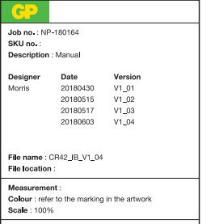

LED Rosso: ricarica in corso
Scollegare il cavo USB a ricarica completa e avvitare il tappo di coda (A) alla torcia
Se si desidera sostituire la batteria svitare la base di r scarica
 Sostituira con una batteria carica assicurandosi di installarla secondo la polarità 
 corretta +/- e sostituire la base di ricarica (B)
 Avvitare saldamente il tapp Operazioni: Operazionii:
• Pressione completa del pulsante -> Alto -> Pressione media del pulsante -> Presentere
• Pressione media de pulsante -> Alto -> Pressione media del pulsantes ->

population and sestinato al uso da parte di bambini picodi o disabili a meno
 prosento ano astinato al uso da parte di bambini picodi o disabili a meno esta provinsional dic

Utilizzare 1 batteria GP Li-ion 18650 con somacoarico e circuito di protezione da
 dispositivo (PCM). Il maneato utilizzo di batterie da populario primerit p
 sperimentare r

Alschio di incendio e usticili, Non ricancare, niscaliale a temperature super
 40 ° C o incenerire. Tenere la batteria fuori dalla portata dei bambini e nella confezioni
 o

ostituzione della batterria
er sostiture la batteria spegnere il fan prima di roda (A) e instalare
uve batteria spegnere il flah prima di rimuovere il tappo di ocda dopo aver

Non gener i discociói el riful indifierezati, usara i serviz di recola diferezita.
 Constitut e le pris ammit

reso tra 0 e 40 °C ed evitar

oal Notare / socitano Cra Datteria.
 Asitaro II toda (A)

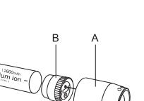

Lea el manual de instrucciones detenidamente antes de usar

Instrucciones de uso

Cargar/cambiar la pila:
2. Aseemoso de la tapa posterior 180 se ha introducido
1. Roomentinen en el compartimento se le littroducido
3. Competimente de Marco USB en

ana manu a a minendo or pilan and programado de conseraction of the conservational di Price
 Liste Corpora moleoda
 Liste of Cargaram collection and polis esté totalmente cor descargada
 Ooloque la pila cargada, teniendo cuidado de esté correctamente colocada según
 las marcas de polaridad +/-, y vuelva a colocar la base de carga (B)
 Atornille f

· Para Enoender/Apagar -> Alto -> Media presión en el internoptor de la tapa posterior
· Presione a fondo el interuptor -> Alto -> Media presión el internuptor -> Every -> Ev

## Instrucciones de seguridad y advertencias

lifíco acciones o ue segun nuad y acuver centrias
Utilios el dispositivo en un rango de temperatura entre o viro la exposición al
calor directo y la luizeolario niños o pers sido supervisadas adecuadamente por una persona responsable para garantizar que 
puedan usarlo de forma segura. Deberá asegurarse de que los niños no jueguen con el 
aparato

Clando se sustituyan las pilas, apague la linterna antes de desencocar la tapa posterio
 (A) e introduzes en el comse en el comse coles correspondiente
 Enroque la tapa pos

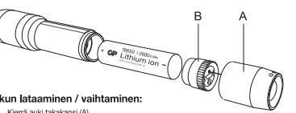

Lue käyttöohjeet huolellisesti ennen käyttöä. Säilytä ohje

Kiemä auki takansi (A)
Varmista, että Li-ion 18650 -akku on asetettu oikein sille kuuluv
Yhdistä Micro- USB:n pää taskulamppuun. Yhdistä USB:n pää
tietokone, varavirtalähde, teenoma, huutii kalandi, SOB pistorubish adopton tar OOD datoitanii
Viihreinerkii lalo:
 Kunainensis lalo:
 Kunaiaus on täysin valmissä
 Kunaiaus on täysin valmis, irrota US

Käyttöohjeet

taskülamppuun
6 – Mikäli haluat vaihtaa akun, kiien kulla, kiinnitään huomiota käytetty akku
7 – Korvaa kiseetty ei kiru uudella, kiinnitäen huomiota akun
8 – Kierrä takakan

## Kävttö:

 Takakannen katkaisimen täytellä painalluksella aikaansaat On/Off-tilan
 Paina kytkintä kokonaan -> High (Kikka) -> Puolikas painalus kylkin -> M
(Keski) > Puolikas painallu syklien toisto)
Vaihtoehtoisesti täysi On/Off-painallus -> jaksottainen toisto

## Turvallisuusohjeet ja varoitukset

 Käytä läitetta 0°C ja 40°C välisessä lämpötilassa. Vältä laitteen altistumista suoralle
 kuumuudelle sekä jatkuvalle auringonvalolle.
 Tämä laite ei sovi käytettäväksi pien asianmukaista valvontaa heistä vastuussa olevalta henkilöltä, joka varmis
turvallisen käytön. Pieniä lapsia tulee valvoa, etteivät he leiki laitteella Älä peitä ajovalaisinta tai aseta sitä alaspäin pintaan, kun valo on päällä

## /!\ Akut

1 x GP Li-ion 18650 -paristoa, jossa on integroitu ylikuormitus- ja
mitussuojausmoduuli (PCM). Jos käytät erillistä GP Li-ion 18650 tusen tuossalit (roin) voi ka kaytat ehilista eli le roi Terrein (sittä tai ron 100)
yttölaitteeseen, se voi vahingoittaa taskulamppua ja / tai paristoja
kea riskejä, jos va Tulipalon ja palovammojen vaara. Ää lataa, pura, kuumenna yli 40 ° C tai polta. Pidä ak
lasten ulottumattomissa ja alkuperäisessä pakkauksessa, kunnes se on valmis
käytettäv

Akun vaihtaminen kaitassasi akkua katkaise ensin viita taskulampusta, ennen kuin imotat siitä takakakaka
4) ja asetat uuden yhteensopivan akun siile tarkoittuun pidikkeeseen. Kunni aikainain

# Instructions d'utilisation Charger / changer la pile

- Dévilser l'embout (A)
 Véiller à ce que la pile Li-ion 18650 soit correctement insérée dans le compartime
 Brancher le néble Micro USB sur la lampe torches Branchez le cable
- source d'allimentation (ordin.
 chargeur de voiture USB)
 Diode d'indication :
- Diode verte : chargement terminé
Diode rouge : chargement en cours
Débrancher le câble USB à la fin du chargement et revisser l'embout (A) sur la lampe

## 6. Pour changer la pile, dévisser la base de chargement (B) et enlever la pile déchargée

## o de sour mplacer par une pile chargée en respectant les polarités +/ et remeitre le provins .
 7

### Fonctionnement : Pression sur l'int ir de l'embou

· Pression complète -> High -> Pression partielle -> Medium -> Pression partielle ->
Low -> Pression partielle -> Eco -> Pression partielle -> SOS (les pressions partielles
r

## nstructions de sécurité et avertissements

 Ultiler est apparel dans une plage de température onte o e tarter e et teritor e inter
 Oct exposition à une chaleur directe et l'a lamire du soles personales 
 Cot apparel nanchoupoou, Les je
pas avec l'appareil bas avec l'appareil.
Ne couvrez pas la lampe frontale et ne placez pas la surface face vers le bas lorsque la l
umière est allumée

## / Piles

Urinez 1 Living BBC ave modele de model de propos di Pulyintegra
 Recel o villiatere serientes on onte de program e ent manare e di Amage ent Amage en Lamara
 Director e cont

Remplacement des piles
Pour changer les piles , étente avant d'enlever l'embout (A) et insére
nouvelles piles dans le competiment Revisser l'embout une fois les ples
importan

Használat előtt figyelmesen olvassa el a használati útmutatót. HU
Őrizze meg az útmutatót a későbbi használathoz

## lasználati útmutató

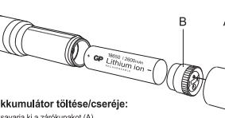

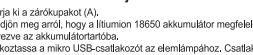

- Cosavarja ki a zárókupakot (A)
 bejözön meg arcól, hogy a más a minusan negfelelően van
 Casalakozassa a milios bronzantozót az elemlámpához. Csatlakoztosás az az
 USB-aliza
- D-jelzőleny.
d LED: Töltés befejeződött
os LED: Töltés folyamatban
- 
- pink LED: Tollós olyánházóan ki az USB-kábelt, és csavarja vissza a zárókupakot
A az ollón línkárásza a kinikárán, savarja vissza a zárókupakot a le a a az
 A ha voltar min
- 
- 
- osobioti a zárókupakon lévő gombot a be-kikig a kapcsolót > Közepes > Közepes >
 Nyomja le téljesen a kapcsolót >> Magas >> Morosokt >> Közepes >>

### Biztonsági utasítások és figyelmeztetések

Biztorisági utasítások és Tigyelmeztetesek
A készüléket 0 és 40 °C közötti hőmérsékleten használja. Óvja a közvellen hötöl és az 
állandó napfénytől

k készüléket kisgyermekek és felügyeletre szoruló személyek csak egy felelős szemé
elügyelete mellett használhatják, aki biztosítja a készülék biztonságos használatát. Ná
ng ongodjó, hogy a hiogyomonok jáloszánan a a fényszórót fejjel lefelé szilárd felületre.

22 Akkumulátorok
 Használjon 18650 akumulátor beépítet túlterhelési és tilterhelési ve
 árankömozulial PCM), Ha nem málik a speciális GP Lión 1860 adhemail.
 szemályanak, a

Tüz és égési veszély Ne töltse fel, ne szerelje szét, ne melegitse fel a 40 ° C-ot, vagy r
egesse el. Az akkumulátort tartsa gyermekektől elzárva és eredeti csomagolásban, a

## Az akkumulátorok cseréje

Az akkumulátorok cseréjekor először kapcsolja ki az elemlámpát, majd vegye le a
zárókupakot (4), és helyezze be az iji akkumulátorokat a korumatkator.
Mittán behelyezte za uj

Перед началом использования фонарика прочитайте раните ин

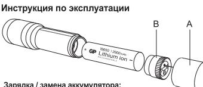

арядка / замена аккумулятора:

Светоции индикатори:
 Средњий света постени посте потрода замлиска (в изведните
 Сречый (А) на Фильма семери авлика семовника (Средионског (Рум
 создавание вариалистратор).

римонение - кажите на перист наведиальным доупова.
 Средник розпости Выполития с Расповат Ресми Расмии А. Ставника
 Средника релику > Вопсименног Расмительског
 Размик ОССС (

Инстрокции по технике безопасности и предупреждени
Инструкции по технике безопасности и предупремпературе от 0 до 400
подвергайте устройство воздействию прямых источников теп одность странтов воздология призования плотолько такончились 
остроследность спортавенных вистования поветиям световать всегиальных
 остросаться сельсовенным сельственным сел

2010 A.K. 2020 (C.C.) 05:10:50 G.m.o.net 2010 March 2010 000 M.
1980 Marc 2010 00:10 PM 0.000 March 2010 March 2010 M.
2000 Minus Comments 2010 Section 2010 Personal Propon

Замена аккумулятора
Перед заменой аккумулятора вык ка выключите фонарик, затем отвинтите крыш
тор в отсек для аккумулятора. После правиль
Сотретствии с маркировкой поддруюсти (+) и ( овите новый акхумулятор в отоек для аккумулятора. После правильной
оеки ажумулятора в состветствии с маркироекой полярности (+) и (-) на а
тулятора завинтите крышку. При уста

(

## Läs instruktionerna noggrant före användning. Spara
denna manual för framtida bruk

## Bruksanvisning

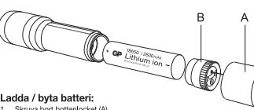

- Ladda / bytta batteri:
1 . Skruva bottenlocket (A)
2 . Kontrollera att Li-ion 18650 batteriet är korrekt placerat i batterihållare
3 . Koslut Micro USB till förklam
- 
- 
- Grön LED: Laddning slutförd
 Röd LED: Laddning pågår
 Koppla bort USB-kabeln när enheten är fulladdad och skruva tillbaka bottenlock
- (A) på ficklampan
 Vid byte av batteri, skruva bort laddningsdelen (B) och ta bort det urladdade
- 
- Datteriet

Andvändnings:
• • Tiyok ner knappen pat het tor Parkeappen halvvägs - > Medium -> Tyck
• • Tiyok markmalar -> Lâg -> Tiyck ner krappen halvvägs -> Tiyok ne -> Tiyok ne Kriste

SäkerhetsföreSkrifter och varningar
Amänd enheiner mellan 0 och 40°C och undvik exponeing för direkt
värmänden i kemperaturer mellan 0 och 40°C och under andersideren mindere

## inteler.
äck inte på strålkastaren eller ställ den nedåt på ytan när lampan tänds

A Batterier Apvilad 1 x GP Li-on 18850-batter med interestad oreladoringsshydders modul
arplikatinselihean land illustralian colodar barteriorian
Karupplera rakadato electronical manusa

### Byta batterier

lär du byter batterier i korsta av ficklampan innan du tar bottenlocket (A) oc
nstallera nya batterier i komkillare När batterierna har blivit korrekt installeringslati meta

Elektriska aparater får nto kasas tilsammans mod osorløral vannas till en ska lämnas till en
a aleriningstallon. Korlekta bikan mod presenter om tilgård jog skerinningsresses

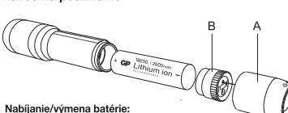

Pred použitím si dôkladne prečítajte návod na používanie

- Nabíjanie/výmena i batérie:
 1. Zdastitlopnéhovali litivovo-jhovej batérie 18650 do držiaka batéria
 3. Korokornikou Uržava-jorovej batéria Koncovku USB pripojite
CR42 Flashlight

Instruction Manual

- 
- 

(SE)

- 
Prevádzka:

A Batérie

Návod na používanie

- EED molikator svieli:
 Zelemá LED: Nabijanie je ukončené
 Po úplanie liti odpojte USB kábel a naskrutkujte uzáver (A) na baterku.
 Voličití baterie vymeniť batériu, odskrutk
- vybliu batehu.
 Nahradte ju nabitou batériou, zabezpečte vloženie so správnou polaritou +/- a
 namontujte nablicu základňu (B).
 Bezpečne naskrutkujte uzáver

revratuzia.
 Priné stlacte vypinača -> Vysokézie -> Polovičné stlačenia vypínača -> Stranice -> Strande -> Strande -> Polovičné stlačenie vypínača ->
 Polovičné stlačenie vyp

Bezpečnostné pokyny a výstrahy
Zariadenie používajte v rozsahu teplôt od 0 °C do 40 °C a nevystavujte ho priam
obsobeniu tepla a slnečného žiarenia

Tento vyrobok nie je určený na hranie pre malé deti a slabe osoby, pokial tieto nie se se
 dohľadom, aby sa zabezpečilo bezpečné používanie výrobku. Malé deti musice neusien

2 - 3 Dateriu s internes in modelom oshany proficeres are are arean a
 použite TV Katorialski link se maits arket dovers postitudente anderes ander
 može doško a vyškimi Ne

ý v rocho botéci ne 
ríslino batérií a jov vypnite svietidlo, potom odskutkujte uzáver (A) a do
ríslušného dětiki obaticí vložile nové batérii, Povyběení, naskrutkujte uzáve

Elektrické zariadnía nevyhadzuje do komunikného odpaduje info zberne tindoníh
 odpadu hómicio o zberních miestnomirado. Ak sa elektrické zárádní dikülyűvű

o výrobok nie je určený na hranie pre malé deti a slabé osoby, pokiaľ tieto nie sú r