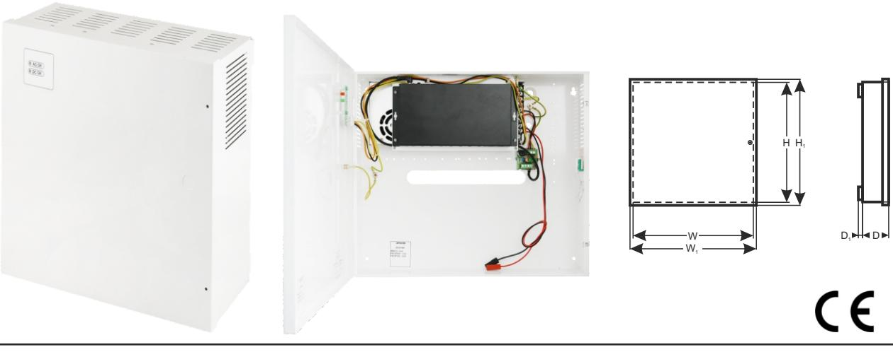

*Pulsar* ®

#### **APS108** v.1.0/I **APS108 10-port switch 8x30W med reservkraft** PRODUKTKODE TYP: :

# **Features:**

- · Avbrottsfri strömförsörjning för 8 IP-enheter (54 V DC)
- · Switch med 10 portar 8 PoE-portar 10/100Mb/s, (data och strömförsörjning) 2 portar 10/100Mb/s (UpLink)
- · Läge med **Lång räckvidd** (upp till 250m)
- · 30 W för varje PoE-port, stöder enheter som uppfyller standarden IEEE802.3af/at vid **(PoE +)**
- · Lysdioder för indikering
- · Metallhölje färg vit RAL 9003 med plats för fyra 7 Ah/12 V-batterier
- · Stöder automatisk inlärning och automatiskt åldrande av MAC-adresser (1K storlek)

## **BESKRIVNING**

APS108 är avsedd för avbrottsfri strömförsörjning av 8 IP-enheter (54 V DC-försörjning).

Systemets huvudsakliga komponenter inkluderar:

- PoE-switch med 10 portar
- 54 V (PSB-3004850) buffertströmförsörjning med fyra 7 Ah / 12V-batterier

wyjście TAMPER : przewody 30cm

Vid strömavbrott aktiveras omedelbart reservkraft (batterier)

 Automatisk upptäckt av enheter som drivs med standarden PoE/PoE+ aktiveras vid portar 1-8 på switchen. Up Link-portarna används för anslutning till en annan nätverksenhet. Lysdioderna på frontpanelen indikerar enhetens driftsstatus.

 Switchen sitter inuti ett metallhölje (färg RAL 9003) med plats för fyra 7 Ah/12 V-batterier. Höljet är utrustat med en sabotageswitch som aktiveras om luckan öppnas (frontpanelen). APS108 är försedd med två lysdioder på frontpanelen (röd lysdiod - indikerar en 230 V matningsspänning, grön lysdiod indikerar likspänning).

## **SWITCHENS PARAMETRAR**

| Portar                    | 10 portar 10/100Mb/s (8 st PoE + 2 st UPPLÄNKAR)                          |
|---------------------------|---------------------------------------------------------------------------|
|                           | med automatisk hantering av anslutningshastighet och MDI/MDIX Auto Cross) |
| PoE-strömförsörjning      | IEEE 802.3af/at (Port 1 till 8 ), 54 V DC / 30 W i varje port *           |
| Läge med lång räckvidd | Lång räckvidd, VLAN                                                       |
| Protokoll, standarder     | IEEE802.3, 802.3u, 802.3x CSMA/CD, TCP/IP                                 |
| Bandbredd                 | 1,6 Gbps                                                                  |
| Överföringsmetod          | Lagra-och-vidarebefordra                                                  |
|                           | Switchens strömförsörjning;                                               |
| Synlig driftsindikering   | Länk/Act;                                                                 |
|                           | PoE-status                                                                |

* 30 W per port är maximal belastning per port, total är maximal belastning 240 W på samtliga portar.

För maximal livslängd rekommenderas en kontinuerlig belastning på maximalt 160 W.

#### **ELEKTRISKA PARAMETRAR**

| Nätförsörjning                       | ~200-240 V; 50 Hz                                    |
|--------------------------------------|------------------------------------------------------|
| Strömstyrka upp till                 | 1,5 A                                                |
| Strömförsörjning                     | 267 W                                                |
| Utgångsström vid PoE-portarna (RJ45) | 8 x 0,6 A ΣI=4,5 A (max.)                            |
| Utgångsström vid PoE-portarna (RJ45) | 54 V DC                                              |
| Kortslutningsskydd SCP och           | 105% ÷ 150% PSU-effekt, automatisk retur             |
| överbelastningsskydd OLP             | (felet kräver frånkoppling av utgångskretsen för DC) |
| PSU-strömförbrukning                 | 230 mA/54 V DC                                       |
| Batteriets laddningsström            | 0,5 A max. /4st 7 Ah (+/-5%)                         |
| Batterikretsskydd SCP och retur      | säkring                                              |
| polaritetsanslutning                 |                                                      |
| Djupurladdningsskydd UVP             | U<38 V (± 5%) – frånkoppling av batterier            |
| Sabotageskydd:                       |                                                      |
| - MANIPULERINGS-indikator när höljet | - mikroswitch, NC-kontakter (stängt hölje),          |
| öppnas                               | 0,5 A@50 V DC (max.)                                 |

### **MEKANISKA PARAMETRAR**

| Mått                | W=397, H=350, D+D1=92+8 [+/- 2mm] W1=402, H1=355 [+/- 2mm]         |
|---------------------|-----------------------------------------------------------------------|
| Batterifackets mått | 370 x 180 x 80mm (WxHxD) max                                          |
| Brutto- / nettovikt | 5,1 / 5,4 kg                                                          |
| Hölje               | Stålplatta, DC01 1,0mm färg vit RAL 9003                              |
| Förslutning         | Spårskruv x 2 (fram), (låsaggregat möjligt)                           |
| Anslutningar        | Strömförsörjning till enheterna: RJ45-uttag                           |
|                     | 230 V-ingång: Φ 0,63-2,50 (AWG 22-10),                                |
|                     | Batteriutgång BAT: 6,3F-2,5                                           |
|                     | MANIPULERINGS-utgång: ledningar                                       |
| OBS!                | Höljet ska inte vidröra monteringsytan för att kablar ska kunna dras. |

wyjście TAMPER : przewody 30cm