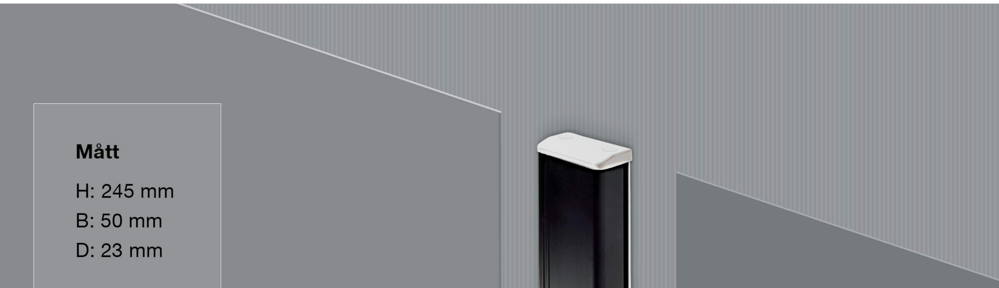
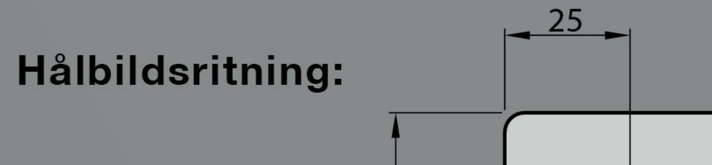
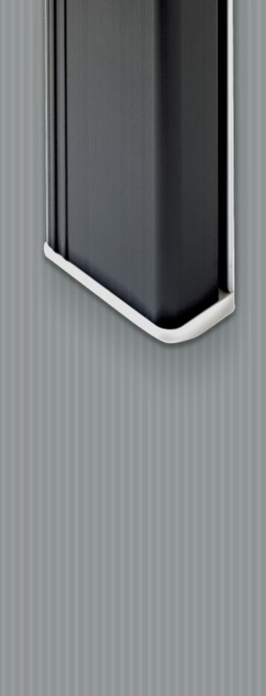
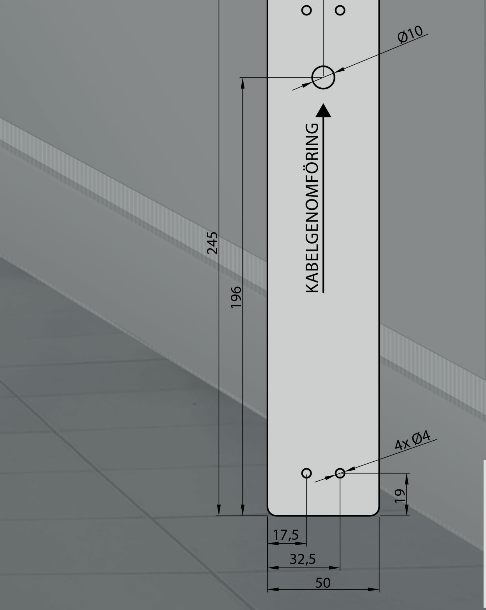

# Tekniskt produktblad JCK255

Mikrobrytare 1 st NO IP klass: IP67 Nominell märkström från: 0,1 A - 10 A/250 V AC Lägsta märkström 1mA/4 V DC

Material: Alu.6060-T6 POM Plast (Acetalplast)

### Rengöring:

Kontakten går att rengöra med alla förekommande rengöringsmedel.

Tillval:

### Går att beställa med:

- * 2 Mikrobrytare
- * NO/NC Mikrobrytare
- * Radiostyrning
- * Universiella symboler:

1. Dörrsymbol

2. Rullstolsymbol

3. Hissymbol

### * Kontrastränder

## OBS.

Vid utomhusmontage bör ett 3mm dräneringshål borras i den nedre gaveln på armbågskontakten för att dränera ut eventuell fukt.

JC Kontakter AB | Karl Johansgatan 152 | SE-414 51 | Göteborg | Tel: 031-24 11 09 | info@jckontakter.se www.jckontakter.se