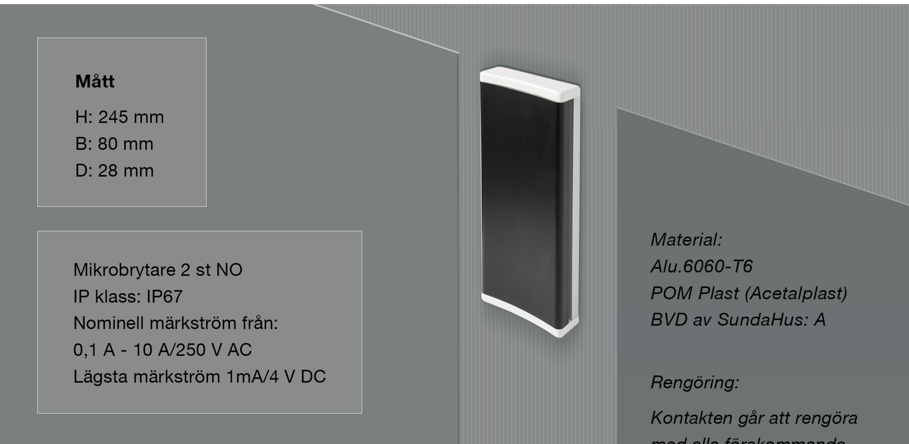
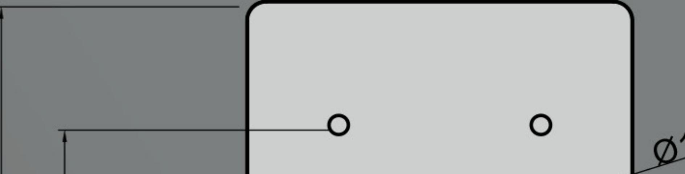

# Tekniskt produktblad JCK118.245

## Hålbildsritningar:

med alla förekommande rengöringsmedel.

Tillval:

- 
- 
- 
- 

### OBS.

Vid utomhusmontage bör ett 3mm dräner gaveln på armbågskontakten för att dränera ut eventuell fukt.

JC Kontakter AB | Karl Johansgatan 152 | SE-414 51 Göteborg I Tel: 031-24 11 09 info@jckontakter.se www.jckontakter.se