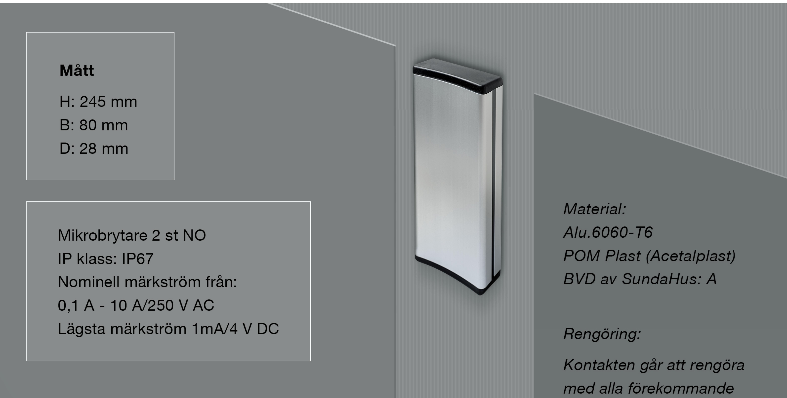
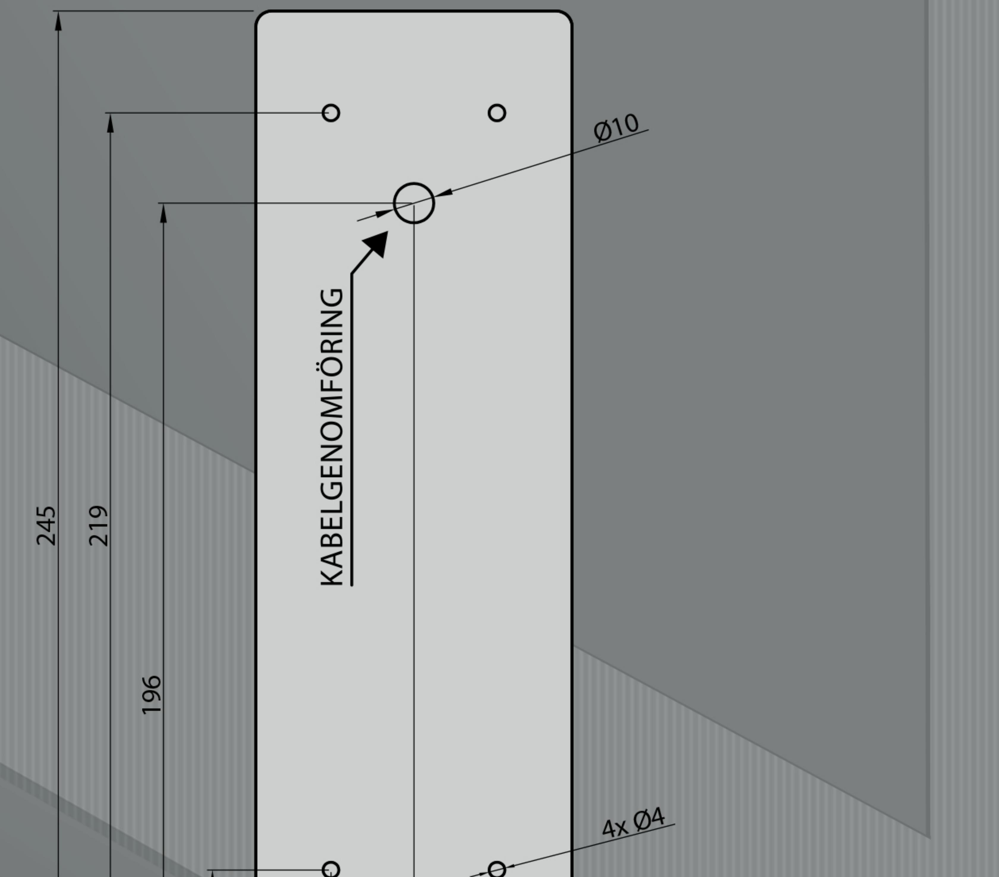
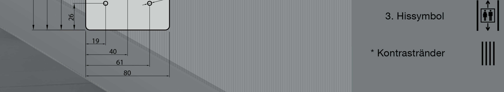

# Tekniskt produktblad JCK108.245

## Version 002

### Hålbildsritningar:

rengöringsmedel.

Tillval:

Går att beställa med:

- * NO/NC Mikrobrytare
- * Radiostyrning
- * Styrenhet med 2 utgångar
- * Universiella symboler:

2. Rullstolsymbol

### OBS.

Vid utomhusmontage bör ett 3mm dräneringshål borras i den nedre gaveln på armbågskontakten för att dränera ut eventuell fukt.

JC Kontakter AB | Karl Johansgatan 152 | SE-414 51 Göteborg I Tel: 031-24 11 09 info@jckontakter.se www.jckontakter.se