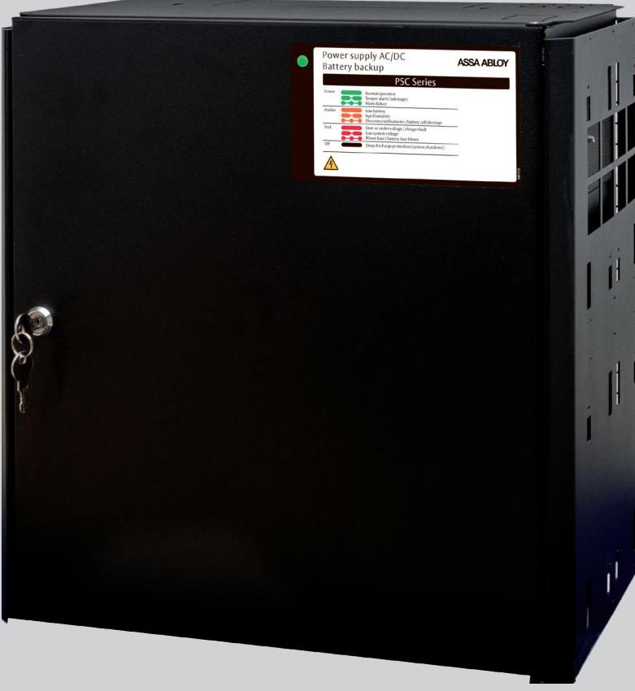

## ASSA ABLOY 15PSC L

### Kommunicerande och SSF1014 godkänd 24V/15A nätaggregat med batteribackup

ASSA ABLOY 15PSC L är en smart batteribackuplösning som är larmgodkänd enligt SSF1014 & systemcertifierad tillsammans med ASSA ABLOY ARX.

Enheten kommuniceras via ASSA ABLOY ARX som övervakar status på batteribackupen t.ex aktuell strömförbrukning, historik över dygnet, temperatur så den inte blir för varm eller kall, fördröjt nätbortfall för att undvika falsklarm och batterikapacitet för att kunna larma när batterierna börjar ta slut i anläggningen.

15PSC L har skydd mot överlast, överspänning, övertemperatur, kortslutning och djupurladdning, den erbjuder även s.k. intelligent laddning vilket genom att koppla från batterierna när de är fulladdade och sedan periodiskt ladda batterierna kan förlänga livslängden på batteriet med upp till 50%. ASSA ABLOY 15PSC L kopplas till ARX via RS485 till 9016III MIO6-6 eller 9016III MIO-Slave. 9016 MIO6-6 eller 9016III MIO-Slave kan hantera upp till åtta stycken batteribackuper på slinga. I ARX är det sedan lätt att programmera enheten och kräver inga ingångslicenser.

Batteribackupen har en välbeprövad design i svartlackerad plåt med tydlig lysdiodsindikering för statusinformation på skåpsfronten. Enheten monteras enkelt på en vägg eller i rack med de inkluderade montagevinklarna.

ASSA ABLOY 15PSC L har plats för upp till 2 st 45Ah batterier och kan vid behov kompletteras med en batteribox – ASSA ABLOY BB for PSC. Batteriboxen placeras under nätaggregatet och kopplas enkelt ihop med inkluderad kabel. I batteriboxen ryms upp till 2x 45Ah batterier.

# ASSA ABLOY 15PSC L

## Kommunicerande och SSF1014 godkänd 24V/15A nätaggregat med batteribackup

#### **Data**

- Inspänning: 170-264VAC
- Stabiliserad utspänning: 27,3VDC
- Maximal belastning: 15A
- Temperaturområde: +5 °C +40 °C
- IP-klassning: IP32

#### **Mått och vikt**

| Höjd       | 444mm |
|------------|-------|
| Bredd      | 436mm |
| Djup       | 210mm |
| Nettovikt: | 15kg  |

- Skydd mot överlast, överspänning, övertemperatur, kortslutning och djupurladdning
- Larmgodkänd: SSF 1014, utgåva 4 Larmklass 3
- SBSC-intyg 16-130

#### **Möjlig medellast enligt SSF1014:**

Exkl. batteribox: Larmklass 1/2: 3,7A. Larmklass 3/4: 1,5A Inkl. 1x batteribox: Larmklass 1/2: 7,4A, Larmklass 3/4: 3A Inkl. 2x batteribox: Larmklass 1/2: 11,1A, Larmklass 3/4: 4,4A

#### **Följande status kan visas i ASSA ABLOY ARX**

- Aktuell strömförbrukning
- Strömförbrukning senaste minuten (medelvärde)
- Strömförbrukning senaste dygnet (medelvärde)
- Max uppmätt strömförbrukning
- Överbelastning i antal minuter
- Antal dagar där belastningen är över 80 %
- Systemspänning
- Max systemspänning
- Min systemspänning
- Max uppmätt temperatur
- Min uppmätt temperatur
- Ackumulerad tid för hög temperatur
- Max kontinuerlig ström i batteribackup (ampere)
- Inställd tid fördröjt nätbortfallarm
- Inställt spänningsvärde för låg batterispänning
- Inställt spänningsvärde för batteritest
- Installerad batterikapacitet
- Inställt larmvärde när batteri börjar ta slut
- Sabotage
- Kommunikation

#### **Artikelnummer**

- ASSA ABLOY 15PSC L: S55299315165
#### **Tillbehör**

- Batteribox ASSA ABLOY BB for PSC: S55299300165
- Batteri 12V, 45Ah, 10-12 år S511107084

We reserve the right to correct any printing errors and update the information after printing.

ASSA ABLOY Opening Solutions Sweden P.O. Box 371 SE-631 05 Eskilstuna Sweden Phone +46 (0)16 17 70 00 Fax +46 (0)16 17 70 49 Customer support:

Phone intl. +46 (0)16 17 71 00 Phone nat. 0771-640 640 Fax +46 (0)16 17 73 72 e-mail: helpdesk.se.openingsolutions@assaabloy.com www.assaabloyopeningsolutions.se