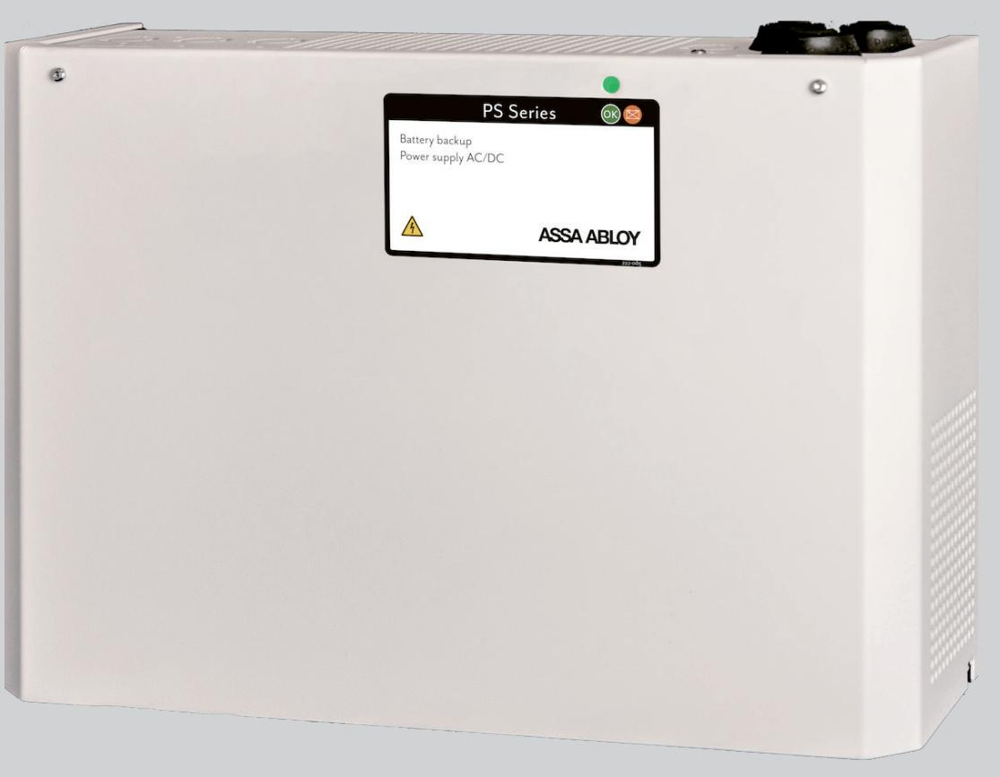

## ASSA ABLOY 10PS

## 24V/10A Nätaggregat med batteribackup

ASSA ABLOY 10PS är ett nätaggregat med inbyggd batteribackup för passersystem.

Enheten har en välbeprövad design i vitlackerad plåt med tydlig lysdiodsindikering för statusinformation på skåpsfronten. Enheten monteras enkelt på en vägg.

10PS har skydd mot överlast, överspänning, övertemperatur, kortslutning och djupurladdning, den erbjuder även kontrollerad laddning vilket förhindrar överladdning av batterierna och därför förlängs livslängden avsevärt.

Nätaggregatet har som standard ett larmrelä för nätbortfall. Nätbortfallslarmet kan fördröjas så att det aktiveras först när batteriernas kapacitet sänkts från 26,5V till 24V, detta för att undvika falsklarm vid korta nätbortfall.

ASSA ABLOY 10PS har plats för upp till 2 st 14Ah batterier och kan vid behov kompletteras med en batteribox – ASSA ABLOY BB. Batteriboxen placeras under nätaggregatet och kopplas enkelt ihop med inkluderad kabel. I batteriboxen ryms upp till 4x 14Ah batterier.

# ASSA ABLOY 10PS

## 24V/10A Nätaggregat med batteribackup

#### **Tekniska data**

- Inspänning: 110-264VAC
- Stabiliserad utspänning: 27,3VDC
- Maximal belastning: 10A
- Temperaturområde: +5 °C 40 °C
- IP-klassning: IP20

| • Mått |       |
|--------|-------|
| Höjd   | 242mm |
| Bredd  | 350mm |
| Djup   | 150mm |

- Nettovikt: 5kg
- Primärswitchteknik
- Skydd mot överlast, överspänning, övertemperatur, kort¬ slutning och djupurladdning
- Larmfunktion som standard för nättavbrott alternativt låg batterispänning (1 utgång)

#### **Artikelnummer**

- ASSA ABLOY 10PS: S55299210165
### **Tillbehör**

- Batteribox ASSA ABLOY BB: S55299200165
- Batteri 12V, 7Ah, 3-5 år S511100084
- Batteri 12V, 12Ah, 3-5 år S511102084

M4313.2006

ASSA ABLOY Opening Solutions Sweden P.O. Box 371 SE-631 05 Eskilstuna Sweden Phone +46 (0)16 17 70 00 Fax +46 (0)16 17 70 49

Customer support: Phone intl. +46 (0)16 17 71 00 Phone nat. 0771-640 640 Fax +46 (0)16 17 73 72 e-mail: helpdesk.se.openingsolutions@assaabloy.com www.assaabloyopeningsolutions.se