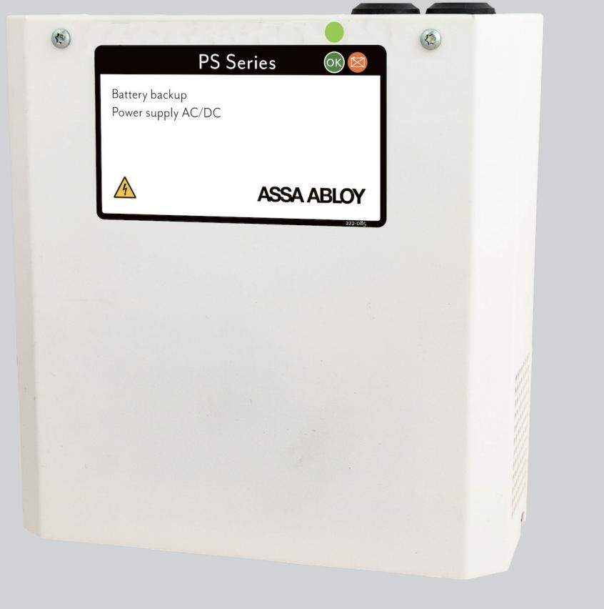

## ASSA ABLOY 3PS

### 24V/3A nätaggregat och batteribackup

ASSA ABLOY 3PS är ett nätaggregat med inbyggd batteribackup för små passersystem eller magneter, kodlås och slutbleck.

3PS har en välbeprövad design i vitlackerad plåt med tydlig lysdiodsindikering med statusinformation på skåpsfronten. Enheten monteras enkelt på en vägg och inkluderar 2x2,3Ah batterier.

3PS har skydd mot överlast, överspänning, övertemperatur, kortslutning och djupurladdning, den erbjuder även kontrollerad laddning vilket förhindrar överladdning av batterierna och därför förlängs livslängden avsevärt.

Nätaggregatet har som standard ett larmrelä för nätbortfall. Nätbortfallslarmet kan fördröjas så att det aktiveras först när batteriernas kapacitet sänkts från 26,5V till 24V, detta för att undvika falsklarm vid korta nätbortfall.

# ASSA ABLOY 3PS

## 24V/3A nätaggregat och batteribackup

#### **Tekniska data**

- Inspänning: 110-264VAC
- Stabiliserad utspänning: 27,3VDC
- Maximal belastning: 3A
- Temperaturområde: +5 °C 40 °C
- IP-klassning: IP20
- Mått

| Höjd  | 230mm |
|-------|-------|
| Bredd | 216mm |
| Djup  | 85mm  |

- Nettovikt: 3kg
- Primärswitchteknik
- Skydd mot överlast, överspänning, övertemperatur, kortslutning och djupurladdning
- Larmfunktion som standard för nätavbrott alternativt låg batterispänning (1 utgång)
- Artikelnummer: S55299203165

ASSA ABLOY Opening Solutions Sweden P.O. Box 371 SE-631 05 Eskilstuna Sweden Phone +46 (0)16 17 70 00 Fax +46 (0)16 17 70 49

Customer support: Phone intl. +46 (0)16 17 71 00 Phone nat. 0771-640 640 Fax +46 (0)16 17 73 72 e-mail: helpdesk.se.openingsolutions@assaabloy.com www.assaabloyopeningsolutions.se