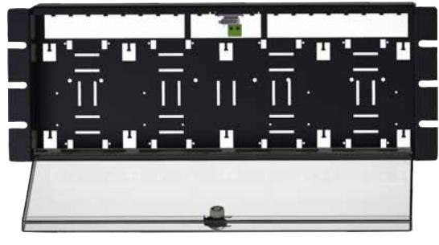
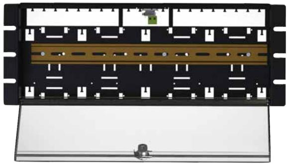
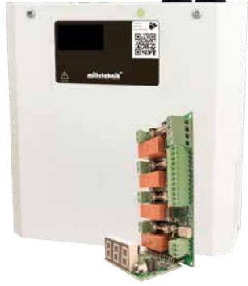
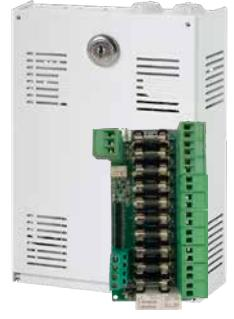
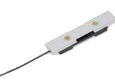

## **Tillbehör avsäkringskort och larmdonsövervakningskort**

19 rack module holder

19 rack DIN module holder

Fire module 4 outputs S

10 output module Mini

DIN module holder

| Produktbeskrvining:            |                                                                                                                                                                                                                                                                                                                                                                                                                                                                                                                                                                                                                                                   |                           |                         |                       |                   |
|--------------------------------|---------------------------------------------------------------------------------------------------------------------------------------------------------------------------------------------------------------------------------------------------------------------------------------------------------------------------------------------------------------------------------------------------------------------------------------------------------------------------------------------------------------------------------------------------------------------------------------------------------------------------------------------------|---------------------------|-------------------------|-----------------------|-------------------|
| 19 rack module holder          | Modul för montering av upp till; 8x 2+2 output module & eller 8x 5 output module & eller 8x DC converter 24V-12V2A & eller 8x DC converter 24V-12V 6A & eller 4x 10 output module & eller 4x Fire module 4 outputs. Kapslingen erbjuder också plats för Linjators L-moduler, t.ex kopplingsplintar eller Sentrion DSS moduler. Kablage stripas i kapslingens ryggparti, vid väggmontage erhålls en distans om 20 mm emot vägg. Kapslingen levereras inkl. låsbart lock i plexiglas samt sabotagekontakt. För montering i 19 rack alternativt på vägg (vändbara vinklar medföljer). Som standard levere ras produkten för rackmontage. |                           |                         |                       |                   |
| 19 rack DIN module holder      | Modul för montering av upp till 20 st automatsäkringar eller andra produkter för DIN montage. Kablage stripas i kapslingens ryggparti, vid väggmontage erhålls en distans om 20 mm emot vägg. Kapslingen levereras inkl. låsbart lock i plexiglas samt sabotagekontakt. För montering i 19 rack alternativt på vägg (vändbara vinklar medföljer). Som standard levereras produkten för rackmontage.                                                                                                                                                                                                                                         |                           |                         |                       |                   |
| Fire module 4 outputs S        | Larmdonsövervakningskort Fire module 4 outputs som levereras monterad i kapsling. Kapslingen levereras med en modul monterad och kan utökas med ytterligare ett tillval av typ Fire module 4 outputs eller avsäkringskort 10 output module. Kapslingen är avsedd för väggmontage.                                                                                                                                                                                                                                                                                                                                                              |                           |                         |                       |                   |
| 10 output module Mini          | Avsäkringskort 10 output module som levereras i en låsbar kapsling. Kapslingen levereras med en modul monterad och kan utökas med ytterligare ett avsäkringskort 10 output module. Kapslingen är avsedd för väggmontage.                                                                                                                                                                                                                                                                                                                                                                                                                       |                           |                         |                       |                   |
| DIN module holder              | Används för att montera; 2 output module, 5 output module,DC converter 24V-12V2A eller DC converter 24V-12V 6A på DIN skena.                                                                                                                                                                                                                                                                                                                                                                                                                                                                                                                      |                           |                         |                       |                   |
| Rekommenderad miljö och mått:  | 19 rack module holder                                                                                                                                                                                                                                                                                                                                                                                                                                                                                                                                                                                                                             | 19 rack DIN module holder | Fire module 4 outputs S | 10 output module Mini | DIN module holder |
| Rekommenderad miljö:           | Miljöklass 1, Inomhus, 20% ~ 90% relativ fuktighet                                                                                                                                                                                                                                                                                                                                                                                                                                                                                                                                                                                                |                           |                         |                       |                   |
| Omgivningstemperatur:          |                                                                                                                                                                                                                                                                                                                                                                                                                                                                                                                                                                                                                                                   |                           | +5 °C - 40 °C           |                       |                   |
| Dimension (HxBxD):             | 173x482x108mm (4HE) vid rackmontage, ytterligare 20mm djup vid väggmontage                                                                                                                                                                                                                                                                                                                                                                                                                                                                                                                                                                     |                           | 230x216x85mm            | 200x146x57mm          | 10x25x100mm       |
| Artikelnamn:                   | 19 rack module holder                                                                                                                                                                                                                                                                                                                                                                                                                                                                                                                                                                                                                             | 19 rack DIN module holder | Fire module 4 outputs S | 10 output module Mini | DIN module holder |
| Artikelnummer:                 | 4U010000P00019P01                                                                                                                                                                                                                                                                                                                                                                                                                                                                                                                                                                                                                                 | 4U01000P00019P01D         | SM01FU002404FS01        | MI01FU002410OP01      | A-0000000DIN01    |
| E-nummer:                      | 5001063                                                                                                                                                                                                                                                                                                                                                                                                                                                                                                                                                                                                                                           | 5001064                   | 5257468                 | 5213622               | 5213623           |
| Produkten möter kraven enligt: | EMC Directive 2014/30EU, Low Voltage directive: 2014/35/EU CE directive according to 765/2008, Emission: EN61000-6-:2001, EN55022:1998:-A1:2000, A2:2003 Klass B, EN61000-3-2:2001. Immunity: EN61000-6-2:2005, EN61000-4-2, -3, 4, -5, -6, -11.                                                                                                                                                                                                                                                                                                                                                                                               |                           |                         |                       |                   |
| Garantiperiod:                 | 2 år                                                                                                                                                                                                                                                                                                                                                                                                                                                                                                                                                                                                                                              |                           |                         |                       | 2 år              |
| Designad och producerad av:    | Milleteknik AB                                                                                                                                                                                                                                                                                                                                                                                                                                                                                                                                                                                                                                    |                           |                         |                       | Linjator          |
| Ursprungsland:                 | Sverige                                                                                                                                                                                                                                                                                                                                                                                                                                                                                                                                                                                                                                           |                           |                         |                       | Sverige           |
|                                |                                                                                                                                                                                                                                                                                                                                                                                                                                                                                                                                                                                                                                                   |                           |                         |                       |                   |

POWER SUPPLIES - MADE IN SWEDEN

**Milleteknik AB** Ögärdesvägen 8B 433 30 Partille Sweden

För order: order@milleteknik.se För sälj support: sales@milleteknik.se För teknisk support: support@milleteknik.se Telefonnummer: +46 31 34 00 230