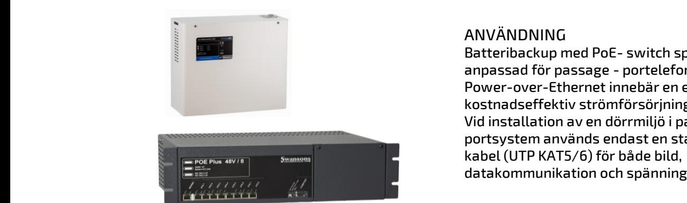
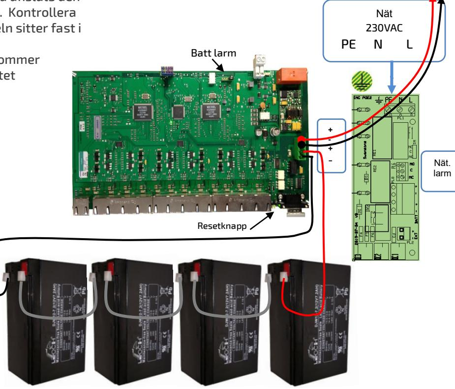
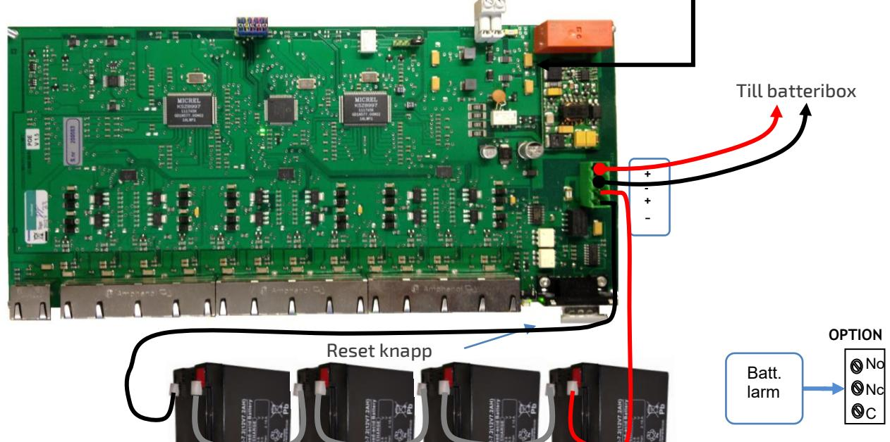

#### Skydd:

Aggregatet är skyddad mot överbelastning och kortslutning. Inbyggt skydd mot djup-urladdning av batterierna. Nät, last och batteri skyddas av säkringar.

#### Indikeringar och larm:

Nätspänning indikeras med grön lysdiod på fronten och batterifellarm med röd blinkande lysdiod. Behöver kompletteras med plintkablage för att vidarekoppla larm.

### TEKNISKA DATA

Inspänning 88-265VAC +/- 15% 1 fas 50-60Hz Reglering max 0,6 % Batterispänn. 48VDC (54,6V) Temp.omr- -10 – +30C

### IEEE 802.3at/ IEEE802.3af

100 MBIT/ kanal CE-märkt enligt *EN61000-6-3:2001 EN61000-6-2:2005.*

## ANVÄNDNING

Batteribackup med PoE- switch speciellt anpassad för passage - portelefon och bilder. Power-over-Ethernet innebär en enkelt, säker och kostnadseffektiv strömförsörjning i ett nätverk. Vid installation av en dörrmiljö i passer - eller portsystem används endast en standard ethernet kabel (UTP KAT5/6) för både bild, datakommunikation och spänningsmatning.

Högeffektiv – 85% vid nätdrift – 98% vid batteridrift High Power – 30W/utgång - kontinuerlig drift på alla portar samtidigt. Övervakad batteriladdare – hög säkerhet. Batterier, nät och utgångar övervakade med larmrelä, LED indikering.

#### UTFÖRANDE:

POE-48/xx 30W/port, IEEE802.3at, PoE Plus är en strömförsörjning med batteriladdare, batterier och switch i en enhet. Uppfyller både IEEE802.3af och IEEE802.3at. och kan för närvarande tillåta upp till 30W/port. Finns både för 19" rack och väggmontage samt med 4-36 portar, med inbyggd batteribackup. Bestyckad med ett RJ45 8-pol uttag utöver det ordinarie portantalet som är avsett att användas som ingång (utan POE). Övriga portar är RJ45 8 pol som är försedda med led för datatrafik och status.

| E-Nummer | Typ         | Beskrivning                                       | HxBxD mm    |
|----------|-------------|---------------------------------------------------|-------------|
| 5172434  | POE48- 4/R  | POE 48V 150W 4 PORTAR 19" max 4x 9Ah        | 132x480x320 |
| 5172435  | POE48- 8/R  | POE 48V 320W 8 PORTAR 19" max 4x 9Ah        | 132x480x320 |
| 5172436  | POE48- 12/R | POE 48V 500W 12 PORTAR 19" max 4x9Ah           | 132x480x320 |
| 5172437  | POE48- 24/R | POE 48V 600W 23 PORTAR 19" max 4x9Ah           | 132x480x320 |
|          |             |                                                   |             |
| 5172431  | POE48- 4/V  | POE 48V 150W 4 PORTAR VÄGGMONTAGE max 4x9Ah    | 320x390x160 |
| 5172432  | POE48- 8/V  | POE 48V 320W 8 PORTAR VÄGGMONTAGE max 4x9Ah    | 320x390x160 |
| 5172433  | POE48- 12/V | POE 48V 600W 12 PORTAR VÄGGMONTAGE max 4x9Ah   | 320x390x160 |
|          | SBX197      | Batteribox 3 19" max 8x 7-9Ah m säkring o kablage | 132x480x320 |

Postadress/Postal address **Swansons Telemekanik AB** Hålstensvägen 4 SE-446 37 Älvängen

Telefon nr/Telephone no +46(0)303-746 320 Hemsida/Webb www.swtm.se e-post info@swtm.se VAT.NO SE556289017701

# INKOPPLING AV BATTERI

Batterierna (4st 12V max 9Ah) placeras på botten i enheten och kopplas i serie till 48V vilket är systemspänningen.

Det färdiga kablaget, en röd/svart som är kopplad till en plint och tre lösa batteribyglar. Anslut den svarta kabeln, från plinten till minus på det första batteriet och en batteribygel till plus på batteriet. Ställ batteriet i botten. Anslut den fria kabeländan på batteribygeln till nästa batteris minuspol och ta en ny batteribygel och anslut till plus på batteriet. Gör så på alla batterier och på det sista batteriet så ansluts den röda kabeln till plus på det batteriet. Kontrollera att den gröna plinten på batterikabeln sitter fast i sin hållare.

Nu är batterierna installerade och kommer automatiskt kopplas in när aggregatet spänningssatts.

Kom ihåg att batterier är alltid elektrokemiskt aktiva. Kortslut inte batteripolerna.

# Väggmodellen

# INKOPPLING OCH START

- Montera aggregatet fritt. Minst 40mm på varje sida.
- Anslut batterierna enligt beskrivningen till vänster.
- Anslut sedan 230V AC på plinten.
- Grön lysdiod för nätspänning tänds. Den röda lysdioden kommer att börja blinka efter några sekunder – tryck in den vita resetknappen för att bekräfta installationen.
- Kontrollera gärna laddningsspänningen. Spänningsjustering görs direkt på likriktaren.
- Om lysdiod för nätindikering ej tänds kontrollera inspänning och ingångssäkringarna.
- Löser utgångssäkringarna, kontrollera inkoppling och inkopplade apparater.

Postadress/Postal address **Swansons Telemekanik AB** Hålstensvägen 4 SE-446 37 Älvängen

Telefon nr/Telephone no +46(0)303-746 320 Hemsida/Webb www.swtm.se e-post

info@swtm.se

VAT.NO SE556289017701

**Till batteribox**

# Rackmodellen

# INKOPPLING AV BATTERI

Batterierna (4st 12V max 9Ah) placeras bakom luckan till höger på enheten och kopplas i serie till 48V vilket är systemspänningen.

Luckan öppnas med de två skruvarna upptill och fälls ned. Där bakom ligger batterikablarna, en röd/svart som är kopplad till en plint och tre lösa batteribyglar.

Anslut den svarta kabeln, från plinten till minus på det första batteriet och en batteribygel till plus på batteriet. Skjut in försiktigt in det i luckan. Anslut den fria kabeländan på batteribygeln till nästa batteris minuspol och ta en ny batteribygel och anslut till plus på batteriet. Gör så på alla batterier och på det sista batteriet så ansluts den röda kabeln till plus på det batteriet. Kontrollera att den gröna plinten på batterikabeln sitter fast i sin hållare.

Nu är batterierna installerade och kommer automatiskt kopplas in när aggregatet spänningssatts.

Kom ihåg att batterier är alltid elektrokemiskt aktiva. Kortslut inte batteripolerna.

# INKOPPLING OCH START

- Montera aggregatet fritt. Minst 40mm på varje sida.
- Anslut batterierna enligt beskrivningen till vänster.
- Anslut sedan 230V AC med stickproppen.
- Grön lysdiod för nätspänning tänds. Den röda lysdioden kommer att börja blinka efter några sekunder – tryck in den vita resetknappen för att bekräfta installationen.
- Kontrollera gärna laddningsspänningen. Spänningsjustering görs direkt på likriktaren.
- Om lysdiod för nätindikering ej tänds kontrollera inspänning och ingångssäkringarna.
- Löser utgångssäkringarna, kontrollera inkoppling och inkopplade apparater.

Postadress/Postal address **Swansons Telemekanik AB** Hålstensvägen 4 SE-446 37 Älvängen

Telefon nr/Telephone no +46(0)303-746 320 Hemsida/Webb www.swtm.se e-post info@swtm.se

VAT.NO SE556289017701

## SÄKERHET

Denna instruktion skall läsas igenom grundligt och förstås av all handhavande personal. Vid minsta tveksamhet om systemets uppbyggnad, funktion, komponenter samt säkerhet skall leverantören kontaktas. Endast auktoriserad och erfaren personal inom AC och DC får använda, arbeta, serva/underhålla, installera denna enhet.  **SM40 Strömförsörjning med plats för batteri**

Endast isolerade verktyg får användas i enheten. Observera att farliga spänningar och strömmar förekommer i apparaten både när interna säkringarna är av eller på.

Kontrollera att kretskort sitter fast och inga delar är transportskadade.

Om batterier används är dessa alltid elektrokemiskt aktiva. Kortslut inte batteripolerna.

## SÄKRINGAR

Det finns säkringar både i power modulen och på själva switchen. Går säkringen i power modulen så måste hela aggregatet bytas. Säkringen på Switchen kan lödas loss ock ersättas med en ny.

# BATTERIDRIFT

Denna tabell ger en uppfattning om den ungefärliga driftiden med batteri, vid olika medelvärden på lasten.

Om man önskar längre drifttid vid batteridrift så finns det batteriboxar, både för rack och vägg, att ansluta till POE switchen.

Det finns en färdig utgång på batteriplinten där man ansluter den nya boxen.

| Utgångar | Batteri | 30W/utg | 15W/utg | 6W/utg |
|----------|---------|---------|---------|--------|
| 4        | 7Ah     | 2tim    | 5,3tim  | 14tim  |
|          |         |         |         |        |
| 8        | 7Ah     | 60min   | 2,5tim  | 6,3tim |
|          |         |         |         |        |
| 12       | 9Ah     | 55min   | 1,8tim  | 4,9tim |
|          |         |         |         |        |
| 23       | 12Ah    | 40min   | 1,4tim  | 4tim   |

| Modell   | Säkring F1 Nät | Säkring F2- OUT 24VAC | Batteri | Säkring F4 |
|----------|-------------------|--------------------------|---------|------------|
| POE48-4  | 2A Cer            | ---                      | 10AS    |            |
| POE48-8  | 4A Cer            | ---                      | 10AS    |            |
| POE48-12 | 6,3A Cer          | ---                      | 10AS    |            |

Postadress/Postal address **Swansons Telemekanik AB** Hålstensvägen 4 SE-446 37 Älvängen

Telefon nr/Telephone no +46(0)303-746 320 Hemsida/Webb www.swtm.se e-post info@swtm.se VAT.NO SE556289017701