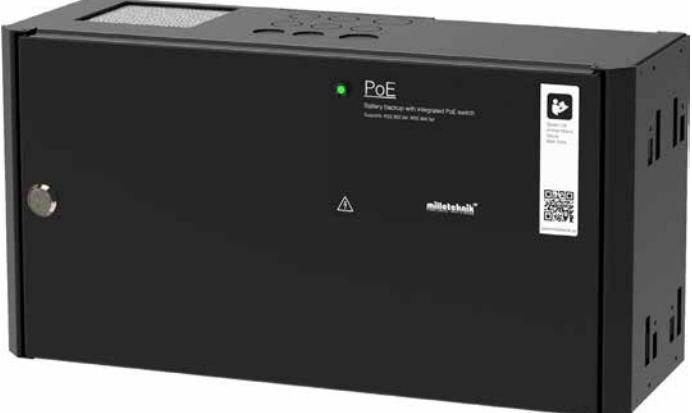

## PoE switch med batteribackup

## PoE switch 4p FLX S+

- √ Enkel och pålitlig batteribackup med inbyggd 4 portars PoE switch
- √ Kan byggas ut med ytterligare 4 PoE portar
- √ 2 LAN switch IN, 4 PoE port UT
- √ PoE Budget: 150W / Max 30,8W per port
- √ Väggmontage eller 19" rack montage
- √ Rymmer 4x 7,2Ah batteri

PoE FLX S används huvudsakligen i säkerhetssystem där en enkel och pålitlig strömförsörjning med batteribackup & PoE funktion behövs.

PoE FLX S erbjuder CONTROLLED CHARGING vilket innebär att batterierna aldrig laddas med mer än 30% av dess märkkapacitet, vilket förhindrar att batterierna överladdas och förlänger deras livslängd betydligt. PoE FLX S kan användas både med AGM-batterier och Lithium LiFePO4-batterier.

PoE FLX S erbjuder också såkallad COLD START, vilket innebär att enheten kan driftsättas med endast batterierna anslutna utan att enheten är ansluten emot 230 V. Detta kan vara betydelsefullt om personen som utför installationen av till exempel passerystemet ej är en behörig elektriker men ändå vill kunna prova av systemet innan behörig elektriker utför en fast installation.

Stöd för PoE standard IEEE 802.3af/15,4W per port & IEEE 802.3at/30,8W per port.

Kapslingen är lackerad i svart färg med struktur & lysdiod för larmindikering. PoE FLX S skall monteras på vägg eller i ett 19" rack (vändbara konsoler ingår).

Typiska användningsområden:

- Passersystem
- Nätverkskameror

Förväntad drifttid vid potentiellt strömavbrott (nya batterier): Vid nedan effekt:

| Systemspänning | Batterier   | 15,4W | 30,8W | 62w  | 100w | 120w | 240w                      |
|----------------|-------------|-------|-------|------|------|------|---------------------------|
| PoE (48V)      | 4x 7,2Ah | 16h   | 8h    | 3,5h | 2h   | 1,5h | Version: 2021-06_V01 - |
|                |             |       |       |      |      |      |                           |
|                |             |       |       |      |      |      |                           |
|                |             |       |       |      |      |      |                           |

Milleteknik AB Ögärdesvägen 8B 433 30 Partille Sweden

## PoE switch med batteribackup

Teknisk data

|                                                | PoE switch 4p FLX S+                                                                                                                                                                                                                            |  |  |  |  |
|------------------------------------------------|-------------------------------------------------------------------------------------------------------------------------------------------------------------------------------------------------------------------------------------------------|--|--|--|--|
| INFORMATION GÄLLANDE KAPSLING:                 |                                                                                                                                                                                                                                                 |  |  |  |  |
| Rekommenderad miljö / Skyddsklass:             | Miljöklass 1, Inomhus, 20% ~ 90% relativ fuktighet / IP32                                                                                                                                                                                       |  |  |  |  |
| Omgivningstemperatur:                          | +5 °C - 40 °C (För optimal batterilivslängd +15 °C - +25 °C)                                                                                                                                                                                    |  |  |  |  |
| Rekommenderad montering:                       | Vägg alt. Rack (vändbara konsoler medföljer). Vid väggmontage erhålls 20 mm distans emot väggen.                                                                                                                                                |  |  |  |  |
| Dimension (Höjd x Bredd x Djup):               | 222x437x145mm (5HE)                                                                                                                                                                                                                             |  |  |  |  |
| Nettovikt:                                     | 7 kg                                                                                                                                                                                                                                            |  |  |  |  |
| Antal kabelgenomföringar:                      | 3 st. + möjlighet till 1 st. utslagshål i ryggen samt 6 st. i kapslingens topp                                                                                                                                                                  |  |  |  |  |
| Kapslingens färg:                              | Svart                                                                                                                                                                                                                                           |  |  |  |  |
| Inbyggd fläkt för kylning:                     | Ja                                                                                                                                                                                                                                              |  |  |  |  |
| Förberedd för utbyggnad av fler PoE switchar:  | Ja, ytterligare 2x LAN & 4 PoE portar kan erhållas via tillvalet PoE switch 4p expansion kit. Observera PoE Budget.                                                                                                                             |  |  |  |  |
| INFORMATION OM INBYGGD POE SWITCH:             |                                                                                                                                                                                                                                                 |  |  |  |  |
| Antal LAN / PoE portar:                        | 2 st. / 4 st.                                                                                                                                                                                                                                   |  |  |  |  |
| Max effekt per port:                           | 30,8W @54,6VDC / 22W@41VDC                                                                                                                                                                                                                      |  |  |  |  |
| PoE Budget:                                    | 150W                                                                                                                                                                                                                                            |  |  |  |  |
| Ethernettyp:                                   | Fast Ethernet Mbit PoE switch                                                                                                                                                                                                                   |  |  |  |  |
| Typ av nätverksport:                           | 10 / 100 PoE+                                                                                                                                                                                                                                   |  |  |  |  |
| Gränssnit:                                     | 1000Base-T RJ-45                                                                                                                                                                                                                                |  |  |  |  |
| Stöd för standard enligt:                      | IEEE 802.3at, IEEE 802.3af                                                                                                                                                                                                                      |  |  |  |  |
| Funktioner:                                    | Auto-negotiation, Auto-uplink (auto MDI/MDI-X)                                                                                                                                                                                                  |  |  |  |  |
| Managerbar:                                    | Nej                                                                                                                                                                                                                                             |  |  |  |  |
| ELEKTRISK INFORMATION:                         |                                                                                                                                                                                                                                                 |  |  |  |  |
| Inspänning:                                    | 110V-264VAC/47-63Hz                                                                                                                                                                                                                             |  |  |  |  |
| Utspänning:                                    | 54,6 VDC                                                                                                                                                                                                                                        |  |  |  |  |
| Max ström:                                     | 2,5A                                                                                                                                                                                                                                            |  |  |  |  |
| Ladd ström:                                    | Max 0,5A                                                                                                                                                                                                                                        |  |  |  |  |
| Nominell effekt:                               | 150W                                                                                                                                                                                                                                            |  |  |  |  |
| Rippel i normalläge:                           | 150mVp-p                                                                                                                                                                                                                                        |  |  |  |  |
| Effektivitet:                                  | 87,5%                                                                                                                                                                                                                                           |  |  |  |  |
| Värmegenerering vid 50% / 80% av märkeffekten: | 10W / 16W                                                                                                                                                                                                                                       |  |  |  |  |
| Ingångsström:                                  | 1,2 A                                                                                                                                                                                                                                           |  |  |  |  |
| Antal avsäkrade utgångar:                      | 1 st.                                                                                                                                                                                                                                           |  |  |  |  |
| Typ av säkring på utgång:                      | F3A                                                                                                                                                                                                                                             |  |  |  |  |
| Djupurladdning av batterier sker vid:          | 41 VDC                                                                                                                                                                                                                                          |  |  |  |  |
| Möjlig att parallellkoppla:                    | Ja                                                                                                                                                                                                                                              |  |  |  |  |
| Skydd mot:                                     | Överlast, Överspänning, Övertemperatur, Kortslutning & Djupurladdning av batterier                                                                                                                                                              |  |  |  |  |
| Larmfunktioner (1 utgång):                     | Fördröjt nätavbrottslarm / eller låg batterispänning, bortkopplade batterier (vid uppstart), säkringsfel                                                                                                                                        |  |  |  |  |
| Larm via:                                      | Växlande relä                                                                                                                                                                                                                                   |  |  |  |  |
| ARTIKEL INFORMATION:                           |                                                                                                                                                                                                                                                 |  |  |  |  |
| Artikelnamn:                                   | PoE switch 4p FLX S+                                                                                                                                                                                                                            |  |  |  |  |
| Artikelnummer:                                 | FS01C10048P02504PU                                                                                                                                                                                                                              |  |  |  |  |
| E-nummer:                                      | 5171952                                                                                                                                                                                                                                         |  |  |  |  |
| Produkten möter kraven enligt:                 | CE direktivet enligt:765/2008, EMC Direktiv 2014/30EU, Emission: EN61000-6-:2001, EN55022:1998:-A1:2000, A2:2003 Klass B, EN61000-3-2:2001, Immunity: EN61000-6-2:2005, EN61000-4-2, -3, 4, -5, -6, -11, Lågspännings direktivet: 2014/35/EU |  |  |  |  |
| Garantiperiod:                                 | 2 år                                                                                                                                                                                                                                            |  |  |  |  |
| Designad och producerad av:                    | Milleteknik AB                                                                                                                                                                                                                                  |  |  |  |  |
| Ursprungsland:                                 | Sverige                                                                                                                                                                                                                                         |  |  |  |  |
| INFORMATION OCH VAL AV BATTERI / BATTERIER:    |                                                                                                                                                                                                                                                 |  |  |  |  |
| Rekommenderad batterityp:                      | 12V Underhållsfria batterier, typ AGM eller Lithium LiFePO4                                                                                                                                                                                     |  |  |  |  |
| Möjliga batterier för montering i kapsling:    | 4 st. 7,2Ah batteri                                                                                                                                                                                                                             |  |  |  |  |
| Rekommenderat batteri:                         | UPLUS 10+ Design Life 7,2Ah batteri                                                                                                                                                                                                             |  |  |  |  |
| Artikelnummer rekommenderat batteri:           | MT113-12V07-01                                                                                                                                                                                                                                  |  |  |  |  |