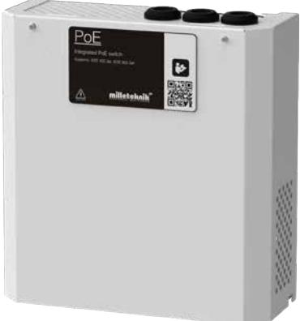
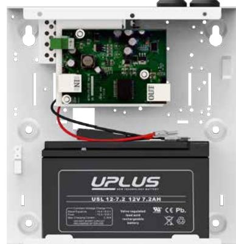

PoE switch med batteribackup

## PoE injector 1p S

- √ Enkel och pålitlig batteribackup med inbyggd PoE injector
- √ 1 LAN switch IN, 1 PoE port UT
- √ PoE Budget: 25W
- √ Väggmontage
- √ Rymmer 1x 7,2Ah batteri

PoE Small används huvudsakligen i säkerhetssystem där en enkel och pålitlig strömförsörjning med batteribackup & PoE funktion behövs.

Stöd för PoE standard IEEE 802.3af/15,4W per port & IEEE 802.3at/30,8W per port. Matningsspänning 12VDC. Injektorn har en inbyggd booster 12V-48V.

Den fläktfria kapslingen är lackerad i vit färg och utrustad med 3 stycken kabelgenomföringar. Levereras inklusive en 230V kabel med stickkontakt.

Typiska användningsområden:

- Passersystem
- Nätverkskameror

## Förväntad drifttid vid potentiellt strömavbrott (nya batterier): Vid nedan effekt:

| Systemspänning | Batterier |       |  |  |  | 15,4W | 30,8W | 62w | 100w | 120w | 240w |
|----------------|-----------|-------|--|--|--|-------|-------|-----|------|------|------|
| PoE (48V)      | 1x        | 2,3Ah |  |  |  | 1,5h  | 40min | -   | -    | -    | -    |
| PoE (48V)      | 1x        | 7,2Ah |  |  |  | 4h    | 1,5h  | -   | -    | -    | -    |

Version: 2021-06_V01

Teknisk data

|                                                | PoE injector 1p S                                                                                                                                                                                                                               |
|------------------------------------------------|-------------------------------------------------------------------------------------------------------------------------------------------------------------------------------------------------------------------------------------------------|
| INFORMATION GÄLLANDE KAPSLING:                 |                                                                                                                                                                                                                                                 |
| Rekommenderad miljö / Skyddsklass:             | Miljöklass 1, Inomhus, 20% ~ 90% relativ fuktighet / IP32                                                                                                                                                                                       |
| Omgivningstemperatur:                          | +5 °C - 40 °C (För optimal batterilivslängd +15 °C - +25 °C)                                                                                                                                                                                    |
| Rekommenderad montering:                       | Väggmontage                                                                                                                                                                                                                                     |
| Dimension (Höjd x Bredd x Djup):               | 230x216x85 mm                                                                                                                                                                                                                                   |
| Nettovikt:                                     | 3 kg                                                                                                                                                                                                                                            |
| Antal kabelgenomföringar:                      | 3 stycken                                                                                                                                                                                                                                       |
| Kapslingens färg:                              | Vit                                                                                                                                                                                                                                             |
| Inbyggd fläkt för kylning:                     | Nej                                                                                                                                                                                                                                             |
| INFORMATION OM INBYGGD POE INJECTOR:           |                                                                                                                                                                                                                                                 |
| Antal LAN / PoE portar:                        | 1 / 1                                                                                                                                                                                                                                           |
| Max effekt per port:                           | 25W                                                                                                                                                                                                                                             |
| PoE Budget:                                    | 25W                                                                                                                                                                                                                                             |
| Ethernettyp:                                   | Injector                                                                                                                                                                                                                                        |
| Typ av nätverksport:                           | 10 / 100 PoE+                                                                                                                                                                                                                                   |
| Gränssnit:                                     | 1000Base-T RJ-45                                                                                                                                                                                                                                |
| Stöd för standard enligt:                      | IEEE 802.3at, IEEE 802.3af                                                                                                                                                                                                                      |
| Funktioner:                                    | Auto-negotiation, Auto-uplink (auto MDI/MDI-X)                                                                                                                                                                                                  |
| Managerbar:                                    | Nej                                                                                                                                                                                                                                             |
| ELEKTRISK INFORMATION:                         |                                                                                                                                                                                                                                                 |
| Inspänning:                                    | 110V-264VAC/47-63Hz                                                                                                                                                                                                                             |
| Utspänning:                                    | 54,6 VDC                                                                                                                                                                                                                                        |
| Max ström:                                     | 0,5A                                                                                                                                                                                                                                            |
| Ladd ström:                                    | Max 0,5A                                                                                                                                                                                                                                        |
| Nominell effekt:                               | 25W                                                                                                                                                                                                                                             |
| Rippel i normalläge:                           | 120mVp-p                                                                                                                                                                                                                                        |
| Effektivitet:                                  | 81,5%                                                                                                                                                                                                                                           |
| Värmegenerering vid 50% / 80% av märkeffekten: | 3W / 5W                                                                                                                                                                                                                                         |
| Ingångsström:                                  | 0,4 A                                                                                                                                                                                                                                           |
| Antal avsäkrade utgångar:                      | 1 st.                                                                                                                                                                                                                                           |
| Typ av säkring på utgång:                      | Termisk                                                                                                                                                                                                                                         |
| Djupurladdning av batterier sker vid:          | 10,5 VDC                                                                                                                                                                                                                                        |
| Möjlig att parallellkoppla:                    | Ja                                                                                                                                                                                                                                              |
| Skydd mot:                                     | Överlast, Överspänning, Övertemperatur, Kortslutning & Djupurladdning av batterier                                                                                                                                                              |
| Larmfunktioner:                                | Inga tillgängliga larmfunktioner                                                                                                                                                                                                                |
| Larm via:                                      | -                                                                                                                                                                                                                                               |
| ARTIKEL INFORMATION:                           |                                                                                                                                                                                                                                                 |
| Artikelnamn:                                   | PoE injector 1p S                                                                                                                                                                                                                               |
| Artikelnummer:                                 | SM01000012P02001PU                                                                                                                                                                                                                              |
| E-nummer:                                      | 5171950                                                                                                                                                                                                                                         |
| Produkten möter kraven enligt:                 | CE direktivet enligt:765/2008, EMC Direktiv 2014/30EU, Emission: EN61000-6-:2001, EN55022:1998:-A1:2000, A2:2003 Klass B, EN61000-3-2:2001, Immunity: EN61000-6-2:2005, EN61000-4-2, -3, 4, -5, -6, -11, Lågspännings direktivet: 2014/35/EU |
| Garantiperiod:                                 | 2 år                                                                                                                                                                                                                                            |
| Designad och producerad av:                    | Milleteknik AB                                                                                                                                                                                                                                  |
| Ursprungsland:                                 | Sverige                                                                                                                                                                                                                                         |
| INFORMATION OCH VAL AV BATTERI / BATTERIER:    |                                                                                                                                                                                                                                                 |
| Rekommenderad batterityp:                      | 12V Underhållsfria batterier, typ AGM eller Lithium LiFePO4                                                                                                                                                                                     |
| Möjliga batterier för montering i kapsling:    | 1 st. 2,3Ah eller 1 st. 7,2Ah batteri                                                                                                                                                                                                           |
| Rekommenderat batteri:                         | UPLUS 10+ Design Life 7,2Ah batteri                                                                                                                                                                                                             |
| Artikelnummer rekommenderat batteri:           | MT113-12V07-01                                                                                                                                                                                                                                  |