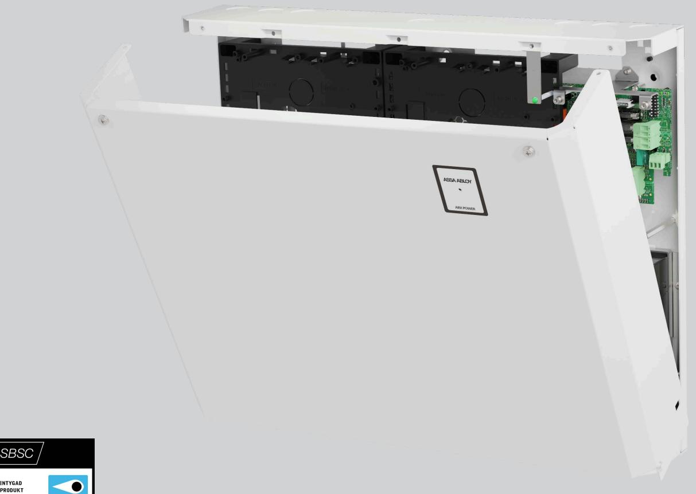
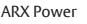
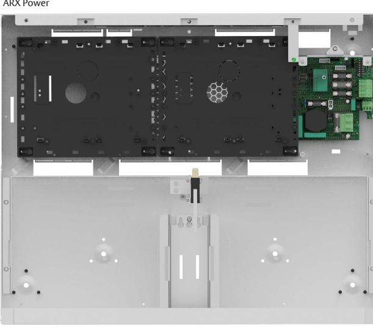
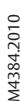

# ASSA ABLOY ARX Power

Smartbox med inbyggd batteribackup

ASSA ABLOY ARX Power är en kompakt allt-i-ett lösning för ARX Säkerhetssystem. Enheten rymmer förutom inbyggd batteribackup också två kortplatser för exempelvis dörrkontrollenheter, centralenhet och in- och utgångsenheter.

ARX Power är alltså inte bestyckad med några kort från början utan är en smart batteribackup med kompletteringsmöjligheter för en mängd ändamål där installationsutrymme, extra ström och batteri behövs.

Enheten har en diskret, stilren design med en passiv konstruktion som leder ut värme utan fläktar vilket gör den helt tyst. Stor designfokus har lagts på installationsvänlighet med exempelvis rymlig kapsling för enkel kabelhantering, VMC-snäppfästen för tillbehör och välplanerade kabelgenomföringar. Genom att kombinera ARX hårdvara och batteribackup i samma kapsling spar du utrymme, förenklar installationen och får en kostnadseffektiv lösning både till material och arbetsinsats.

ARX Power är larmgodkänd upp till larmklass 2 och uppfyller elsäkerhets standard EN 62368-1.

Fellarm från batteribackup kopplas från balanseringskort på strömförsörjning till valfri ingång. ARX Power har även kommunikation från batteribackup upp till larmklass 2 som kopplas till ARX larmbuss.

Extra tanke har också lagts på att designa enheten för att så enkelt som möjligt kunna ersätta befintliga föråldrade system.

ARX Power har skydd mot överlast, överspänning, övertemperatur, kortslutning och djupurladdning. Den rymmer upp till 2 st 20Ah batterier och kan vid behov kompletteras med en batteribox i samma formfaktor – ARX Power box som rymmer ytterligare upp till 2 st 20Ah batterier.

Enheten monteras enkelt på en vägg.

# ASSA ABLOY ARX Power

# Smartbox med inbyggd batteribackup

# **Data**

- Matningsspänning: 230V AC
- Inström: 1,7A vid 230V AC
- Egenförbrukning:
	- o Elnätsdrift: 135mA
	- o Batteridrift: 125mA
- Utgångsspänning: 27,3 V DC
- Kontinuerlig last 4A, 5A peak
- Godkänd medellast enligt SSF1014:
	- o Larmklass 1/2: 1,35A
- Batteri
	- o UPLUS: 2st 7,2Ah 12V eller
	- o UPLUS: 2st 20Ah 12V
- Temperaturområde +5°C till +40°C
- Relativ fuktighet 75%
- IP-klass 30 endast inomhus

# **Certifikat**

- LK 2, Security Grade 3, MK 1 Environment Class 1. EN50131-1-A1
- EN50136 Security Grade 3, SP4
- EN 62368-1 SE
- EN 50131-6
- SBSC intyg 16-130
- Kräver ARX version 4.7 eller högre

# **Mått och vikt**

- Bredd: 444mm
- Höjd: 366mm
- Djup: 108mm
- Vikt: 5,15kg utan batterier

# ASSA ABLOY Opening Solutions Sweden P.O. Box 371 SE-631 05 Eskilstuna Sweden

Phone +46 (0)16 17 70 00 Fax +46 (0)16 17 70 49

Customer support: Phone intl. +46 (0)16 17 71 00 Phone nat. 0771-640 640 Fax +46 (0)16 17 73 72 e-mail: helpdesk.se.openingsolutions@assaabloy.com www.assaabloyopeningsolutions.se

### **Larmhändelser från balanseringsingång**

Balanseringsingång: Sabotage, Nätbortfall och Fel UPS (Säkringsfel, Laddfel överspänning, Laddfel underspänning, Ej anslutet batteri, Låg batterispänning)

### **Följande händelser kan visas i ARX**

Anslutning av kommunikation till ARX Larmbuss. Nätavbrott, Säkringsfel, Sabotagelarm, Överspänning, Underspänning, Batterifel, Låg systemspänning, Låg batterispänning, Övertemperatur, Undertemperatur

# **Följande status kan visas i ARX**

Anslutning av kommunikation till ARX Larmbuss. Aktuell strömförbrukning, Strömförbrukning senaste minuten (medelvärde),Strömförbrukning senaste dygnet (medelvärde), Max uppmätt strömförbrukning, Överbelastning i antal minuter, Antal dagar där belastningen är över 80%, Systemspänning, Max systemspänning, Min systemspänning, Max uppmätt temperatur, Min uppmätt temperatur, Ackumulerad tid för hög temperatur, Max kontinuerlig ström i batteribackup (ampere), Inställd tid fördröjt nätbortfallarm, Inställt spänningsvärde för låg batterispänning, Installerad batterikapacitet,, Sabotage, Kommunikation

#### **Artikelnummer** • ARX Power

| •                    | ARX Power                              | S5529X050165                    | E58 014 34               |
|----------------------|----------------------------------------|---------------------------------|--------------------------|
| Tillbehör            |                                        |                                 |                          |
|                      | • ARX Power Firmware Kit               | S55299300100                    | E58 014 97               |
|                      | • ARX Power Box • ARX Power Fuse 05 | S5529X00B165 S5529X00F160    | E58 014 35 E58 014 36 |
|                      | • LCU9101IV WOB                        | S58910142085WOB                 | E58 014 99               |
|                      | • SIO6-4 • DAC530III                | S5566512N160 S5566503085     | E58 703 81 E58 703 97 |
|                      | • SIO12-3WOB                           | S5890167N085WOB S5590169N085 | E58 014 98 E58 703 65 |
| • SIO2-16 Batteri |                                        |                                 |                          |
|                      |                                        |                                 |                          |

- UPLUS 12V, 7,2Ah, 10-12 år S511107084 E53 320 95 • UPLUS 12V, 20Ah, 10-12 år S511104084 E53 320 97

We reserve the right to correct any printing errors and update the information after printing.

