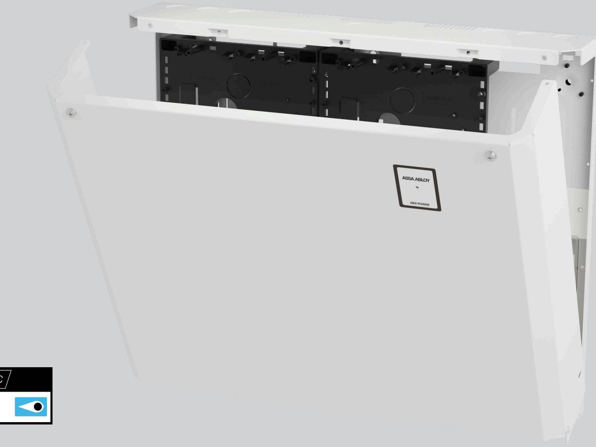
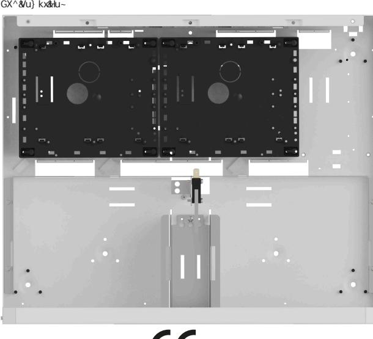

## ASSA ABLOY ARX Power Box

Smart batteribox till ARX Power-serien

ASSA ABLOY ARX Power Box är en batteri och utökningsbox anpassad till ARX Power-serien.

Enheten monteras på vägg och kopplas till huvudenheten. Monteras den direkt under huvudenheten kopplas den snabbt ihop med den medföljande kabeln. Den medföljande kabeln är klar med kabelskor och hängsäkring.

Enheten speglar ARX Powers diskreta, stilrena design. Stor designfokus har lagts på installationsvänlighet med exempelvis rymlig kapsling för enkel kabelhantering och välplanerade kabelgenomföringar.

ARX Power Box är larmgodkänd upp till larmklass 4 och uppfyller elsäkerhets standard EN 62368-1.

ARX Power Box rymmer upp till 2st 20Ah batterier och är utrustad med två stycken plastkassetter för montage av exempelvis dörrkontrollenheter, centralenhet och in- och utgångsenheter.

# ASSA ABLOY ARX Power BOX

Smart batteribox till ARX Power-serien

## **Data**

#### • Batteri

- o UPLUS: 2st 7,2Ah 12V eller
- o UPLUS: 2st 20Ah 12V
- Temperaturområde +5°C till +40°C
- Relativ fuktighet 75%
- IP-klass 30 endast inomhus

## **Certifikat**

• LK 2, *LK 3/4 Security Grade 4, MK 1 Environment Class 1. EN50131-1-A1

- EN 62368-1 SE
- SBSC intyg 16-130

## **Mått och vikt**

- Bredd: 444mm
- Höjd: 366mm
- Djup: 108mm
- Vikt: 5,15kg utan batterier

*För larmklass 3/4 Krävs MIO6-6 eller MIO-Slave. Borrskyddsdetektor CD470, E-nummer E63 100 90, beställs i separat kanal.

| Artikelnummer • ARX Power Box     | S5529X00B165    | E58 014 35 |
|-----------------------------------------|-----------------|------------|
| Tillbehör                               |                 |            |
| • ARX Power Fuse 05                     | S5529X00F160    | E58 014 36 |
| • LCU9101IV WOB                         | S58910142085WOB | E58 014 99 |
| • SIO6-4                                | S5566512N160    | E58 703 81 |
| • DAC530III                             | S5566503085     | E58 703 97 |
| • SIO12-3WOB                            | S5890167N085WOB | E58 014 99 |
| • SIO2-16                               | S5590169N085    | E58 703 65 |
| 7ViiZg^                                 |                 |            |
| • UPLUS 12V, 7,2Ah, 10-12 år S511107084 |                 | E53 320 95 |

- UPLUS 12V, 20Ah, 10-12 år S511104084 E53 320 97

ASSA ABLOY Opening Solutions Sweden P.O. Box 371 SE-631 05 Eskilstuna Sweden Phone +46 (0)16 17 70 00 Fax +46 (0)16 17 70 49

Customer support: Phone intl. +46 (0)16 17 71 00 Phone nat. 0771-640 640 Fax +46 (0)16 17 73 72 e-mail: helpdesk.se.openingsolutions@assaabloy.com www.assaabloyopeningsolutions.se