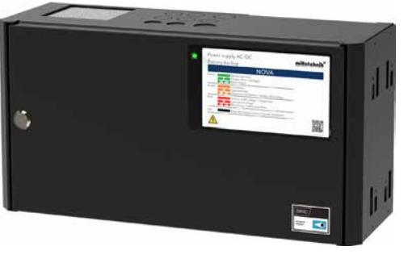
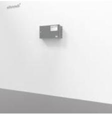
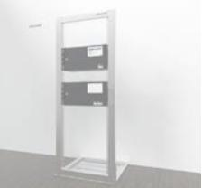

## NOVA FLX S

POWER SUPPLIES - MADE IN SWEDEN

- √ SSF1014, Larmklass 1-3 godkänd batteribackup
- √ Intelligent charging funktion
- √ Kvalificerat batterikapacitetstest
- √ Kan kompletteras med flera olika tillvalskort
- √ Väggmontage eller 19" rack montage
- √ Rymmer 2x 14Ah batterier men kan kompletteras med batteriboxar upp till 70Ah batterikapacitet

NOVA FLX S används huvudsakligen i säkerhetssystem där en SSF 1014 godkänd batteribackup krävs eller där kraven är högre gällande; högre flexibilitet, fler larmfunktioner, längre reservdrifttider eller när batteribackupen behöver hantera högre laster.

NOVA Serien är systemcertifierad enligt SSF1014 tillsammans med flertalet system på den svenska marknaden. Milleteknik har försäljningsrätten emot två olika system på den svenska marknaden; Sentrion & Integra. NOVA Serien erbjuder kommunikation via RS485 emot Sentrion S4, S4 DUO & CISS. Via MOVEO kit (tillval) erbjuds RS232 kommunikation med Integra MOVEO & MOVEO XL.

NOVA Serien läser av ansluten systemlast och laddar batterierna med tillgänglig kvarvarande ström ifrån nätaggregatet, dock laddas aldrig batterierna med mer än max 4A (gäller för FLX S) i laddström. Detta förhindrar att batterierna överladdas och förlänger deras livslängd avsevärt. NOVA serien är också utrustade med interna effektmotstånd (anpassade för systemtestat batteri) för kvalificerat batterikapacitetstest, som meddelar när batterierna måste bytas ut innan batterierna åldras. NOVA serien är systemcertifierad tillsammans med / & skall användas tillsammans med UPLUS 10+ Design Life AGM batterier enligt SSF1014.

NOVA serien erbjuder också INTELLIGENT CHARGING, vilket innebär att när batterierna är fulladdade kommer de att kopplas bort elektroniskt för standby-läge i upp till 20 dagar eller när batterierna har nått 26,7V (24V). Genom att ladda ur batterierna och ladda dem kontinuerligt (istället för att de aldrig används) förlänger systemet batteriets livslängd med upp till 50%. Batterierna ansluts automatiskt på mindre än 50 mikrosekunder vid behov. NOVA serien kan användas med både AGM-batterier och litium LiFePO4-batterier.

NOVA FLX S kan kompletteras med upp till två stycken batteriboxar vid behov. Batteriboxen skall placeras under batteribackupen och ansluts via en kabel som medföljer i batteriboxen. Batteriboxen har plats för 4 stycken 14Ah batterier per varje batteribox.

Observera att NOVA 12V 10A FLX S uppfyller kraven enligt EN50131-6 & SSF 1014 men har ej certifierats enligt kraven för de olika certifikaten.

| Tillåten medellast enligt SSF1014 Larmklass 1-3:               |                   |                    |  |  |  |  |
|----------------------------------------------------------------|-------------------|--------------------|--|--|--|--|
|                                                                | NOVA 24V 5A FLX S | NOVA 24V 10A FLX S |  |  |  |  |
| exkl. Batteribox FLX S, enligt Larmklass 1-2 / Larmklass 3:    | 1,1A / 0,45A      | 1,1A / 0,45A       |  |  |  |  |
| inkl. 1x Batteribox FLX S, enligt Larmklass 1-2 / Larmklass 3: | 3,4A / 1,4A       | 3,4A / 1,4A        |  |  |  |  |
| inkl. 2x Batteribox FLX S, enligt Larmklass 1-2 / Larmklass 3: | -                 | 5,7A / 2,3A        |  |  |  |  |

### POWER SUPPLIES - MADE IN SWEDEN

# NOVA Serien

### Teknisk data

|                                                | NOVA 12V 10A FLX S                                                                                                                                                                                                                                                                                                                                                                                    | NOVA 24V 5A FLX S                                                                  | NOVA 24V 10A FLX S |  |  |  |  |
|------------------------------------------------|-------------------------------------------------------------------------------------------------------------------------------------------------------------------------------------------------------------------------------------------------------------------------------------------------------------------------------------------------------------------------------------------------------|------------------------------------------------------------------------------------|--------------------|--|--|--|--|
| INFORMATION GÄLLANDE KAPSLING:                 |                                                                                                                                                                                                                                                                                                                                                                                                       |                                                                                    |                    |  |  |  |  |
| Rekommenderad miljö / Skyddsklass:             | Miljöklass 1, Inomhus, 20% ~ 90% relativ fuktighet / IP32                                                                                                                                                                                                                                                                                                                                             |                                                                                    |                    |  |  |  |  |
| Omgivningstemperatur:                          |                                                                                                                                                                                                                                                                                                                                                                                                       | +5 °C - 40 °C (För optimal batterilivslängd +15 °C - +25 °C)                       |                    |  |  |  |  |
| Rekommenderad montering:                       | Vägg alt. Rack (vändbara vinklar medföljer). Vid väggmontage erhålls 20 mm distans emot väggen.                                                                                                                                                                                                                                                                                                       |                                                                                    |                    |  |  |  |  |
| Dimension (Höjd x Bredd x Djup):               |                                                                                                                                                                                                                                                                                                                                                                                                       | 222x437x145mm (5HE)                                                                |                    |  |  |  |  |
| Nettovikt:                                     | 6,5 kg                                                                                                                                                                                                                                                                                                                                                                                                | 6,5 kg                                                                             | 7 kg               |  |  |  |  |
| Antal kabelgenomföringar:                      |                                                                                                                                                                                                                                                                                                                                                                                                       | 3 st. + möjlighet till 1 st. utslagshål i ryggen samt 6 st. i kapslingens topp     |                    |  |  |  |  |
| Kapslingens färg:                              |                                                                                                                                                                                                                                                                                                                                                                                                       | Svart                                                                              |                    |  |  |  |  |
| Inbyggd fläkt för kylning:                     | Ja                                                                                                                                                                                                                                                                                                                                                                                                    |                                                                                    |                    |  |  |  |  |
| ELEKTRISK INFORMATION:                         |                                                                                                                                                                                                                                                                                                                                                                                                       |                                                                                    |                    |  |  |  |  |
| Inspänning:                                    |                                                                                                                                                                                                                                                                                                                                                                                                       | 110V-264VAC/47-63Hz                                                                |                    |  |  |  |  |
| Utspänning:                                    | 13,6 VDC                                                                                                                                                                                                                                                                                                                                                                                              | 27,3 VDC                                                                           |                    |  |  |  |  |
| Max ström:                                     | 10A                                                                                                                                                                                                                                                                                                                                                                                                   | 5A                                                                                 | 10A                |  |  |  |  |
| Ladd ström:                                    |                                                                                                                                                                                                                                                                                                                                                                                                       | Beroende av strömuttag, dock max; 4A                                               |                    |  |  |  |  |
| Nominell effekt:                               | 150W                                                                                                                                                                                                                                                                                                                                                                                                  | 150W                                                                               | 240W               |  |  |  |  |
| Rippel i normalläge:                           | 150mVp-p                                                                                                                                                                                                                                                                                                                                                                                              | 200mVp-p                                                                           | 200mVp-p           |  |  |  |  |
| Effektivitet:                                  | 87,5%                                                                                                                                                                                                                                                                                                                                                                                                 | 89%                                                                                | 89%                |  |  |  |  |
| Värmegenerering vid 50% / 80% av märkeffekten: | 10W / 16W                                                                                                                                                                                                                                                                                                                                                                                             | 8W / 13W                                                                           | 17W / 27W          |  |  |  |  |
| Ingångsström:                                  | 1,7A                                                                                                                                                                                                                                                                                                                                                                                                  | 1,7A                                                                               | 2A                 |  |  |  |  |
| Antal avsäkrade utgångar:                      | 2 st.                                                                                                                                                                                                                                                                                                                                                                                                 | 2 st.                                                                              | 2 st.              |  |  |  |  |
| Typ av säkring på utgång:                      | 2 st. F10A (glas)                                                                                                                                                                                                                                                                                                                                                                                     | 2 st. F5A (glas)                                                                   | 2 st. F10A (glas)  |  |  |  |  |
| Djupurladdning av batterier sker vid:          | 10,5 VDC                                                                                                                                                                                                                                                                                                                                                                                              | 21 VDC                                                                             |                    |  |  |  |  |
| Möjlig att parallellkoppla:                    | Ja                                                                                                                                                                                                                                                                                                                                                                                                    | Ja                                                                                 | Ja                 |  |  |  |  |
| Skydd mot:                                     |                                                                                                                                                                                                                                                                                                                                                                                                       | Överlast, Överspänning, Övertemperatur, Kortslutning & Djupurladdning av batterier |                    |  |  |  |  |
| Larmfunktioner (4 utgångar):                   | Åldrat batteri, Bortkopplade batterier (10 sek), Fördröjt nätavbrottslarm (10 sek), Laddarfel överspänning, Laddarfel underspänning, Låg batterispänning, Låg systemspänning, Sabotage & Säkringsfel.                                                                                                                                                                                              |                                                                                    |                    |  |  |  |  |
| Larm via:                                      |                                                                                                                                                                                                                                                                                                                                                                                                       | Växlande relä / RS485. Option: RS232, TCP/IP                                       |                    |  |  |  |  |
| Möjlig information via överordnat system:      | Fläktfelslarm, forcerat batteritest, hög / låg temperatur larm, högsta / lägsta batterispänning sedan start, högsta / lägsta temperatur sedan start, min/max/medel spänning senaste 1h / 72h, min/max/medel ström senaste: min / 1h / 24h / 72h, min/max/medel temperatur senaste 1h / 72h, möjlig drifttid vid potentiellt strömavbrott, möjligt att ställa larmnivåer & temperatursensor larm |                                                                                    |                    |  |  |  |  |
| ARTIKEL INFORMATION:                           |                                                                                                                                                                                                                                                                                                                                                                                                       |                                                                                    |                    |  |  |  |  |
| Artikelnamn:                                   | NOVA 12V 10A FLX S                                                                                                                                                                                                                                                                                                                                                                                    | NOVA 24V 5A FLX S                                                                  | NOVA 24V 10A FLX S |  |  |  |  |
| Artikelnummer:                                 | FS01P30012P100                                                                                                                                                                                                                                                                                                                                                                                        | FS01P30024P050-SSF                                                                 | FS01P30024P100-SSF |  |  |  |  |
| E-nummer:                                      | 5213647                                                                                                                                                                                                                                                                                                                                                                                               | 5213562                                                                            | 5213563            |  |  |  |  |
| Produkten möter kraven enligt:                 | CE direktivet enligt:765/2008, EMC Direktiv 2014/30EU, Emission: EN61000-6-:2001, EN55022:1998:-A1:2000, A2:2003 Klass B, EN61000-3-2:2001, Immunity: EN61000-6-2:2005, EN61000-4-2, -3, 4, -5, -6, -11. SS-EN 50 130-4:2011 Edition 2, EN50131-6 & SSF1014 Larmklass 1-4 (Inbrottslarm), Lågspännings direktivet: 2014/35/EU                                                                   |                                                                                    |                    |  |  |  |  |
| Certifierad enligt / Certifikatsnummer:        | EN50131-6 & SSF1014, Uppfyller larmklass 3, SSF 1014, utgåva 5 / 20-117 -                                                                                                                                                                                                                                                                                                                          |                                                                                    |                    |  |  |  |  |
| Garantiperiod:                                 | 5 år (observera garantivillkor)                                                                                                                                                                                                                                                                                                                                                                       |                                                                                    |                    |  |  |  |  |
| Garantivillkor:                                | Batteribackupen skall användas tillsammans med UPLUS 10+ Design Life batterier, fläkten skall rengöras årligen och bytas om nödvändigt, medellast får ej överstiga 80% av nätaggregatets märkkapacitet, omgivningstemperatur skall ej överstiga 32°.                                                                                                                                               |                                                                                    |                    |  |  |  |  |
| Designad och producerad av:                    | Milleteknik AB                                                                                                                                                                                                                                                                                                                                                                                        |                                                                                    |                    |  |  |  |  |
| Ursprungsland:                                 | Sverige                                                                                                                                                                                                                                                                                                                                                                                               |                                                                                    |                    |  |  |  |  |
| INFORMATION OCH VAL AV BATTERI / BATTERIER:    |                                                                                                                                                                                                                                                                                                                                                                                                       |                                                                                    |                    |  |  |  |  |
| Rekommenderad batterityp:                      | 12V Underhållsfria batterier, typ AGM eller Lithium LiFePO4                                                                                                                                                                                                                                                                                                                                           |                                                                                    |                    |  |  |  |  |
| Möjliga batterier för montering i kapsling:    | 2 st. 14 Ah batterier                                                                                                                                                                                                                                                                                                                                                                                 |                                                                                    |                    |  |  |  |  |
| Rekommenderat batteri:                         | UPLUS 10+ Design Life 14Ah batteri                                                                                                                                                                                                                                                                                                                                                                    |                                                                                    |                    |  |  |  |  |
| Artikelnummer rekommenderat 14Ah batteri:      | MT113-12V14-01                                                                                                                                                                                                                                                                                                                                                                                        |                                                                                    |                    |  |  |  |  |

### Exempel på tillval

| ARTIKELTYP:                                  | ARTIKELNAMN:                 | ARTIKELNUMMER:    | SPÄNNING: | E-NUMMER: | MAX MÖJLIGT ANTAL: |
|----------------------------------------------|------------------------------|-------------------|-----------|-----------|--------------------|
| Batteribox med plats för 4x 14Ah batterier   | Battery box 24V FLX S        | FS010000024BB01   | 24V       | 5213574   | 2x                 |
| Avsäkringskort 5 utgångar                    | 5 output module              | A-FU12245OP01LM01 | 12V / 24V | 5213588   | 2x                 |
| Jordfelsdetektormodul                        | Ground fault detector module | A-OT0024EA01LM01  | 24V       | 5213594   | 2x                 |
| Panel för extern montering av avsäkringskort | 19 rack module holder        | 4U01000P00019P01  | 12V / 24V | 5001063   | -                  |