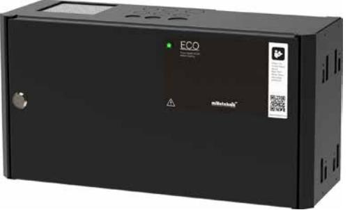
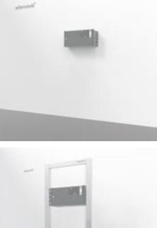

## ECO Serien

# ECO FLX S

- √ Enkel och pålitlig batteribackup
- √ Controlled charging funktion
- √ Cold start funktion
- √ Kan kompletteras med flera olika tillbehör
- √ Väggmontage eller 19" rack montage

ECO Serien används främst i system där en enkel och pålitlig strömförsörjning med batteribackupfunktion behövs.

ECO Serien erbjuder CONTROLLED CHARGING vilket innebär att batterierna aldrig laddas med mer än 30% av rekommenderat batteris märkkapacitet. Kontrollerad laddning förhindrar att batterierna överladdas och förlänger deras livslängd betydligt.

ECO-serien kan användas både med AGM-batterier och Lithium LiFePO4-batterier.

ECO Serien erbjuder också såkallad COLD START vilket innebär att batteribackupen kan driftsättas med endast batterierna anslutna utan att enheten är ansluten emot 230 V. Detta kan vara betydelsefullt om personen som utför installationen av till exempel passerystemet ej är en behörig elektriker men ändå vill kunna prova av systemet innan behörig elektriker utför en fast

installation.

ECO FLX S har utrymme för upp till 2 stycken L-moduler (avsäkringskort, spänningsomvandlare med flera.) som snäpps fast i kapslingens kassett och ansluts emot batteribackupens moderkort. Kapslingen levereras inklusive sabotagekontakt monterad i dörröppningen.

ECO FLX S kan kompletteras med upp till två stycken batteriboxar vid behov (endast 24 V). Batteriboxen skall placeras under batteribackupen och ansluts via en kabel som medföljer i batteriboxen. Batteriboxen har plats för 4 stycken 14Ah batterier per varje batteribox.

ECO FLX S serien skall monteras på vägg eller i ett 19" rack (vändbara konsoler ingår).

Typiska användningsområden:

- Passersystem
- Låssystem

Förväntad drifttid vid potentiellt strömavbrott (nya batterier): Vid nedan last:

| Systemspänning |    | Batterier | 0,5A | 1A  | 2A  | 4A | 6A    | 8A                            |
|----------------|----|-----------|------|-----|-----|----|-------|-------------------------------|
| 12 V           | 2x | 7,2 Ah    | 24h  | 12h | 5h  | 2h | 1h    | 30min                         |
| 12 V           | 2x | 14 Ah     | 48h  | 24h | 10h | 4h | 2h    | 1,5h                          |
| 24 V           | 2x | 7,2 Ah    | 12h  | 5h  | 2h  | 1h | 30min | 15min                         |
| 24 V           | 2x | 14 Ah     | 24h  | 12h | 5h  | 2h | 1h    | Version: 2021-06_V01 45min |
|                |    |           |      |     |     |    |       |                               |
|                |    |           |      |     |     |    |       |                               |

### POWER SUPPLIES - MADE IN SWEDEN

### ECO Serien

#### Teknisk data

|                                                | ECO 12V 10A FLX S                                                                                                                                                                                                                               | ECO 24V 5A FLX S                                                                                | ECO 24V 10A FLX S |  |  |  |
|------------------------------------------------|-------------------------------------------------------------------------------------------------------------------------------------------------------------------------------------------------------------------------------------------------|-------------------------------------------------------------------------------------------------|-------------------|--|--|--|
| INFORMATION GÄLLANDE KAPSLING:                 |                                                                                                                                                                                                                                                 |                                                                                                 |                   |  |  |  |
| Rekommenderad miljö / Skyddsklass:             | Miljöklass 1, Inomhus, 20% ~ 90% relativ fuktighet / IP32                                                                                                                                                                                       |                                                                                                 |                   |  |  |  |
| Omgivningstemperatur:                          | +5 °C - 40 °C (För optimal batterilivslängd +15 °C - +25 °C)                                                                                                                                                                                    |                                                                                                 |                   |  |  |  |
| Rekommenderad montering:                       |                                                                                                                                                                                                                                                 | Vägg alt. Rack (vändbara vinklar medföljer). Vid väggmontage erhålls 20 mm distans emot väggen. |                   |  |  |  |
| Dimension (Höjd x Bredd x Djup):               |                                                                                                                                                                                                                                                 | 222x437x145mm (5HE)                                                                             |                   |  |  |  |
| Nettovikt:                                     | 6,5 kg                                                                                                                                                                                                                                          | 6,5 kg                                                                                          | 7 kg              |  |  |  |
| Antal kabelgenomföringar:                      |                                                                                                                                                                                                                                                 | 3 st. + möjlighet till 1 st. utslagshål i ryggen samt 6 st. i kapslingens topp                  |                   |  |  |  |
| Kapslingens färg:                              |                                                                                                                                                                                                                                                 | Svart                                                                                           |                   |  |  |  |
| Inbyggd fläkt för kylning:                     | Ja                                                                                                                                                                                                                                              | Ja                                                                                              | Ja                |  |  |  |
| ELEKTRISK INFORMATION:                         |                                                                                                                                                                                                                                                 |                                                                                                 |                   |  |  |  |
| Inspänning:                                    |                                                                                                                                                                                                                                                 | 110V-264VAC/47-63Hz                                                                             |                   |  |  |  |
| Utspänning:                                    | 13,6VDC                                                                                                                                                                                                                                         |                                                                                                 | 27,3VDC           |  |  |  |
| Max ström:                                     | 10A                                                                                                                                                                                                                                             | 5A                                                                                              | 10A               |  |  |  |
| Ladd ström:                                    | Max 1A                                                                                                                                                                                                                                          | Max 1A                                                                                          | Max 1A            |  |  |  |
| Nominell effekt:                               | 150W                                                                                                                                                                                                                                            | 150W                                                                                            | 240W              |  |  |  |
| Rippel i normalläge:                           | 150mVp-p                                                                                                                                                                                                                                        | 200mVp-p                                                                                        | 200mVp-p          |  |  |  |
| Effektivitet:                                  | 87,5%                                                                                                                                                                                                                                           | 89%                                                                                             | 89%               |  |  |  |
| Värmegenerering vid 50% / 80% av märkeffekten: | 10W / 16W                                                                                                                                                                                                                                       | 8W / 13W                                                                                        | 17W / 27W         |  |  |  |
| Ingångsström:                                  | 1,7A                                                                                                                                                                                                                                            | 1,7A                                                                                            | 2A                |  |  |  |
| Antal avsäkrade utgångar:                      | 2 st.                                                                                                                                                                                                                                           | 2 st.                                                                                           | 2 st.             |  |  |  |
| Typ av säkring på utgång:                      | 2 st. F10A (glas)                                                                                                                                                                                                                               | 2 st. F5A (glas)                                                                                | 2 st. F10A (glas) |  |  |  |
| Djupurladdning av batterier sker vid:          | 10,5 VDC                                                                                                                                                                                                                                        |                                                                                                 | 21 VDC            |  |  |  |
| Möjlig att parallellkoppla:                    | Ja                                                                                                                                                                                                                                              | Ja                                                                                              | Ja                |  |  |  |
| Skydd mot:                                     | Överlast, Överspänning, Övertemperatur, Kortslutning & Djupurladdning av batterier                                                                                                                                                              |                                                                                                 |                   |  |  |  |
| Larmfunktioner (2 utgångar):                   | Fördröjt nätavbrottslarm / eller låg batterispänning, bortkopplade batterier (vid uppstart), externt larm via pin list (tillvalskort), säkringsfel (summalarmutgång 1), samt sabotage (larmutgång 2).                                        |                                                                                                 |                   |  |  |  |
| Larm via:                                      |                                                                                                                                                                                                                                                 | Växlande relä                                                                                   |                   |  |  |  |
| ARTIKEL INFORMATION:                           |                                                                                                                                                                                                                                                 |                                                                                                 |                   |  |  |  |
| Artikelnamn:                                   | ECO 12V 10A FLX S                                                                                                                                                                                                                               | ECO 24V 5A FLX S                                                                                | ECO 24V 10A FLX S |  |  |  |
| Artikelnummer:                                 | FS01C10112P100                                                                                                                                                                                                                                  | FS01C10124P050                                                                                  | FS01C10124P100    |  |  |  |
| E-nummer:                                      | 5213644                                                                                                                                                                                                                                         | 5213645                                                                                         | 5213646           |  |  |  |
| Produkten möter kraven enligt:                 | CE direktivet enligt:765/2008, EMC Direktiv 2014/30EU, Emission: EN61000-6-:2001, EN55022:1998:-A1:2000, A2:2003 Klass B, EN61000-3-2:2001, Immunity: EN61000-6-2:2005, EN61000-4-2, -3, 4, -5, -6, -11, Lågspännings direktivet: 2014/35/EU |                                                                                                 |                   |  |  |  |
| Garantiperiod:                                 |                                                                                                                                                                                                                                                 | 2 år                                                                                            |                   |  |  |  |
| Designad och producerad av:                    | Milleteknik AB                                                                                                                                                                                                                                  |                                                                                                 |                   |  |  |  |
| Ursprungsland:                                 |                                                                                                                                                                                                                                                 | Sverige                                                                                         |                   |  |  |  |
| INFORMATION OCH VAL AV BATTERI / BATTERIER:    |                                                                                                                                                                                                                                                 |                                                                                                 |                   |  |  |  |
| Rekommenderad batterityp:                      | 12V Underhållsfria batterier, typ AGM eller Lithium LiFePO4                                                                                                                                                                                     |                                                                                                 |                   |  |  |  |
| Möjliga batterier för montering i kapsling:    | 2 st. 7,2 Ah eller 2 st. 14 Ah                                                                                                                                                                                                                  |                                                                                                 |                   |  |  |  |
| Rekommenderat batteri:                         | UPLUS 10+ Design Life 14Ah batteri                                                                                                                                                                                                              |                                                                                                 |                   |  |  |  |
| Artikelnummer rekommenderat 7,2Ah batteri:     | MT113-12V07-01                                                                                                                                                                                                                                  |                                                                                                 |                   |  |  |  |
| Artikelnummer rekommenderat 14Ah batteri:      |                                                                                                                                                                                                                                                 | MT113-12V14-01                                                                                  |                   |  |  |  |

#### Exempel på tillval

| ARTIKELTYP:                                  | ARTIKELNAMN:                | ARTIKELNUMMER:    | SPÄNNING: | E-NUMMER: | MAX MÖJLIGT ANTAL: |
|----------------------------------------------|-----------------------------|-------------------|-----------|-----------|--------------------|
| Batteribox med plats för 4x 14Ah batterier   | Battery box 24V FLX S       | FS010000024BB01   | 24V       | 5213574   | 2x                 |
| Avsäkringskort 5 utgångar                    | 5 output module             | A-FU12245OP01LM01 | 12V / 24V | 5213588   | 2x                 |
| Spänningsomvandlare 24V-12V 6A               | Voltage Converter 24V-12V6A | A-VC002406A01LM01 | 24V       | 5213593   | 2x                 |
| 230V Kabel med stickpropp                    | 230V Powercord incl. tamper | A-00002301FA01    | 12V / 24V | 5257446   | 1x                 |
| Panel för extern montering av avsäkringskort | 19 rack module holder       | 4U01000P00019P01  | 12V / 24V | 5001063   | -                  |