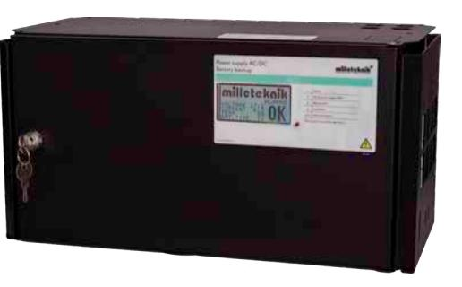
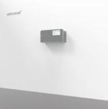
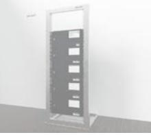

## NEO Serien

# NEO FLX M Display

POWER SUPPLIES - MADE IN SWEDEN

- √ Avancerad batteribackup med grafisk display
- √ Intelligent charging funktion
- √ Kan kompletteras med batteriboxar & hyllor
- √ Kan kompletteras med flera olika tillvalskort
- √ Väggmontage eller 19" rack montage
- √ Kommunicerar med Sentrion S4 via RS485

NEO FLX M serien används normalt i säkerhetsanläggningar där kraven är högre gällande; högre flexibilitet, fler larmfunktioner, längre reservdrifttider eller när batteribackupen behöver hantera högre laster. Levereras inkl. en grafisk display. NEO FLX M Display kommunicerar överordnat emot Sentrion S4. Vägg eller rackmonteras.

NEO-serien erbjuder "INTELLIGENT CHARGING", vilket innebär att när batterierna är fulladdade kommer de att kopplas bort elektroniskt för standby-läge i upp till 20 dagar eller när batterierna har nått 26,7V (24V). Genom att ladda ur batterierna och ladda dem kontinuerligt (istället för att de aldrig används) förlänger systemet batteriets livslängd med upp till 50%. Batterierna ansluts automatiskt på mindre än 50 mikrosekunder vid behov. NEO-serien kan användas med både AGM-batterier och litium LiFePO4-batterier.

NEO 24V FLX M Display serien erbjuder en grafisk display som visualiserar max / medium / minimum för: spänning (V), ström (A), temperatur (C). Visualiserar också möjlig drifttid vid potentiellt strömavbrott.

NEO FLX M Display serien kan kompletteras med upp till 4 batteriboxar eller 19 "rack batterihyllor vid behov. Batteriboxarna och hyllorna ansluts via en 9-polig kontakt. Batteriboxen har plats för upp till 2x 45Ah batterier per batteribox. Våra 19" batterihyllor har plats för 2x 45Ah batterier (Medium) och upp till 2x 150Ah batterier (Large) per varje batterihylla.

Typiska Användningsområden:

- Passersystem
- Inbrottslarmsystem
- Integrerade säkerhetssystem
- Låssystem

Förväntad drifttid vid potentiellt strömavbrott (nya batterier): Vid nedan last:

| Systemspänning |    | Batterier    |                             | 2A  | 4A   | 8A   | 10A | 14A   | 18A   |
|----------------|----|--------------|-----------------------------|-----|------|------|-----|-------|-------|
| 24V            | 2x | 20Ah         |                             | 9h  | 3,5h | 1,5h | 1h  | 30min | 20min |
| 24V            | 2x | 45Ah         | (inkl. 1x FLX M batteribox) | 21h | 12h  | 4h   | 3h  | 2h    | 1,5h  |
| 24V            | 4x | 45Ah (90Ah)  | (inkl. 2x FLX M batteribox) | 42h | 20h  | 12h  | 8h  | 5h    | 3,5h  |
| 24V            | 6x | 45Ah (135Ah) | (inkl. 3x FLX M batteribox) | 64h | 30h  | 15h  | 12h | 9h    | 6h    |
| 24V            | 8x | 45Ah (180Ah) | (inkl. 4x FLX M batteribox) | 82h | 42h  | 20h  | 16h | 12h   | 10h   |

### POWER SUPPLIES - MADE IN SWEDEN

## NEO Serien

#### Teknisk data

|                                                | NEO 24V 5A FLX M D                                                                                                                                                                                                                                                                                                        | NEO 24V 10A FLX M D                                         | NEO 24V 15A FLX M D                                                                                                                   | NEO 24V 25A FLX M D       |  |  |
|------------------------------------------------|---------------------------------------------------------------------------------------------------------------------------------------------------------------------------------------------------------------------------------------------------------------------------------------------------------------------------|-------------------------------------------------------------|---------------------------------------------------------------------------------------------------------------------------------------|---------------------------|--|--|
| INFORMATION GÄLLANDE KAPSLING:                 |                                                                                                                                                                                                                                                                                                                           |                                                             |                                                                                                                                       |                           |  |  |
| Rekommenderad miljö / Skyddsklass:             | Miljöklass 1, Inomhus, 20% ~ 90% relativ fuktighet / IP32                                                                                                                                                                                                                                                                 |                                                             |                                                                                                                                       |                           |  |  |
| Omgivningstemperatur:                          | +5 °C - 40 °C (För optimal batterilivslängd +15 °C - +25 °C)                                                                                                                                                                                                                                                              |                                                             |                                                                                                                                       |                           |  |  |
| Rekommenderad montering:                       | Vägg alt. Rack (vändbara vinklar medföljer). Vid väggmontage erhålls 20 mm distans emot väggen.                                                                                                                                                                                                                           |                                                             |                                                                                                                                       |                           |  |  |
| Dimension (Höjd x Bredd x Djup):               |                                                                                                                                                                                                                                                                                                                           | 224x437x212 mm (5HE)                                        |                                                                                                                                       |                           |  |  |
| Nettovikt:                                     | 8 kg                                                                                                                                                                                                                                                                                                                      | 8,5 kg                                                      | 9,5 kg                                                                                                                                | 10,5 kg                   |  |  |
| Antal kabelgenomföringar:                      |                                                                                                                                                                                                                                                                                                                           |                                                             | 3 st. + möjlighet till 1 st. utslagshål i ryggen samt 6 st. i kapslingens topp                                                        |                           |  |  |
| Kapslingens färg:                              | Svart                                                                                                                                                                                                                                                                                                                     |                                                             |                                                                                                                                       |                           |  |  |
| Inbyggd fläkt för kylning:                     |                                                                                                                                                                                                                                                                                                                           | Ja                                                          |                                                                                                                                       |                           |  |  |
| ELEKTRISK INFORMATION:                         |                                                                                                                                                                                                                                                                                                                           |                                                             |                                                                                                                                       |                           |  |  |
| Inspänning:                                    | 110V-264VAC/47-63Hz                                                                                                                                                                                                                                                                                                       |                                                             |                                                                                                                                       |                           |  |  |
| Utspänning:                                    | 27,3VDC                                                                                                                                                                                                                                                                                                                   |                                                             |                                                                                                                                       |                           |  |  |
| Max ström:                                     | 5A                                                                                                                                                                                                                                                                                                                        | 10A                                                         | 15A                                                                                                                                   | 25A                       |  |  |
| Ladd ström:                                    | Beroende av strömuttag                                                                                                                                                                                                                                                                                                    |                                                             |                                                                                                                                       |                           |  |  |
| Nominell effekt:                               | 150W                                                                                                                                                                                                                                                                                                                      | 240W                                                        | 336W                                                                                                                                  | 648W                      |  |  |
| Rippel i normalläge:                           | 200mVp-p                                                                                                                                                                                                                                                                                                                  | 200mVp-p                                                    | 150mVp-p                                                                                                                              | 150mVp-p                  |  |  |
| Effektivitet:                                  | 89%                                                                                                                                                                                                                                                                                                                       | 89%                                                         | 87%                                                                                                                                   | 88%                       |  |  |
| Värmegenerering vid 50% / 80% av märkeffekten: | 8W / 13W                                                                                                                                                                                                                                                                                                                  | 17W / 27W                                                   | 31W / 49W                                                                                                                             | 50W / 80W                 |  |  |
| Ingångsström:                                  | 1,7A                                                                                                                                                                                                                                                                                                                      | 2A                                                          | 2A                                                                                                                                    | 3,6A                      |  |  |
| Antal avsäkrade utgångar:                      | 2 st.                                                                                                                                                                                                                                                                                                                     | 2 st.                                                       | 2 st.                                                                                                                                 | 2 st.                     |  |  |
| Typ av säkring på utgång:                      | 2 st. F5A (glas)                                                                                                                                                                                                                                                                                                          | 2 st. F10A (glas)                                           | 2x 15A (flatstift)                                                                                                                    | 2x 25A (flatstift)        |  |  |
| Djupurladdning av batterier sker vid:          |                                                                                                                                                                                                                                                                                                                           | 21 VDC                                                      |                                                                                                                                       |                           |  |  |
| Möjlig att parallellkoppla:                    | Ja                                                                                                                                                                                                                                                                                                                        |                                                             |                                                                                                                                       |                           |  |  |
| Skydd mot:                                     |                                                                                                                                                                                                                                                                                                                           |                                                             | Överlast, Överspänning, Övertemperatur, Kortslutning & Djupurladdning av batterier                                                    |                           |  |  |
| Tillgänglig information via displayen:         |                                                                                                                                                                                                                                                                                                                           |                                                             | Max / medium / minimum för: Spänning (V), Ström (A), Temperatur (C). Visualiserar också möjlig drifttid vid potentiellt strömavbrott. |                           |  |  |
| Larmfunktioner (3 utgångar):                   | Åldrat batteri, Bortkopplade batterier (10 sek), Fördröjt nätavbrottslarm (10 sek), Laddarfel överspänning, Laddarfel underspänning, Låg batterispänning, Sabotage, Säkringsfel. Separat sabotageplint placerad vid kapslingens dörröppning.                                                                           |                                                             |                                                                                                                                       |                           |  |  |
| Larm via:                                      |                                                                                                                                                                                                                                                                                                                           | Växlande relä & RS485 (Sentrion S4)                         |                                                                                                                                       |                           |  |  |
| ARTIKEL INFORMATION:                           |                                                                                                                                                                                                                                                                                                                           |                                                             |                                                                                                                                       |                           |  |  |
| Artikelnamn:                                   | NEO 24V 5A FLX M Display                                                                                                                                                                                                                                                                                                  | NEO 24V 10A FLX M Display                                   | NEO 24V 15A FLX M Display                                                                                                             | NEO 24V 25A FLX M Display |  |  |
| Artikelnummer:                                 | FM01P10024P050-DSP1                                                                                                                                                                                                                                                                                                       | FM01P10024P100-DSP1                                         | FM01P10024P150-DSP1                                                                                                                   | FM01P10024P250-DSP1       |  |  |
| E-nummer:                                      | 5213632                                                                                                                                                                                                                                                                                                                   | 5213633                                                     | 5213634                                                                                                                               | 5213635                   |  |  |
| Produkten möter kraven enligt:                 | CE direktivet enligt:765/2008, EMC Direktiv 2014/30EU, Emission: EN61000-6-:2001, EN55022:1998:-A1:2000, A2:2003 Klass B, EN61000-3-2:2001, Immunity: EN61000-6-2:2005, EN61000-4-2, -3, 4, -5, -6, -11. SS-EN 50 130-4:2011 Edition 2 & SSF1014 Larm klass 1-2 (Inbrottslarm), Lågspännings direktivet: 2014/35/EU |                                                             |                                                                                                                                       |                           |  |  |
| Garantiperiod:                                 |                                                                                                                                                                                                                                                                                                                           | 2 år                                                        |                                                                                                                                       |                           |  |  |
| Designad och producerad av:                    | Milleteknik AB                                                                                                                                                                                                                                                                                                            |                                                             |                                                                                                                                       |                           |  |  |
| Ursprungsland:                                 |                                                                                                                                                                                                                                                                                                                           | Sverige                                                     |                                                                                                                                       |                           |  |  |
| INFORMATION OCH VAL AV BATTERI / BATTERIER:    |                                                                                                                                                                                                                                                                                                                           |                                                             |                                                                                                                                       |                           |  |  |
| Rekommenderad batterityp:                      |                                                                                                                                                                                                                                                                                                                           | 12V Underhållsfria batterier, typ AGM eller Lithium LiFePO4 |                                                                                                                                       |                           |  |  |
| Möjliga batterier för montering i kapsling:    | 2 st. 20 Ah batterier                                                                                                                                                                                                                                                                                                     |                                                             |                                                                                                                                       |                           |  |  |
| Rekommenderat batteri:                         | UPLUS 10+ Design Life 20Ah batteri                                                                                                                                                                                                                                                                                        |                                                             |                                                                                                                                       |                           |  |  |
| Artikelnummer rekommenderat 20Ah batteri:      | MT113-12V20-01                                                                                                                                                                                                                                                                                                            |                                                             |                                                                                                                                       |                           |  |  |

#### Exempel på tillval

| ARTIKELTYP:                                   | ARTIKELNAMN:                 | ARTIKELNUMMER:    | SPÄNNING: | E-NUMMER: | MAX MÖJLIGT ANTAL: |
|-----------------------------------------------|------------------------------|-------------------|-----------|-----------|--------------------|
| Batteribox med plats för 2x 45Ah batterier    | Battery box 24V FLX M        | FM010000024BB01   | 24V       | 5213573   | 4x                 |
| Batterihylla med plats för 2x 150Ah batterier | Battery shelf 24V L          | BS020000024BL01   | 24V       | 5213587   | 4x                 |
| Avsäkringskort 5 utgångar                     | 5 output module              | A-FU12245OP01LM01 | 12V / 24V | 5213588   | 3x                 |
| Avsäkringskort 10 utgångar                    | 10 output module             | A-FU002410OP01    | 24V       | 5213590   | 2x                 |
| Spänningsomvandlare 24V-12V 6A                | Voltage Converter 24V-12V6A  | A-VC002406A01LM01 | 24V       | 5213593   | 3x                 |
| Jordfelsdetektormodul                         | Ground fault detector module | A-OT0024EA01LM01  | 24V       | 5213594   | 3x                 |
| Panel för extern montering av avsäkringskort  | 19 rack module holder        | 4U01000P00019P01  | -         | 5001063   | -                  |