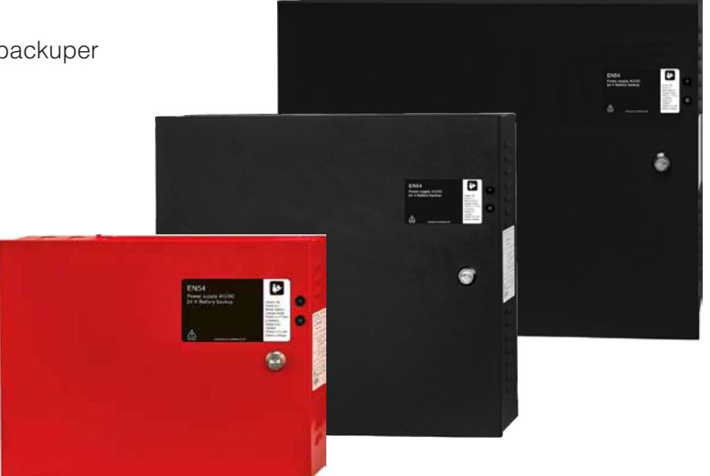

# EN54 Serien

# EN54 MX Serien

- √ EN54-4 & EN12101-10 Certifierade batteribackuper
- √ Controlled charging funktion
- √ Kvalificerat batterikapacitetstest
- √ Väggmontage
- √ MX S rymmer 2x 7,2Ah batterier
- √ MX M rymmer 2x 20Ah batterier
- √ MX L rymmer 2x 45Ah batterier

EN54 MX serien används huvudsakligen för att driva rökluckor där en EN12101-10 certifierad batteribackup krävs eller larmdon där en godkänd eller EN54-4 certifierad batteribackup krävs.

EN54 MX Serien erbjuder CONTROLLED CHARGING vilket innebär att batterierna aldrig laddas med mer än 30% av rekommenderat batteris märkkapacitet. Kontrollerad laddning förhindrar att batterierna överladdas och förlänger deras livslängd betydligt.

EN54 MX serien är också utrustad med interna effektmotstånd för kvalificerat batterikapacitetstest, som meddelar när batterierna måste bytas ut innan batterierna åldras.

Typiska användningsområden:

- Rökluckort
- Externa larmdon
- Brandlarm

Förväntad drifttid vid potentiellt strömavbrott (nya batterier): Vid nedan last:

| Systemspänning |    | Batterier | 0,5A | 1A   | 2A  | 4A   | 6A |
|----------------|----|-----------|------|------|-----|------|----|
| 24V            | 2x | 7,2Ah     | 12h  | 5,5h | -   | -    | -  |
| 24V            | 2x | 20Ah      | 30h  | 18h  | 9h  | 3,5h | -  |
| 24V            | 2x | 45Ah      | 70h  | 40h  | 20h | 10h  | 6h |

Version: 2021-06_V01

## POWER SUPPLIES - MADE IN SWEDEN

# EN54 Serien

## Teknisk data

|                                                | EN54 24V 1,5A MX S                                                                                                                                                    | EN54 24V 5,5A MX M                                                                                                                                                                                                                              | EN54 24V 7,5A MX L                 |  |
|------------------------------------------------|-----------------------------------------------------------------------------------------------------------------------------------------------------------------------|-------------------------------------------------------------------------------------------------------------------------------------------------------------------------------------------------------------------------------------------------|------------------------------------|--|
| INFORMATION GÄLLANDE KAPSLING:                 |                                                                                                                                                                       |                                                                                                                                                                                                                                                 |                                    |  |
| Rekommenderad miljö / Skyddsklass:             |                                                                                                                                                                       | Miljöklass 1, Inomhus, 20% ~ 90% relativ fuktighet / IP32                                                                                                                                                                                       |                                    |  |
| Omgivningstemperatur:                          |                                                                                                                                                                       | +5 °C - 40 °C (För optimal batterilivslängd +15 °C - +25 °C)                                                                                                                                                                                    |                                    |  |
| Rekommenderad montering:                       |                                                                                                                                                                       | Väggmontage                                                                                                                                                                                                                                     |                                    |  |
| Dimension (Höjd x Bredd x Djup):               | 250x340x80 mm                                                                                                                                                         | 356x395x96 mm                                                                                                                                                                                                                                   | 455x356x187 mm                     |  |
| Nettovikt:                                     | 3,1 kg                                                                                                                                                                | 4,2 kg                                                                                                                                                                                                                                          | 7 kg                               |  |
| Antal kabelgenomföringar:                      | 4 st                                                                                                                                                                  | 7 st                                                                                                                                                                                                                                            | 7 st                               |  |
| Kapslingens färg:                              | Röd                                                                                                                                                                   | Svart                                                                                                                                                                                                                                           | Svart                              |  |
| Inbyggd fläkt för kylning:                     |                                                                                                                                                                       | Nej                                                                                                                                                                                                                                             |                                    |  |
| ELEKTRISK INFORMATION:                         |                                                                                                                                                                       |                                                                                                                                                                                                                                                 |                                    |  |
| Inspänning:                                    |                                                                                                                                                                       | 110V-264VAC/47-63Hz                                                                                                                                                                                                                             |                                    |  |
| Utspänning:                                    |                                                                                                                                                                       | 27,3VDC                                                                                                                                                                                                                                         |                                    |  |
| Max ström:                                     | 1,5A                                                                                                                                                                  | 5,5A                                                                                                                                                                                                                                            | 7,5A                               |  |
| Ladd ström:                                    | 0,5A                                                                                                                                                                  | 1A                                                                                                                                                                                                                                              | 2A                                 |  |
| Nominell effekt:                               | 36W                                                                                                                                                                   | 150W                                                                                                                                                                                                                                            | 200W                               |  |
| Rippel i normalläge:                           | 150mVp-p                                                                                                                                                              | 150mVp-p                                                                                                                                                                                                                                        | 200mVp-p                           |  |
| Effektivitet:                                  | 88%                                                                                                                                                                   | 90%                                                                                                                                                                                                                                             | 89%                                |  |
| Värmegenerering vid 50% / 80% av märkeffekten: | 3W / 5W                                                                                                                                                               | 6W / 10W                                                                                                                                                                                                                                        | 9W / 15W                           |  |
| Ingångsström:                                  | 0,42A                                                                                                                                                                 | 1,2A                                                                                                                                                                                                                                            | 1,7A                               |  |
| Antal avsäkrade utgångar:                      | 2 st.                                                                                                                                                                 | 2 st.                                                                                                                                                                                                                                           | 2 st.                              |  |
| Typ av säkring på utgång:                      | 2 st. F1,5A (glas)                                                                                                                                                    | 2 st. F6A (glas)                                                                                                                                                                                                                                | 2x 7,5A (flatstift)                |  |
| Djupurladdning av batterier sker vid:          |                                                                                                                                                                       | 21 VDC                                                                                                                                                                                                                                          |                                    |  |
| Möjlig att parallellkoppla:                    |                                                                                                                                                                       | Ja                                                                                                                                                                                                                                              |                                    |  |
| Skydd mot:                                     |                                                                                                                                                                       | Överlast, Överspänning, Övertemperatur, Kortslutning & Djupurladdning av batterier                                                                                                                                                              |                                    |  |
| Larmfunktioner (2 utgångar):                   | Åldrat batteri, Bortkopplade batterier, Nätavbrottslarm, Laddarfel överspänning, Laddarfel underspänning, Låg batterispänning, Säkringsfel (Option: Sabotagelarm). |                                                                                                                                                                                                                                                 |                                    |  |
| Larm via:                                      |                                                                                                                                                                       | Växlande relä                                                                                                                                                                                                                                   |                                    |  |
| ARTIKEL INFORMATION:                           |                                                                                                                                                                       |                                                                                                                                                                                                                                                 |                                    |  |
| Artikelnamn:                                   | EN54 24V 1,5A MX S                                                                                                                                                    | EN54 24V 5,5A MX M                                                                                                                                                                                                                              | EN54 24V 7,5A MX L                 |  |
| Artikelnummer:                                 | C000P00024P015-EN54                                                                                                                                                   | C010P00024P055-EN54                                                                                                                                                                                                                             | C010P00024P075-EN54                |  |
| E-nummer:                                      | 5213545                                                                                                                                                               | 5213630                                                                                                                                                                                                                                         | 5213631                            |  |
| Produkten möter kraven enligt:                 |                                                                                                                                                                       | CE direktivet enligt:765/2008, EMC Direktiv 2014/30EU, Emission: EN61000-6-:2001, EN55022:1998:-A1:2000, A2:2003 Klass B, EN61000-3-2:2001, Immunity: EN61000-6-2:2005, EN61000-4-2, -3, 4, -5, -6, -11, Lågspännings direktivet: 2014/35/EU |                                    |  |
| Certifierad enligt / Certifikatsnummer:        |                                                                                                                                                                       | EN54-4:1997, EN54-4:1997/A2:2006, EN54-4:1997/AC:1999 /18-243                                                                                                                                                                                   |                                    |  |
| Garantiperiod:                                 |                                                                                                                                                                       | 2 år                                                                                                                                                                                                                                            |                                    |  |
| Designad och producerad av:                    |                                                                                                                                                                       | Merawex                                                                                                                                                                                                                                         |                                    |  |
| Ursprungsland:                                 |                                                                                                                                                                       | Polen                                                                                                                                                                                                                                           |                                    |  |
| INFORMATION OCH VAL AV BATTERI / BATTERIER:    |                                                                                                                                                                       |                                                                                                                                                                                                                                                 |                                    |  |
| Rekommenderad batterityp:                      |                                                                                                                                                                       | 12V Underhållsfria batterier, typ AGM eller Lithium LiFePO4                                                                                                                                                                                     |                                    |  |
| Möjliga batterier för montering i kapsling:    | 2 st. 7,2 Ah batterier                                                                                                                                                | 2 st. 20 Ah batterier                                                                                                                                                                                                                           | 2 st. 45 Ah batterier              |  |
| Rekommenderat batteri:                         | UPLUS 10+ Design Life 7,2Ah batteri                                                                                                                                   | UPLUS 10+ Design Life 20Ah batteri                                                                                                                                                                                                              | UPLUS 10+ Design Life 45Ah batteri |  |
| Artikelnummer rekommenderat 20Ah batteri:      | MT113-12V07-01                                                                                                                                                        | MT113-12V20-01                                                                                                                                                                                                                                  | MT113-12V45-01                     |  |

### Möjliga tillval

| ARTIKELTYP:                                 | ARTIKELNAMN:            | ARTIKELNUMMER:   | SPÄNNING: | E-NUMMER: | MAX MÖJLIGT ANTAL: |
|---------------------------------------------|-------------------------|------------------|-----------|-----------|--------------------|
| Avsäkringskort 6 utgångar                   | 6 output module         | A-FU002406OP01   | 24V       | 5213560   | 1x                 |
| Panel för extern montering av tillvalskort: | 19 rack module holder   | 4U01000P00019P01 | -         | 5001063   | -                  |
| Larmdonsövervakningskort i kapsling         | Fire module 4 outputs S | SM01FU002404FS01 | 24V       | 5257468   | -                  |
| Avsäkringskort 10 output module i kapsling  | 10 output module Mini   | MI01FU002410OP01 | 24v       | 5213622   | -                  |