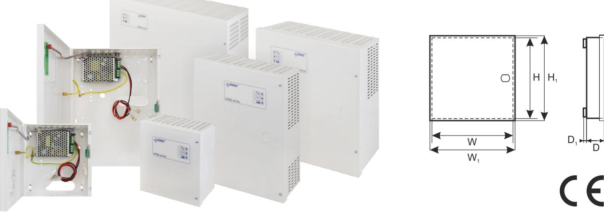

## **Power supplies HPSB series**

**Buffer switched mode power supply**

**EN**

**HPSB** v.1.0/I CODE:

**Buffer switched mode power supply** TYPE:

**Features:**

- · supply voltage ~200 240 V
- · DC 13,8 V; 27,6 V or 54 V uninterruptible power supply
- · available versions with space for **7 Ah – 65 Ah** batteries
- · available versions with current efficiencies **13,8 V: 2A/3A/5A/7A/10A/15A/20A 27,6 V: 2A/3A/5A/7A/10A 54 V: 3A/5A**
- · high efficiency (up to 90%)
- · battery charging and maintenance control
- · battery charging current jumper selectable (models with charging current adjustment)
- · LED optical indication
	- · deep discharge battery protection (UVP)
	- · battery output protection against short circuit and reverse connection
	- · protections:
		- o SCP short-circuit protection
		- o OLP overload protection
		- o over voltage protection
		- o surge protection
		- o against sabotage: unwanted enclosure opening
	- · warrenty 2 years from production date

## **Description**

Switch mode buffer power supply units HPSB are intended for continuous power supply to devices that require stabilised voltage of 12, 24 or 48 V DC (±15%).

## **DISPLAYING PARAMETERS OF THE POWER SUPPLY:**

| PSU's name    | Output voltage | Output current max. | Charging current |
|---------------|----------------|---------------------|------------------|
| HPSB-12V2A-B  | 13,8 V         | 2,5 A               | 0,5 A            |
| HPSB-12V3A-B  | 13,8 V         | 3,5 A               | 0,5 A            |
| HPSB-12V3A-C  | 13,8 V         | 3,5 A               | 0,5 A            |
| HPSB-12V5A-C  | 13,8 V         | 5,5 A               | 0,5 / 1 A        |
| HPSB-12V7A-C  | 13,8 V         | 7 A                 | 1 / 2 A          |
| HPSB-12V10A-C | 13,8 V         | 10 A                | 1 / 4 A          |
| HPSB-12V15A-D | 13,8 V         | 15 A                | 2 / 4 A          |
| HPSB-12V20A-E | 13,8 V         | 20 A                | 2 / 4 / 8 A      |
| HPSB-24V2A-B  | 27,6 V         | 2,2 A               | 0,2 / 0,5 A      |
| HPSB-24V3A-B  | 27,6 V         | 3,5 A               | 0,5 / 1 A        |
| HPSB-24V5A-C  | 27,6 V         | 5 A                 | 0,5 / 2 A        |
| HPSB-24V7A-C  | 27,6 V         | 7 A                 | 1 / 2 A          |
| HPSB-24V10A-D | 27,6 V         | 10 A                | 1 / 2 / 4 A      |
| HPSB-48V3A-B  | 54 V           | 3 A                 | 0,5 / 1 A        |
| HPSB-48V5A-C  | 54 V           | 5 A                 | 0,5 / 1 / 2 A    |

**Total current of the receivers + battery charging current mustn't cross maximum current of power supply.**

## **Power supplies HPSB series Buffer switched mode power supply**

**Overload protection OLP**

| TECHNICAL DATA                                                     | HPSB-12V                                                                                                          | HPSB-24V                                                                                              | HPSB-48V                                                                  |  |
|--------------------------------------------------------------------|-------------------------------------------------------------------------------------------------------------------|-------------------------------------------------------------------------------------------------------|---------------------------------------------------------------------------|--|
| PSU type:                                                          | A (EPS - External Power Source), II environmental class                                                        |                                                                                                       |                                                                           |  |
| Power supply:                                                      | ~ 200 - 240 V                                                                                                     |                                                                                                       |                                                                           |  |
| Output voltage:                                                    | 11 - 13,8 V – buffer operation 10 - 13,8 V – battery-assisted operation                                     | 22 - 27,6 V – buffer operation 20 - 27,6 V – battery-assisted operation                         | 44 - 54 V – buffer operation 40 - 54 V – battery-assisted operation |  |
| Voltage adjustment range:                                          | 13.5 – 14 V                                                                                                       | 27 – 28,8 V                                                                                           | 53 – 56 V                                                                 |  |
| Current consumption by PSU during battery – assisted operation  | 15 - 40mA                                                                                                         | 15 - 30mA                                                                                             | 30mA                                                                      |  |
| Battery circuit protection SCP and reverse polarity connection: | – polymer fuse (returnable) – F fuse (in case of a failure, fuse-element replacement required) BAT |                                                                                                       |                                                                           |  |
| Overload protection OLP                                            | 105-150% of the PSU power, automatic return                                                                       |                                                                                                       |                                                                           |  |
| Overvoltage protection OVP                                         | 37V activation of protection requires disconnection of main supply voltage for approx. 1 minute                |                                                                                                       |                                                                           |  |
| Deep discharge battery protection UVP:                             | U<9,5 V – disconnection of battery terminal                                                                    | U<19 V – disconnection of battery terminal                                                         | U<38 V – disconnection of battery terminal                             |  |
| Tamper protection:                                                 |                                                                                                                   |                                                                                                       |                                                                           |  |
| TAMPER indicates enclosure opening                                 | microswitch, NC contacts (enclosure closed), 0,5 A@50 V DC (max.)                                              |                                                                                                       |                                                                           |  |
| Optical indication:                                                | LEDs on PCB of power supply unit LED indicators on power supply's cover                                        |                                                                                                       |                                                                           |  |
| Operating conditions:                                              | o o II environmental class (PN-EN12101-10:2007), -5 C ÷ 40 C                                                |                                                                                                       |                                                                           |  |
| Protection class EN 62368-1:                                       | I (first)                                                                                                         |                                                                                                       |                                                                           |  |
| Degree of Protection EN 60529:                                     | IP20                                                                                                              |                                                                                                       |                                                                           |  |
| Operating temperature:                                             | -10ºC+40ºC                                                                                                        |                                                                                                       |                                                                           |  |
| Storage temperature:                                               | -20ºC+60ºC                                                                                                        |                                                                                                       |                                                                           |  |
| Vibrations and impulse waves during transport:                  | Wg PN-83/T-42106                                                                                                  |                                                                                                       |                                                                           |  |
| Enclosure:                                                         | Steel sheet DC01 0,7–1,0mm, color: RAL 9003                                                                       |                                                                                                       |                                                                           |  |
| Closing:                                                           | Cheese head screw x 2 (at the front), (lock assembly possible)                                                    |                                                                                                       |                                                                           |  |
| Declarations, warranty:                                            | CE, 2 years from production date                                                                                  |                                                                                                       |                                                                           |  |
| Notes:                                                             |                                                                                                                   | Enclosure does not adjoin assembly surface so that cables can be led Cooling: convectional / orced |                                                                           |  |