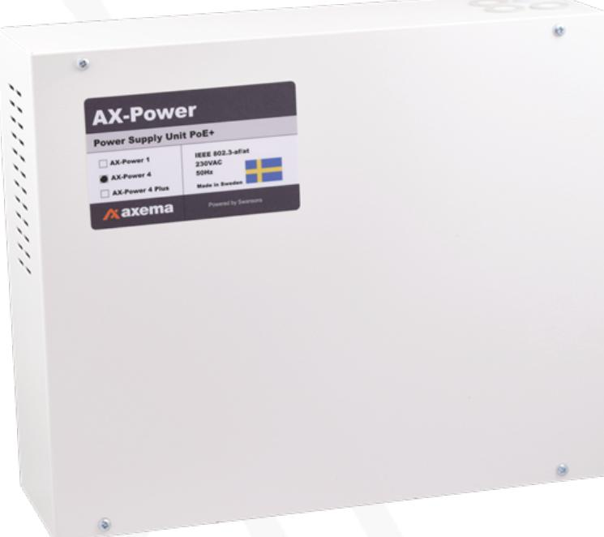
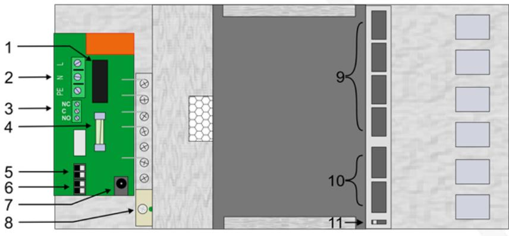
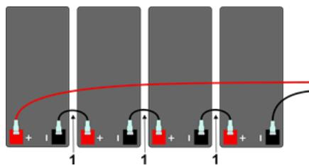

#### Manual

Uppdaterad 2021-10-19

## **AX-Power 4 (Med patchpanel)**

Strömförsörjningsaggregat med PoE-switch, 4 portar samt möjlighet till reservkraft.

Dokumentet gäller för AX-Power 4 fr.o.m. serienummer 001001.

# Introduktion

AX-Power 4 är ett strömförsörjningsaggregat PoE (Power over Ethernet) enligt standard IEEE 802.3at, med möjlighet till avbrottsfri kraft då enheten har plats för 4 st. batterier (12V 7,2-9 Ah). En enda ethernet-kabel (CAT6 UTP) är allt som behövs till dörrmiljön. AX-Power 4 har fyra PoEportar, vilka förser dörrmiljöer i Axema VAKA passersystem med upp till 30W per port, samt två standard nätverks-portar (utan PoE, används som in-/utgång).

AX-Power 4 har en inbyggd patchpanel för Keystone-jack, för enklare och snyggare installationer samt för smidig sammankoppling med ytterligare enheter.

AX-Power 4 är skyddad mot överbelastning, kortslutning samt mot djup-urladdning av batterierna. Nät, last och batterier skyddas av säkringar.

# Säkerhet

#### Denna instruktion skall läsas igenom i sin helhet av all handhavande personal.

Vid tveksamhet kring aggregatets uppbyggnad, funktion, komponenter och/eller säkerhet skall Axema kontaktas.

Endast behörig elektriker får installera och/eller utföra underhåll av denna enhet. Endast isolerade verktyg ska användas vid arbete med aggregatet. Observera att farliga spänningar och strömmar kan förekomma i enheten oavsett om de interna säkringarna är in- eller urkopplade.

Kontrollera att kretskort är fast monterade och att enheten inte är transportskadad.

Används batterier är dessa alltid elektrokemiskt aktiva. Kortslut inte batteripolerna.

#### Anslutningar

- 1. Säkring 230 VAC-sidan, 2AT keramisk
- 2. Nätspänning, 230 VAC
- 3. Larmutgång, indikerar nätspänningsavbrott
- 4. Batterisäkring 3,15AT
- 5. Batterianslutning, notera + och -
- 6. Spänningsutgång 48 VDC för extrern utrustning, exempelvis DC/DC-omvandlare
- 7. 48 VDC-utgång (för PoE-switch)
- 8 Laddspänningsjustering (Används normalt inte)
- 9. RJ-45-portar med PoE (Port 3-6)
- 10. RJ-45-portar utan PoE (Port 1-2)
- 11. Driftläges-omkopplare, ska stå i läge Standard.

#### Inkoppling 230 VAC

- 1. Montera aggregatet med minst 100 mm fritt utrymme runt enheten.
- 2. Anslut nätspänning 230 VAC genom någon av de övre kabelgenomföringarna, lysdioden för nätspänning tänds. Om så inte sker, kontrollera nätspänning och säkring för denna.
- 3. Innan batterierna ansluts till batterianslutningen, koppla batterierna i serie med medföljande kablage.
- 4. Anslut batterierna till batterianslutningen.

Tips: Om batterisäkringen utlöser, kontrollera kopplingar och ansluten utrustning.

#### Batterier i serie

Batterier i PoE-aggregatens batteribank seriekopplas för att uppnå aggregatets driftspänning. AX-Power 1 har två batterier, alla övriga PoE-switchar från Axema har fyra batterier.

- 1. Sammankopplingskabel
- 2. Ansluts till PoE-switchens batterianslutning (röd +, svart -)

# Ungefärliga batteritider

En dörrmiljö med läsarterminal med inaktivt elektriskt lås motsvarar normalt en last på mindre än 6W.

#### PoE-Portar Batterier 30W/utg. 15W/utg. 6W/utg.

| 1 | 4*7,2 | 11   | 21   | 40   |
|---|-------|------|------|------|
|   | Ah    | tim. | tim. | tim. |
| 2 | 4*7,2 | 5,5  | 11   | 28   |
|   | Ah    | tim. | tim. | tim. |
| 3 | 4*7,2 | 2,8  | 8,2  | 20   |
|   | Ah    | tim. | tim. | tim. |
| 4 | 4*7,2 | 1,5  | 5,3  | 14   |
|   | Ah    | tim. | tim  | tim. |

#### Teknisk data och prestanda

| Attribut                | AX-Power 4                          |
|-------------------------|----------------------------------------|
| Strömförsörjning        | 230VAC +/-15%, 1fas, 50 Hz |
| Inbyggd switch       | Ja                                     |
| Inbyggd brandvägg    | Nej                                    |
| PoE-stöd                | Ja                                     |
| IP-klass                | IP20                                   |
| IK-klass                | IK06                                   |
| Temperaturområde (C) | -10° till +30°                   |
| Art.-nr                 | 2-3740-1                               |
| E-nummer                | E5172451                               |