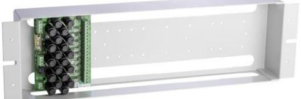
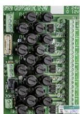

 **SM40** 

Funktion: Hel säkring indikeras med grön lysdiod och utlöst larm av att lysdioden för gruppen slocknar och att ett summalarmrelä med potentialfri växlingskontakt aktiveras. Fördelning av strömmatning, max 10A, till 10 sektioner 2-poligt avsäkrade med 2A. Huvudsäkring 1 poligt 10As. Automatisk anpassning till 12V eller 24V. Separat anslutning för skärm (jord).

### **MODELLER**

 

- **SM910:** Stativmontage 19" säkringspanel för 12-24VDC för
- **SM930:** Väggmonterad säkringspanel för 12-24VDC
- **SM920:** Utökningskort för 12-24VDC
- **SM919:** Stativmontage 19" säkringspanel för 12-24VAC
- **SM929:** Utökningskort för 12-24VAC

### **BESKRIVNING**

Gruppsäkringskort monterat i 19" kassett eller i plastkapsling för väggmontage med transparant lock .  **Strömförsörjning med plats för batteri**

> 19" kassetten SM910/SM919 levereras med ett gruppsäkringskort med 10 utgångar och kan enkelt kompletteras med ytterligare 3st utökningskort. Det ger upp till 40 utgångar i en 19" enhet.

Väggmonterade lådan levereras med ett gruppsäkringskort med 10st utgångar och kan inte kompletteras med ytterligare kort.

Plint för inkommande och vidarekoppling av huvudspänning - max 2,5 mm2 kabel och plint för gruppfördelning, max 1,5 mm2 kabel.

#### **TEKNISKA DATA**

| SM910, SM920, SM930 Inspänning DC | 9-32VDC |
|--------------------------------------|---------|
| SM919, SM929 Inspänning AC        | 8-30VAC |

 **CE-märkt enligt EN50081-1 och EN50082-1** 

| E-Nummer | Typ  |                                                | HxBxD mm    |
|----------|------|------------------------------------------------|-------------|
| 5247045  | 910S | SM910 19"ram med 10-gruppsäkringskort 12-24VDC | 135x480x60  |
| 5247046  | 911S | SM911 19" endast ram                           | 135x480x60  |
| 5247047  | 912S | SM912 Lock till 19" ram                        | 135x480     |
| 5247048  | 920S | SM920 Utökningskort 10-grupp 12-24VDC          | 130x90x45   |
| 5247049  | 930S | SM930 Vägg mont.10-gruppsäkringskort 12-24VDC  | 180x180x100 |
| 5247044  | 919S | SM919 19"ram med 10-gruppsäkringskort 12-24VAC | 135x480x60  |
| 5247065  | 929S | SM929 Utökningskort 10-grupp 12-24VAC          | 135x480x60  |

Postadress/Postal address **Swansons Telemekanik AB** Hålstensvägen 4 SE-446 37 Älvängen

Telefon nr/Telephone no +46(0)303-746 320 Hemsida/Webb www.swtm.se

Telefax nr/Telefax no +46(0)303-748 490 e-post info@swtm.se

# **SM930 DC E nr: 52 470 49**

# **SM910 DC E nr: 52 470 45 SM920 DC E nr: 52 470 48**

# **INKOPPLINGSANVISNING**

Anslut först 12-24Vpå plint8 märkt 12-24V IN. Om utökningskort ska användas kopplas spänningen vidare på plint7 12- 24V UT. Lysdiod för utgångarna tänds Kontrollera att utspänningen är riktig Anslut lasten Om lysdiod för utgångar inte tänds kontrollera inspänning och ingångssäkringarna. Löser säkringarna, kontrollera inkoppling och inkopplade apparater.

# **SÄKRINGAR**

| F21               | Primärsäkringar 10As  |
|-------------------|-----------------------|
| FUSE1-1 – 10-2 | Sekundärsäkringar 2As |

|                       | GR1  |
|-----------------------|------|
| INGÅNG                |      |
| 12-24V                | GR2  |
| UTG.                  |      |
| 12-24V                | GR3  |
|                       | GR4  |
|                       |      |
|                       | GR5  |
|                       |      |
| Säkrfel               | GR6  |
| Larm                  | GR7  |
|                       |      |
| 127mm                 | GR8  |
|                       | GR9  |
| Jord                  |      |
|                       | GR10 |
|                       |      |
| 90mm FUSE          |      |
| LED F1-F10 UTSP |      |
|                       |      |
|                       |      |

Postadress/Postal address **Swansons Telemekanik AB** Hålstensvägen 4 SE-446 37 Älvängen

Telefon nr/Telephone no +46(0)303-746 320 Hemsida/Webb www.swtm.se

Telefax nr/Telefax no +46(0)303-748 490 e-post info@swtm.se

# 

# **SM919 AC E nr: 52 470 44 SM929 AC E nr: 52 470 65**

## **INKOPPLINGSANVISNING**

Anslut först 12-24VAC på plint8 märkt 12-24V IN. Om utökningskort ska användas kopplas spänningen vidare på plint7 12- 24VAC UT. Lysdiod för utgångarna tänds Kontrollera att utspänningen är riktig Anslut lasten Om lysdiod för utgångar inte tänds kontrollera inspänning och ingångssäkringarna. Löser säkringarna, kontrollera inkoppling och inkopplade apparater.

# **SÄKRINGAR**

| F21               | Primärsäkringar 10As  |
|-------------------|-----------------------|
| FUSE1-1 – 10-2 | Sekundärsäkringar 2As |

|         | GR1  |
|---------|------|
| 12- 24V |      |
| AC IN   | GR2  |
| 12-24V  |      |
| AC UT   | GR3  |
|         |      |
|         | GR4  |
|         |      |
|         | GR5  |
|         |      |
| Larm    | GR6  |
| relä    |      |
|         | GR7  |
|         |      |
| 127mm   | GR8  |
|         |      |
| Jord    | GR9  |
|         |      |
|         | GR10 |
|         |      |

**90mm** 

Postadress/Postal address **Swansons Telemekanik AB** Hålstensvägen 4 SE-446 37 Älvängen

Telefon nr/Telephone no +46(0)303-746 320 Hemsida/Webb www.swtm.se

Telefax nr/Telefax no +46(0)303-748 490 e-post info@swtm.se

# **SM910 DC E nr: 52 470 45 SM920 DC E nr: 52 470 48 SM930 DC E nr: 52 470 49**

# **INKOPPLINGSANVISNING**

Anslut först 12-24Vpå plint8 märkt 12-24V IN. Om utökningskort ska användas kopplas spänningen vidare på plint7 12- 24V UT. Lysdiod för utgångarna tänds Kontrollera att utspänningen är riktig Anslut lasten Om lysdiod för utgångar inte tänds kontrollera inspänning och ingångssäkringarna. Löser säkringarna, kontrollera inkoppling och inkopplade apparater.

# **SÄKRINGAR**

| F21               | Primärsäkringar 10As  |
|-------------------|-----------------------|
| FUSE1-1 – 10-2 | Sekundärsäkringar 2As |

|         | GR1  |
|---------|------|
| 12- 24V |      |
| IN      | GR2  |
| 12-24V  |      |
| UT      | GR3  |
|         |      |
|         | GR4  |
|         |      |
|         | GR5  |
|         |      |
|         | GR6  |
| Larm    |      |
| relä    | GR7  |
|         |      |
|         | GR8  |
| 127mm   |      |
|         | GR9  |
| Jord    |      |
|         | GR10 |
|         |      |
|         |      |

**90mm** 

Postadress/Postal address **Swansons Telemekanik AB** Hålstensvägen 4 SE-446 37 Älvängen

Telefon nr/Telephone no +46(0)303-746 320 Hemsida/Webb www.swtm.se

Telefax nr/Telefax no +46(0)303-748 490 e-post info@swtm.se