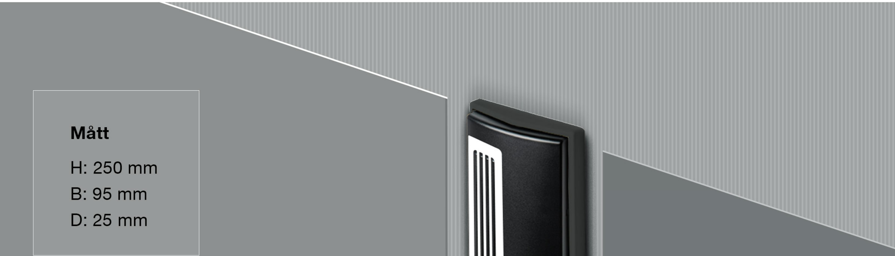
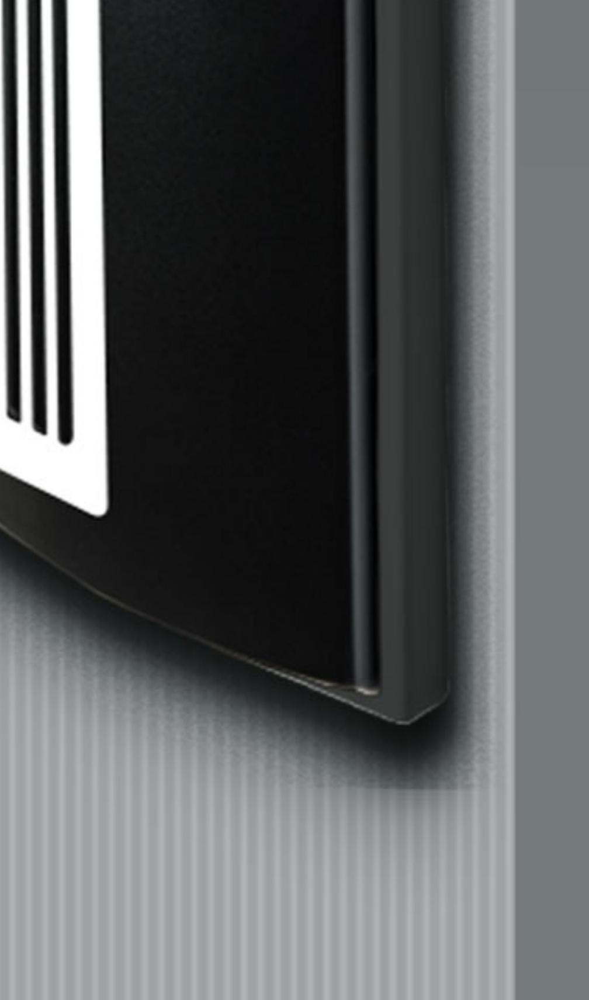
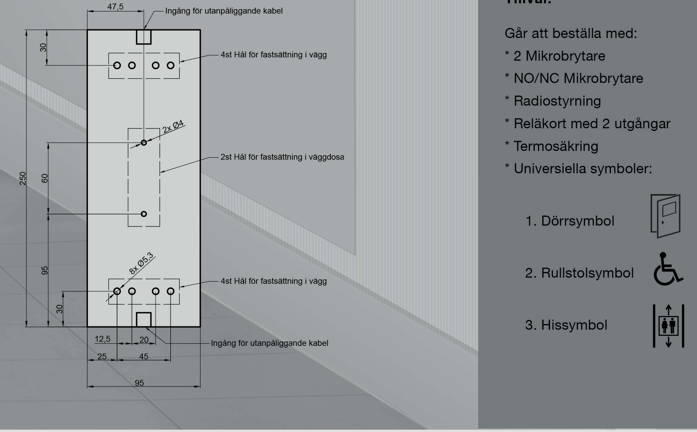

## Tekniskt produktblad JCK212

Mikrobrytare 1 st NO IP klass: IP67 Nominell märkström från: 0,1 A - 10 A/250 V AC Lägsta märkström 1mA/4 V DC

Material: ABS - Plast

## Rengöring:

Kontakten går att rengöra med alla förekommande rengörningsmedel.

## Hålbildsritning:

## Tillval:

JC Kontakter AB | Karl Johansgatan 152 | SE-414 51 | Göteborg | Tel: 031-24 11 09 | info@jckontakter.se www.jckontakter.se