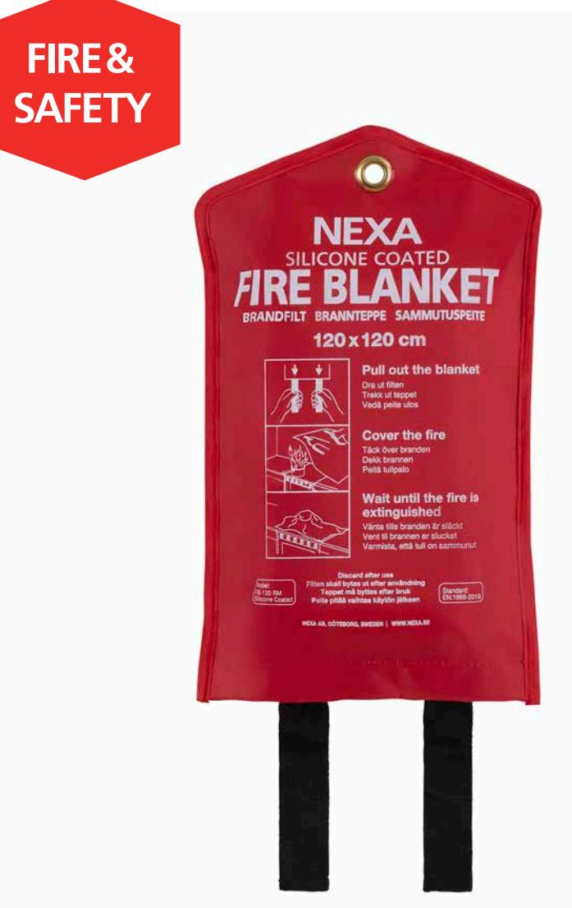

## **TRYGGA HEM**

## **FB-120 RM** BRANDFILT SILIKON, 120 CM

En brandfilt rekommenderas som komplement till en brandsläckare, för att snabbt kunna släcka mindre bränder i exempelvis kläder eller kokkärl.

En silikonbelagd brandfilt kväver branden ännu snabbare än en vanlig brandfilt och minskar risken för återantändning avsevärt. Placera brandfilten synligt där risk för brand kan förekomma, exempelvis i köket, verkstaden eller bredvid öppen spis.

- Minimalt med saneringsarbete efter släckning·
- Snabbare släckning,·mindre risk för återantändning·
- Uppfyller kraven enligt EN1869-2019

## **TEKNISK DATA**

| Material brandfilt            | Glasfiberväv med silikonbeläggning |
|-------------------------------|------------------------------------|
| Temperatur                    | Tål temperaturer upp till 500 °C   |
| Mått filt (B x H)             | 120 x 120 cm                       |
| Mått fodral (B x H)           | 18,5 x 30,5 cm                     |
| EAN                           | 7330545136111                      |
| Art nr   E-nummer   EL-nummer | 13611   16 939 05   88 046 94      |

