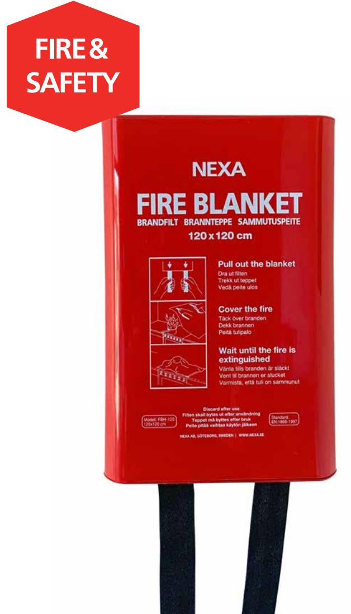

## **TRYGGA HEM**

## **FB-120 RH** BRANDFILT SILIKON, 120 CM

Brandfilt förpackad i en glansig hårdbox som gör den lätt att torka av.

En silikonbelagd brandfilt i glasfiberväv kväver brand snabbare än en vanlig brandfilt och minskar risken för återantändning avsevärt och är ett bra komplement till en brandsläckare, för att snabbt kunna släcka mindre bränder i exempelvis kläder eller kokkärl.

Placera brandfilten synligt där risk för brand kan förekomma, exempelvis i köket, verkstaden eller bredvid öppen spis.

- Minimalt med saneringsarbete efter släckning
- Snabbare släckning, mindre risk för återantändning
- Lätt att torka av
- Uppfyller kraven enligt EN 1869:2019

| Material brandfilt            | Glasfiberväv, Silikonbelagd      |
|-------------------------------|----------------------------------|
| Temperatur                    | Tål temperaturer upp till 500 °C |
| Mått filt (B x H)             | 120 x 120 cm                     |
| Mått box (B x H)              | 16 x 24,5 cm                     |
| EAN                           | 7330545136715                    |
| Art nr   E-nummer   EL-Nummer | 13 671   16 940 50   88 017 02   |

