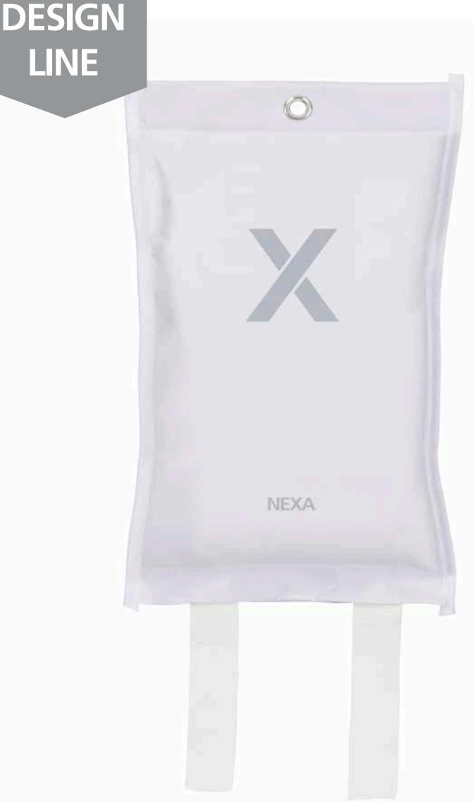

## **TRYGGA HEM**

## **FB-120 VMD** BRANDFILT VIT, 120 CM

Design Line är ett stilfullt sortiment från Nexa med designade brandfiltar och brandsläckare för hem och fritid.

En silikonbelagd brandfilt i glasfiberväv kväver brand snabbare än en vanlig brandfilt och minskar risken för återantändning avsevärt och är ett bra komplement till en brandsläckare, för att snabbt kunna släcka mindre bränder i exempelvis kläder eller kokkärl.

Placera brandfilten synligt där risk för brand kan förekomma, exempelvis i köket, verkstaden eller bredvid öppen spis.

- Minimalt med saneringsarbete efter släckning
- Snabbare släckning, mindre risk för återantändning
- Uppfyller kraven enligt EN 1869:2019

## **TEKNISK DATA**

| Material brandfilt            | Glasfiberväv, silikonbelagd      |
|-------------------------------|----------------------------------|
| Temperatur                    | Tål temperaturer upp till 500 °C |
| Mått filt (B x H)             | 120 x 120 cm                     |
| Mått fodral (B x H)           | 18 x 30 cm                       |
| EAN                           | 7330545136333                    |
| Art nr   E-nummer   EL Nummer | 13 633   16 940 46   88 016 97   |

