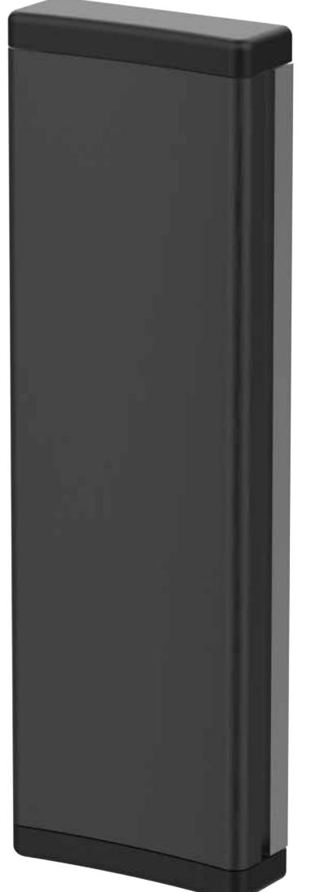

## **Armbågskontakt Svart Aluminium**

AK-11

Tillverkad av aluminium, svart med grå botten. Kontakten är vandalsäker och avsedd att placeras utomhus då den har fuktsäkra dubbla mikrobrytare. Som tillbehör finns komplett sats med mikrobrytare och montagedetaljer. Skyddshuven är tillverkad i 1,25 mm rostfritt stål med borstad yta. De levereras med montagehål där armbågskontakten kan monteras tillsammans med skyddshuven direkt på underlag. Som tillbehör till AK finns även dekaler för kontrastmarkering i vitt eller svart och dekal med text dörröppning

## **Specifikationer**

| Djup (mm):             | 28             |
|------------------------|----------------|
| Bredd (mm):            | 80             |
| Höjd (mm):             | 245            |
| Vikt (kg):             | 0.4            |
| IP klass:              | IP67           |
| Material:              | Aluminium      |
| Maxström (VAC):        | 10A / 250VDC   |
| Kontakter:             | 2x NO          |
| Laddström:             | 0              |
| Strömförbrukning (mA): | 0              |
| Färg:                  | Svart / silver |