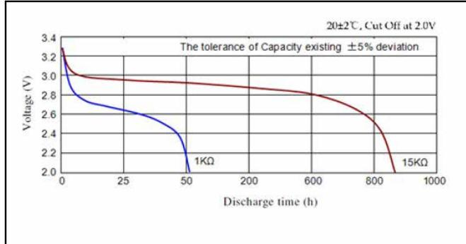
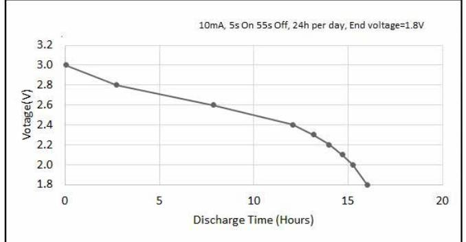
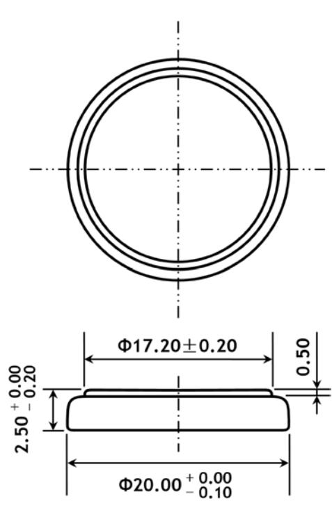

| Description       | : Flat Lithium Battery         |  |
|-------------------|--------------------------------|--|
| Chemical system   | : Lithium Manganese            |  |
| Nominal voltage   | : 3 Volts                      |  |
| Nominal capacity  | : 165mAh                       |  |
| Dimensions        | : Ø20mm x 2.5mm                |  |
| Shelf life        | : 10 years at room temperature |  |
| Average weight    | : 2.5 grams                    |  |
| Temperature range | : -20°C ~60°C                  |  |

### **Cross References:**

| IEC    | JIS    | Panasonic | Varta  |
|--------|--------|-----------|--------|
| CR2025 | CR2025 | CR2025    | CR2025 |

#### **Discharge Characteristics**

### **Pulse discharge characteristics**

# **DATA SHEET**

## **Model No.: CR2025**

Dimension Drawing

The information (subject to change without prior notice) contained in this document is for reference only and should not be used as a basis for product guarantee or warranty. For applications other than those described here, please consult your nearest GP Sales and Marketing Office or Distributors.

