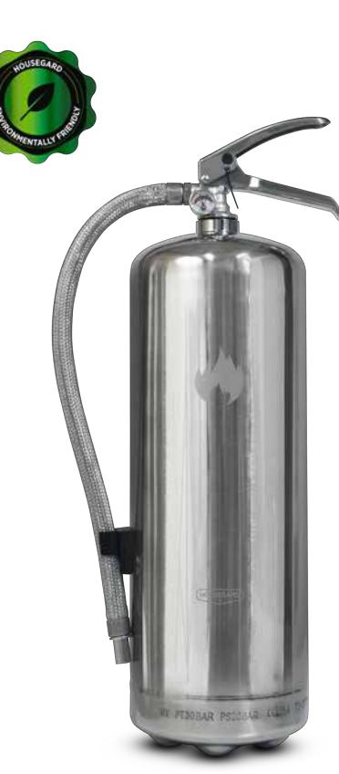

# **PRODUKTDATABLAD FDV**

Modell: PE6HR-B

## **Bruksområde**

Er nya Housegard brandsläckare innehåller ett ABC-pulver som är avsett för släckning av bränder i olika material såsom trä, papper, tyger, brandfarliga vätskor och kemikalier. Brandsläckaren kan också användas vid bränder i elektriska installationer som uppgår till 1000 Volt. Vid släckning av bränder i elektriska installationer skall du hålla ett säkerhetsavstånd på minst 1 meter.

**Typiska användningsområde:** Industri, offentlig verksamhet, verkstäder, jordbruk, sjöfart, offshore, transport, fordon, fritidsbåtar och andra platser där hög prestanda är avgörande. Pulverbrandsläckare är förstahandsvalet för bostäder.

## **Släckmedlets funktion**

ABC-pulvret reagerar kemiskt med branden. Pulvret förhindrar kemiska kedjereaktioner som branden är beroende av. Pulvret bidrar också till att kväva branden, då syret trängs bort. För att förhindra att elden återuppstår vid bränder i ex. träverk, papper och tyg kan det vara nödvändigt att eftersläcka med vatten.

### **Placering**

Släckaren levereras med en upphängningsanordning för montering på vägg. Om släckaren skall stå utomhus eller i en starkt förorenad miljö bör den placeras i ett specialskåp för brandsläckare. Brandsläckaren bör placeras väl synlig och lättillgänglig.

### **Underhåll och kontroll**

Visuell kontroll av brandsläckaren är användarens ansvar, tex att det är tillfredsställande tryck i handsläckaren.

Underhåll av handsläckare skall utföras enligt SS 3656 och Housegard's serviceinstruktioner. I privata bostäder skall auktoriserad kontroll genomföras vart 5:e år och full service vart 10:e år.

För näringsverksamhet gäller SS 3656 och Housegard´s serviceinstruktioner.

| Brandklass:                       | ABC              |
|-----------------------------------|------------------|
| Effektivitetsklass:               | 55A 233B C       |
| Temperaturområde: -30 °C / +60 °C |                  |
| Släckmedel:                       | SUN ABC Standard |
| Storlek släckare:                 | 6 kg             |
| Tömningstid:                      | 22 s             |
| Kastlängd:                        | 4-6 m            |
| Arbetstryck:                      | 15 Bar           |
| Arbetstryck:                      | 15 Bar           |
| Cylindermaterial:                 | Stål             |
| Drivgas:                          | Nitrogen         |
| Bruttovikt (kg):                  | 8.9              |
| Höjd (mm):                        | 520              |
| Bredd (mm):                       | 150              |

Modell: PE6HR-B Artikel: 600179 EAN: 7320896001794 Certifiering: CE

*VIKTIGT: Brandsla*̈*ckaren ma*̊*ste alltid laddas om efter anva*̈*ndning a*̈*ven om bara delar av inneha*̊*llet anva*̈*nts. Omladdning kra*̈*ver specialutrustning. Kontakta en auktoriserad serviceverkstad. Anva*̈*nd endast specificerade sla*̈*ckmedel och reservdelar.*

För mer information, kontakta: GPBM Nordic AB Telefon: +46 (0)31 799 16 00

www.gpbmnordic.se

