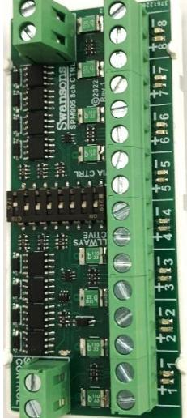
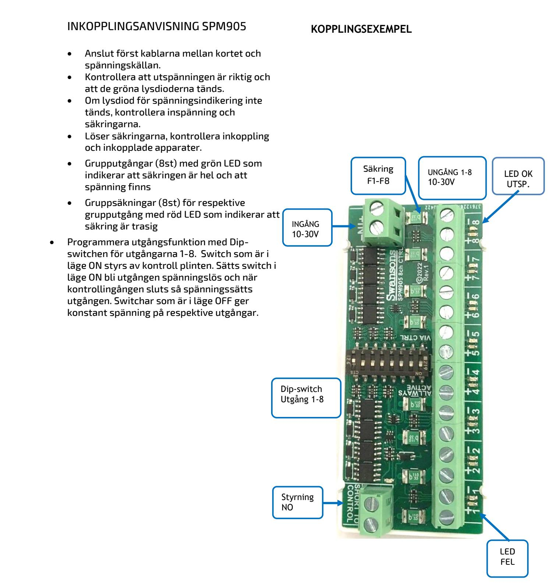

### BESKRIVNING SPM905

Säkringsmodul med 8 utgångar som är individuellt styrbara från tex brandalarm

#### Montage

L-modul eller Din-skena, bara att snäppa in i strömförsörjningsaggregat eller kapslingar med anpassad hålbild. (se blad 3)

## Funktion  **SM40**

Säkringsmodulen är avsedd att säkra och distribuera strömförbrukningen i lågspänningslarmsystem som kräver en likspänning i området: 10V - 30. SPM905 har två ingångar, en för spänning och en för styrning från brandmanöver. Det finns totalt 8 säkrade utgångar, som alla är säkrade med PTC-säkringar. Spänning på utgången indikeras med grön lysdiod och fel indikeras med en röd lysdiod som lyser vid aktuell utgång. Säkringen återställs automatiskt när belastningen justeras eller felet åtgärdas.  **Strömförsörjning med plats för batteri**

> Signalen från brandlarmscentralen (NO) styr de utgångar som man valt skall öppnas vid brand. På dipswitchen kan man välja vilka dörrar som skall vara öppna och vilka som ska styras.

# TEKNISKA DATA

| Inspänning DC | 10-30VDC |
|------------------|----------|
| Avsäkring grupp  | 1,5A     |
| Max ström/kort   | 10A      |

CE-märkt enligt EN61000-1-2 och EN61000-3-4

| E-Nummer | Typ        | Beskrivning                                      | Mått H x B x D (mm) |
|----------|------------|--------------------------------------------------|------------------------|
| 5247561  | SPM905-L   | Säkringskort 8st styrbara utgångar               | 37x86x25               |
| 5256991  | SPM BOX 7  | Kopplingsbox 7 SPM900 Serien                     | 230X365X45             |
| 5257243  | SPM900-DS  | Plast kapsling med plats för ett eller två kort. | 120x120x40             |
| 5257244  | SPM900-ENC | Plåt kapsling med plats för ett till fem kort    | 216x155x45             |
|          | SPM900-SAB | Sabotagekontakt för SPM900-DS                    | 120x120x40             |

Postadress/Postal adress Swansons Telemekanik AB Osbackevägen 4 SE-449 44 Nol

Telefon nr/Telephone no +46(0)303-746 320 Hemsida/Webb www.swtm.se e-post info@swtm.se VAT.NO SE556289017701

# **SPM905 SÄKRINGSMODUL MED STYRBARA UTGÅNGAR**

Postadress/Postal adress Swansons Telemekanik AB Osbackevägen 4 SE-449 44 Nol

Telefon nr/Telephone no +46(0)303-746 320 Hemsida/Webb www.swtm.se e-post info@swtm.se VAT.NO SE556289017701