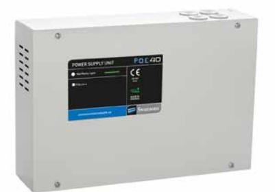
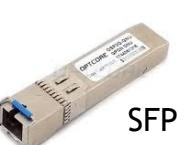
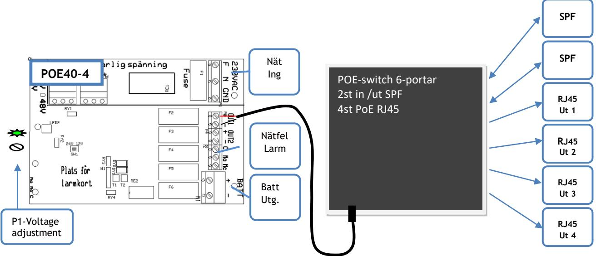
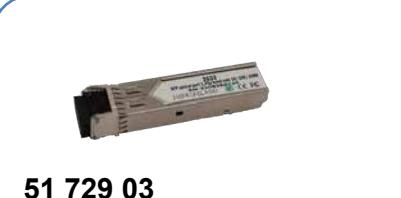
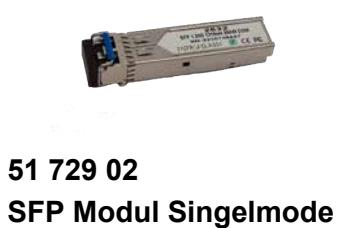
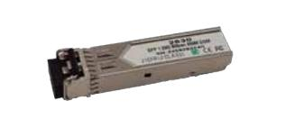

## **POE40-FIBER POWER OVER ETHERNET MED BATTERIBACKUP**

**Skydd:** Aggregatet är skyddad mot överbelastning och kortslutning. Inbyggt skydd mot djupurladdning av batterierna. Nät, last och batteri skyddas av säkringar.

**Indikeringar och larm:** Nätspänning indikeras med grön lysdiod på fronten Är försedd med larmrelä för nätavbrott. Kan kompletteras med larmkort SM102 för laddnlikriktar- och batterifel. Summalarmrelä och larm med röd lysdiod.

### **TEKNISKA DATA**

| Inspänning            | 88-265VAC +/- 15% |         |  |
|-----------------------|-------------------|---------|--|
|                       | 1 fas 50-60Hz     |         |  |
| Reglering             | max 0,6 %         |         |  |
| Batterispänn. POE40-1 |                   | 27,4VDC |  |
| Batterispänn. POE40-4 |                   | 54,6VDC |  |
| Temp.omr-             | -10 – +30 C       |         |  |

IEEE 802.3at/ IEEE802.3af 100 MBIT/ kanal

Batteribackup med PoE- switch speciellt anpassad för passage - portelefon och bilder.

PoE switch med 2st SFP-portar gör att du aldrig behöver stå handfallen, oavsett vilket behov du möter ute i fält. Med vårt utbud av SFP:er har du tillgång till olika fiberanslutningar, både singlemode och multimode, koppar, WDM, CWDM, DWDM. Bara välja önskad SFP-modul och jacka i.

**Högeffektiv** – 90% vid nätdrift – 98% vid batteridrift **High Power** – 30W/utgång - kontinuerlig drift på alla portar samtidigt.

### **UTFÖRANDE:**

### **POE40-4 FIBER**

Är en batteribackup med inbyggd PoE-switch-fiber Intern sp.: 48VDC Montage: Vägg Batterier: Plats för max 4st 12V 9Ah batterier Tillbehör: En modulplats för tillbehör ur SPM90x serien

Aggregatet uppfyller både IEEE802.3af och IEEE802.3at. och kan leverera upp till 30W/port. Bestyckad med 2st SPF portar för up/down link som är avsett att användas för kommunikation och fyra portar med PoE RJ45 8-pol, som är försedda med led, för datatrafik och status.

*CE-märkt enligt EN61000-6-3:2001 EN61000-6-2:2005.*

| E-Nummer | Typ           | Beskrivning                                                  | HxBxD mm        |
|----------|---------------|--------------------------------------------------------------|-----------------|
| 5172900  | POE40-4 FIBER | POE 48V 150W 4 RJ45 PORTAR 2 SPF PORTAR Switch max 4x 9Ah | 300 x 360 x 110 |
| 5172901  | SFP-M         | SFP-Modul Multimode 850nm 550nm                              |                 |
| 5172902  | SFP-S         | SFP- Modul Singelmode 1310nm 20km                            |                 |
| 5172903  | SFP-R         | SFP- Modul RJ45                                              |                 |

Postadress/Postal address **Swansons Telemekanik AB**  Osbackevägen 5 SE-449 44 Älvängen

Telefon nr/Telephone no +46(0)303-746 320 Hemsida/Webb www.swtm.se e-post info@swtm.se VAT.NO SE556289017701

# **POE40-FIBER POWER OVER ETHERNET MED BATTERIBACKUP**

### **SÄKERHET**

Endast auktoriserad och erfaren personal inom AC och DC får använda, arbeta, serva/underhålla, installera denna enhet.

Endast isolerade verktyg får användas i enheten. Observera att farliga spänningar och strömmar förekommer i apparaten både när interna säkringarna är av eller på.

Denna instruktion skall läsas igenom grundligt och förstås av all handhavande personal. Vid minsta tveksamhet om systemets uppbyggnad, funktion, komponenter samt säkerhet skall leverantören kontaktas.

Kontrollera att kretskort sitter fast och inte är transportskadade.

Om batterier används är dessa alltid elektrokemiskt aktiva. Kortslut inte batteripolerna.

| Modell  | Säkring F1 Nätsäkring | Säkring F2- F3 OUT 1 | Säkring F4- F5 OUT2 | Säkring F6 Batteri |
|---------|--------------------------|----------------------------|---------------------------|--------------------------|
|         |                          |                            |                           |                          |
| POE40-4 | 2AT Cer                  | 3,15AS                     | 3,15AS                    | 4AS                      |

### **INKOPPLING**

- Montera aggregatet fritt. Minst 100mm på varje sida.
- Anslut först 230V AC.
- Lysdiod för nätspänning tänds. Kontrollera att utspänningen är riktig.
- Spänningsjustering görs direkt på likriktaren.
- Om lysdiod för nätindikering ej tänds kontrollera inspänning och ingångssäkringarna.
- Anslut batterierna som kopplas i serie och därefter lasten.
- Löser utgångssäkringarna, kontrollera inkoppling och inkopplade apparater**.**

 

Postadress/Postal address **Swansons Telemekanik AB**  Osbackevägen 5 SE-449 44 Älvängen

Telefon nr/Telephone no +46(0)303-746 320 Hemsida/Webb www.swtm.se e-post info@swtm.se VAT.NO SE556289017701

# **POE40-FIBER POWER OVER ETHERNET MED BATTERIBACKUP**

### **Optional Accessories**

### **51 729 03 SFP Modul koppar RJ45**

 **SFP Modul Singelmode 1310nm 20km** 

**51 729 01 SFP Modul Multimode 850nm 550m**

### **Snabbfakta**

- 1,25 Gb/s dubbelriktade datalänkar
- Kompakt RJ-45-kontakt
- 1 Gigabit Ethernet över Cat 5-kabel
- 10/100/1000 Mbps kompatibel med SGMII

### **Produktinformation**

10/100/1000M SFP över koppar RJ45, 2633i Transceiver, Upp till 1,25 Gb/s dubbelriktade datalänkar, 1 Gb Ethernet över CAT5-kabel, 1000BASE-T, 10/100/1000 Mbps II-kompatibel, 0Mbps II-kompatibel 70?,

### **Snabbfakta**

- 100Base-FX Singlemode fiber 20 km
- Hot-swap ger non-stop service
- DDM för enkel statusövervakning

### **Produktinformation**

Single Mode SFP Transceiver med LC-kontakt, Dual Fiber, 1,25G, 1310nm FP lasersändare och PIN-fotodetektor, kompatibel med SFP MSA och SFF-8472. Maxlängden är 20km. Tempområde 0-70 C. Våra transceivers levereras även med DDM (Digital Diagnostic Monitoring) som standard, en övervakningsfunktion som ger användaren möjlighet att utläsa realtidsparametrar ur den optiska modulen.

### **Snabbfakta**

- Duplex LC-kontakt
- 1000Base-SX Multi-mode fiber max 550m
- Hot-swap ger non-stop service
- DDM för enkel statusövervakning

### **Produktinformation**

Multimode SFP Transceiver med LC-kontakt, Dual Fiber , 1,25Gbps, 850nm, Multimode, kompatibel med SFP MSA och SFF-8472. Maxlängden på multimode 50/125µm är 550 meter och på 62,5/125µm är det 300m. Tempområde 0-70 ?. Våra transceivers levereras även med DDM (Digital Diagnostic Monitoring) som standard, en övervakningsfunktion som ger användaren möjlighet att utläsa realtidsparametrar ur den optiska modulen.

Postadress/Postal address **Swansons Telemekanik AB**  Osbackevägen 5 SE-449 44 Älvängen

Telefon nr/Telephone no +46(0)303-746 320 Hemsida/Webb www.swtm.se e-post info@swtm.se VAT.NO SE556289017701