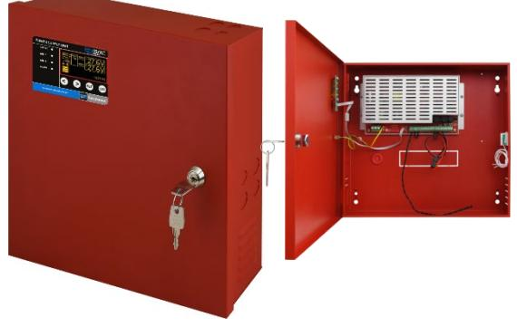
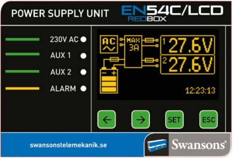
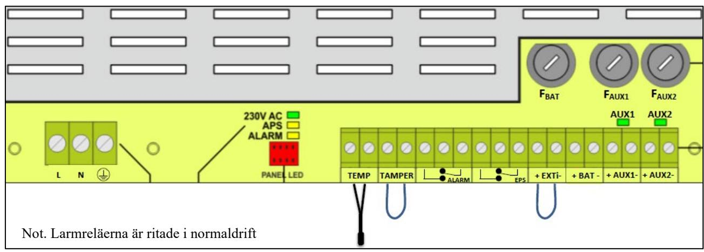

# EN54C/LCD – REDBOX Rev 1.1

STRÖMFÖRSÖRJNING, certifierade enl. EN54-4, EN12101-10

#### Skydd:

Aggregatet är skyddat mot överbelastning och kortslutning.

Inbyggt skydd mot djupurladdning av batterierna. Nät, last och batteri är skyddas av säkring.

#### Indikeringar och larm Normaldrift: Indikeras med 2st gröna lysdioder.

| 230V AC (grön)     | Nätspänning ok      |
|--------------------|---------------------|
| AUX 1 (grön)       | Utspänning ok AUX1  |
| AUX 2 (grön)       | Utspänning ok AUX2  |
| ALARM (gul)        | Fel.                |
| Display            | Volt, Batteri       |
| Larmrelä EPS       | Nätspänningsfel     |
|                    | (fördröjt 30minter) |
| Larmrelä ALARM     | Summalarm           |
| Tillbehör          |                     |
| Ethernet interface | Distansövervakning  |
|                    | Sparade loggar      |

## BESKRIVNING

Strömförsörjningsaggregat anpassad för drift av brandlarmsutrustning med display. Certifierad av tredje part enl. EN54-4 och EN 12101-10. Primärswitch teknik som är högeffektiv och är strömsnål och har mycket stabil utspänning. Mycket låg egenförbrukningen vid batteridrift. Har display för volt, ampere och batteristatus. Programmerbar fördröjning av nätlarm. Plats för tillbehör, ex. larmdonskort och för nätverkskort

Övervakning av driftsparametrarna: Nät, utspänning, temperatur och batteriresistans, batterispänning

Två utgångar som har övervakning och larm.

#### Utförande:

Aggregaten är utförda i röd självventilerad plåtkapsling och avsett för väggmontage. Förberedd för 9st genomföringar 4 uppåt + 4st åt höger + 1st bakåt.

Plats för underhållsfria blybatterier enligt tabell.

| E:      | Typ                 | Total utström                          |                                               | Batteriplats             | Internförb.         | Mått            |
|---------|---------------------|----------------------------------------|-----------------------------------------------|--------------------------|---------------------|-----------------|
| nummer  |                     | Kontinuerlig Drift Imax a + Ilad | Intermittent Drift (5min) Imax a + Ilad | (12V batterier)       | vid batteridrift | (H x B x D)     |
| 5257600 | EN54C/LCD -5A17  | 3,8A + 1,2A                            | 5A + 0A                                       | 2 x 20Ah (1 (ej 12Ah) | 55mA                | 402 x385 x 88   |
| 5257601 | EN54C/LCD -10A40 | 8,2+ 1,8A                              | 10A + 0A                                      | 2 x 45Ah                 | 85mA                | 407 x 420 x 178 |

|              | Tillbehör             |            |                             |                       |                        |              |
|--------------|-----------------------|------------|-----------------------------|-----------------------|------------------------|--------------|
| E: nummer | Typ                   | Anslutning | Spännings försörjning    | Loggning av värden | Montage                | Mått         |
| 5257606      | Ethernet EN54C-LCD | RJ45       | Internt via seriell port | Ja                    | Internt i EN54C/LCD | 71 x 50 x 20 |

Not.

1) 12V 20Ah batterier har samma mått som 17Ah

Postadress/Postal address **Swansons Telemekanik AB**  Osbackevägen 5 SE-449 44 Nol

Telefon nr/Telephone no +46(0)303-746 320 Hemsida/Webb www.swtm.se e-post

info@swtm.se

VAT.NO SE556289017701

# EN54C/LCD – REDBOX Rev 1.1

STRÖMFÖRSÖRJNING, certifierade enl. EN54-4, EN12101-10

# SÄKERHET

Endast auktoriserad och erfaren personal inom AC och DC får använda, arbeta, serva/underhålla, installera denna enhet.

Endast isolerade verktyg får användas i enheten. Observera att farliga spänningar och strömmar förekommer i apparaten både när interna säkringarna är av eller på.

Denna instruktion skall läsas igenom grundligt och förstås av all handhavande personal. Vid minsta tveksamhet om systemets uppbyggnad, funktion, komponenter samt säkerhet skall leverantören kontaktas.

Kontrollera att kretskort sitter fast och inte är transportskadade.

Om batterier används är dessa alltid elektrokemiskt aktiva.

FBAT

Säkring FAUX1

F 10 A F 6,3 A F 6,3 A

F 12,5A F 10 A F 10 A

Säkring FAUX2

Kortslut inte batteripolerna.

Modell Säkring

EN54C/LCD-

EN54C/LCD-10A40

5A17

## INKOPPLING

- Montera aggregatet fritt. Minst 100mm på varje sida.
- Lossa de två skruvarna i locket.
- Lätta försiktigt på locket och lossa bandkabeln till lysdiodskortet.
- Placera batterierna på avsedd plats i skåpet och anslut med batterikablarna.
- Anslut först 230V AC. Spänningsätt.
- 2st gröna LED tänds på fronten.
- Kontrollera att utspänningen är riktig.
- Anslut därefter lasten.
- Löser utgångssäkringarna, kontrollera inkoppling och inkopplade apparater.
- Larmrelä ritade i olarmat läge.

### TEKNISKA DATA

| Inspänning               | 230VAC (-15% +10%)                     |
|--------------------------|----------------------------------------|
|                          | 1 fas 50-60Hz                          |
| Reglering                | max 0,6 %                              |
| Utspänning               | 27,6VDC                                |
|                          | Rippelspänn. max 0,1 % av utspänningen |
| Temp. omr.               | -5 – 40 C                              |
| Larmrelä                 | Växlande,                              |
|                          | Max 1A 50V                             |
| Kapsling                 | IP30                                   |
| CE-märkt                 | EN 60950–1:2007                        |
|                          | EN 61000-6-3:2008+A1:2012              |
|                          | EN IEC 63000:2019–01                   |
|                          | EN 50130–4:2015+A1:2015–03             |
| Certifieringar EN54-4/A2 |                                        |
|                          | EN12101-10                             |

Postadress/Postal address **Swansons Telemekanik AB**  Osbackevägen 5 SE-449 44 Nol

Telefon nr/Telephone no +46(0)303-746 320 Hemsida/Webb www.swtm.se e-post info@swtm.se

VAT.NO SE556289017701