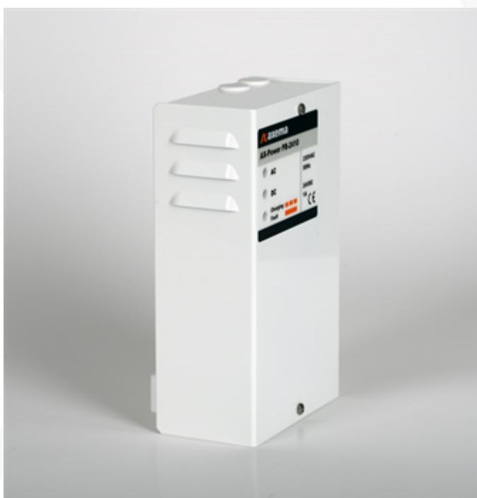

## Datablad

Uppdaterad 2023-06-20

## **AX-Power PB-2410, 2-3790**

AX-Power PB-2410 är ett kompakt strömförsörjningsaggregat för säker och avbrottsfri kraft, vilken säkerställer full funktionalitet även vid strömavbrott.

## Teknisk Data

| Attribut                              | AX-Power PB-2410                        |
|---------------------------------------|--------------------------------------------|
| Mått                                  | 220*135*80                                 |
| Kapsling/ material                 | Stålplåt 1,5mm, vit pulverlack    |
| Montage                               | Väggmontage utanpåliggande              |
| Strömförsörjning                      | 90-264 VAC , 1fas, 47-63 Hz |
| Elektrisk anslutning               | Skruvplint                                 |
| Maximal kontinuerlig belastning | 1A                                         |
| Utspänning                            | 27,6 VDC                                |
| IP-klass                              | 20                                         |
| IK-klass                              | 06                                         |
| Temperaturområde (C)               | -10° till +60°                       |
| Art.-nr                               | 2-3790                                     |
| E-nummer                              | 5240383                                    |