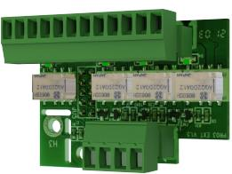

# PRODUKTBLAD - STRÖMFÖRSÖRJNING FRÅN MILLETEKNIK

#### Namn, artikelnummer och e-nummer

| Namn                                           | Artikelnummer  | E-nummer |
|------------------------------------------------|----------------|----------|
| Relay Card NOVA Series (5A and 10A-PRO3) | A-AL1224NOVA02 | 5213626  |

#### Produktbild

#### Benämning

Kort som ger larm via reläväxling. Används för strömförsörjning som behöver larm över reläväxling (istället för larm via kommunikation.

#### Användningsområde

När larm behövs via reläväxling.

## Batteri och batterityp

Batterityp: 12 V, AGM blysyra batteri, underhållsfritt. Batterier ingår ej.

#### Larm

Fyra larmutgångar. Larm via RS-485 och växlande relä.

| Larm 1                                           | Larm2                                                                                                                                                                        | Larm 3                     | Larm 4                |
|--------------------------------------------------|------------------------------------------------------------------------------------------------------------------------------------------------------------------------------|----------------------------|-----------------------|
| Fördröjt nätav brotts larm (10 sek), | Larm för bort kopplade batteri er (10 sek), lad darfel överspän ning, laddarfel underspänning, låg batterispän ning, säkringsfel och åldrat batteri. | Låg sy stems pänning | Sabo tage larm. |

#### Indikeringar och kommunikation

Kommunikation via RS-485, (reläväxaling).

Vikt

| Namn          | Nettovikt | Vikt m förp. |
|---------------|-----------|--------------|
| Reläkort NOVA | 0,1 kg    | 0,2 kg       |

#### Installationskrav

Produkten skall installeras i kompatibel produkt från Milleteknik.

#### Tillvalet passar i

| Produkt                           | Antal kort som får platsa. |
|-----------------------------------|-------------------------------|
| Batteribackup med PRO3- kortb. | 1                             |

a.Antalet kort/tillval som får plats är totalt antal som får plats i kapslingen. Elektroniska- och mekaniska begränsningar kan finnas.

b.5 A - 10 A enheter.

#### Krav som produkten uppfyller

| EMC:  | EMC Direktivet 2014/30EU                                                                                                |
|-------|-------------------------------------------------------------------------------------------------------------------------|
| El:   | Lågspänningsdirektivet: 2014/35/EU                                                                                      |
| CE:   | CE direktivet enligt:765/2008                                                                                           |
| Miljö | REACH Regulation: Directive 1907/2006, WEEE Regulation: Directive 20021961E, RoHS Regula tion: Directive 2015/863 |
|       |                                                                                                                         |

#### Garanti

Produkten har två års garanti för tillverkningsfel.

Tillverkning, livslängd, miljöpåverkan och återvinning

Tillverkad av Milleteknik i Partille, Sverige.

Produkten konstrueras för lång livslängd vilket minskar miljöpåverkan. Uttjänta produkter lämnas till närmaste återvinningscentral.

### Länk till senaste informationen

Produkter är föremål för uppdateringar, du hittar alltid den senaste informationen på [www.milletek](https://www.milleteknik.se/)[nik.se](https://www.milleteknik.se/).

#### [Tillbehör & tillval](https://www.milleteknik.se/produkt-kategori/tillbehoer/)

# Om dessa uppgifter

Alla uppgifter publiceras med reservation för eventuella fel. Uppdateras utan föregående meddelande.