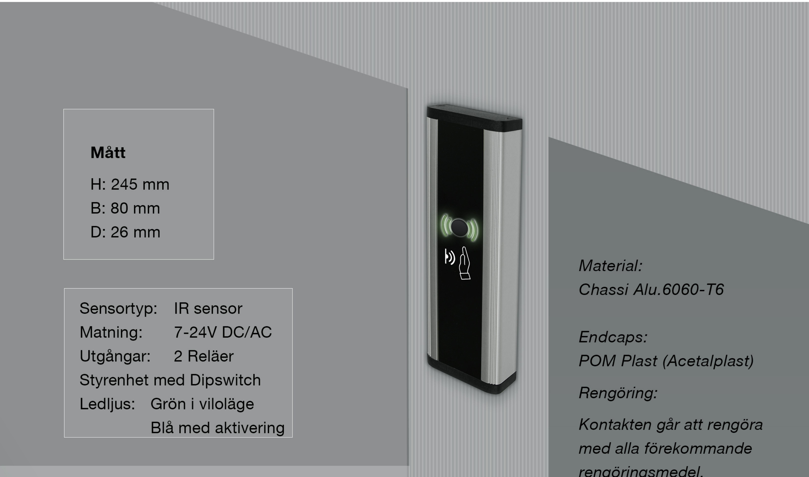
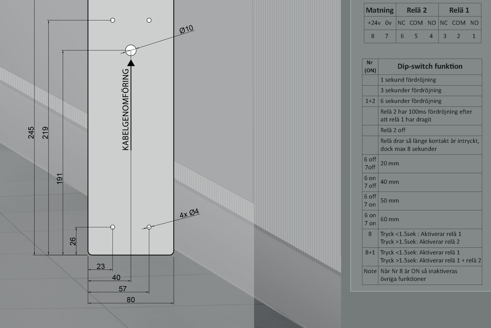

## Tekniskt produktblad JCK201 Beröringsfri

## Hålbildsritning:

rengöringsmedel.

Monteringsanvisning Styrenhet

| Matning       |                                                                | Relä 2 |           |   | Relä 1 |           |   |
|---------------|----------------------------------------------------------------|--------|-----------|---|--------|-----------|---|
| +24v Ov       |                                                                |        | NC COM NO |   |        | NC COM NO |   |
| 8             | 7                                                              | ნ      | 5         | 4 | 3      | 2         | 1 |
|               |                                                                |        |           |   |        |           |   |
| Nr (ON)    | Dip-switch funktion                                            |        |           |   |        |           |   |
|               | 1 sekund fördröjning                                           |        |           |   |        |           |   |
|               | 3 sekunder fördröjning                                         |        |           |   |        |           |   |
| 1+2           | 6 sekunder fördröjning                                         |        |           |   |        |           |   |
|               | Relä 2 har 100ms fördröjning efter att relä 1 har dragit    |        |           |   |        |           |   |
|               | Relä 2 off                                                     |        |           |   |        |           |   |
|               | Relä drar så länge kontakt är intryckt, dock max 8 sekunder |        |           |   |        |           |   |
| 6 off 7off | 20 mm                                                          |        |           |   |        |           |   |
| 6 on 7 off | 40 mm                                                          |        |           |   |        |           |   |

JC Kontakter AB | Karl Johansgatan 152 | SE-414 51 | Göteborg | Tel: 031-24 11 09 | info@jckontakter.se