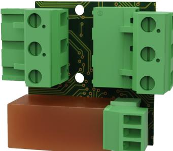
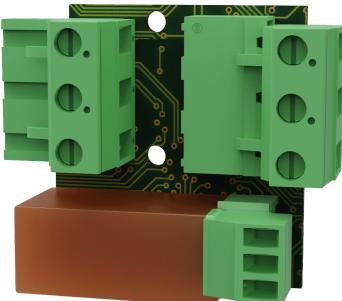

### TEKNISKA SPECIFIKATIONER

ECO mains failure alarm card är ett larmkort för övervakning av nätbortfall. Larmkortet kan sättas i 24 V batteribackuper ECO M och ECO FLX S.

### TEKNISKA DATA

| Artikelnummer                   | A-AL1224ECO01card                                                                                                                                                                                                                                      |  |
|---------------------------------|--------------------------------------------------------------------------------------------------------------------------------------------------------------------------------------------------------------------------------------------------------|--|
| Produkbeskrivning               | Larmkort för ECO M och ECO FLX S. Larm på växlande relä.                                                                                                                                                                                               |  |
| Mått                            | 21 x 55 x 42 mm                                                                                                                                                                                                                                        |  |
| Egenförbrukning                 | N/A                                                                                                                                                                                                                                                    |  |
| Spänning, in                    | 27,3 V DC                                                                                                                                                                                                                                              |  |
| Larmutgång:                     | Nätavbrott NC/CO/NO                                                                                                                                                                                                                                    |  |
|                                 |                                                                                                                                                                                                                                                        |  |
| Tekniska data                   |                                                                                                                                                                                                                                                        |  |
| Rekommenderad miljö             | Miljöklass 1, Inomhus, 20% ~ 90% relativ fuktighet                                                                                                                                                                                                     |  |
| Produkterna möter kraven enligt | EMC Directive 2014/30EU, Low Voltage directive: 2014/35/EU CE directive according to 765/2008, Emission: EN61000-6-:2001, EN55022:1998:-A1:2000, A2:2003 Klass B, EN61000-3-2:2001. Immunity: EN61000-6-2:2005, EN61000-4-2, -3, 4, -5, -6, -11. |  |
| Garanti                         | 2 år                                                                                                                                                                                                                                                   |  |

Tillverkad i Milletekniks fabrik i Partille, Sverige.

Bruksanvisning/produktblad i original: Svenska.

Manualens artikelnummer: 350-243

Detta dokument kan ändras utan föregående meddelande.

Alla uppgifter publiceras med reservation för tryckfel.

#### ADRESS OCH KONTAKTUPPGIFTER

- Milleteknik AB Ögärdesvägen 8 B 433 30 Partille 031-340 02 30 www.milleteknik.se
## TECHNICAL SPECIFICATIONS

ECO mains failure alarm card is an alarm card for monitoring mains failure. The alarm card can be inserted into 24 V battery backups ECO M and ECO FLX S.

# TECHNICAL DATA

| Item number                                         | A-AL1224ECO01 card                                                                                                                                                                                                                                      |  |
|-----------------------------------------------------|---------------------------------------------------------------------------------------------------------------------------------------------------------------------------------------------------------------------------------------------------------|--|
| Product description                                 | Alarm card for ECO M and ECO FLX S. Alarm on changing relay.                                                                                                                                                                                            |  |
| Measure                                             | 21 x 55 x 42 mm                                                                                                                                                                                                                                         |  |
| Own energy consumption                              | N/A                                                                                                                                                                                                                                                     |  |
| Tension, in                                         | 27.3V DC                                                                                                                                                                                                                                                |  |
| Alarm output:                                       | Mains failure NC/CO/NO                                                                                                                                                                                                                                  |  |
| Technical data                                      |                                                                                                                                                                                                                                                         |  |
| Recommended environment                             | Environmental class 1, Indoor, 20% ~ 90% relative humidity                                                                                                                                                                                              |  |
| The products meet the require ments according to | EMC Directive 2014/30EU, Low Voltage directive: 2014/35/EU CE directive according to 765/2008, Emission: EN61000-6-:2001, EN55022:1998:-A1:2000, A2:2003 Class B, EN61000-3 -2:2001. Immunity: EN61000-6-2:2005, EN61000-4-2, -3, 4, -5, -6, -11. |  |
| Guarantee                                           | 2 years                                                                                                                                                                                                                                                 |  |

Manufactured in Milleteknik's factory in Partille, Sweden.

This translation is not verified and should be cross referenced with the swedish original before use.

User manual article number: 350-243

This document is subject to change without notice.

All information is published subject to typographical errors.

## ADDRESS AND CONTACT DETAILS

- Milleteknik AB Ögärdesvägen 8 B S-433 30 Partille +46 31 340 02 30 www.milleteknik.se