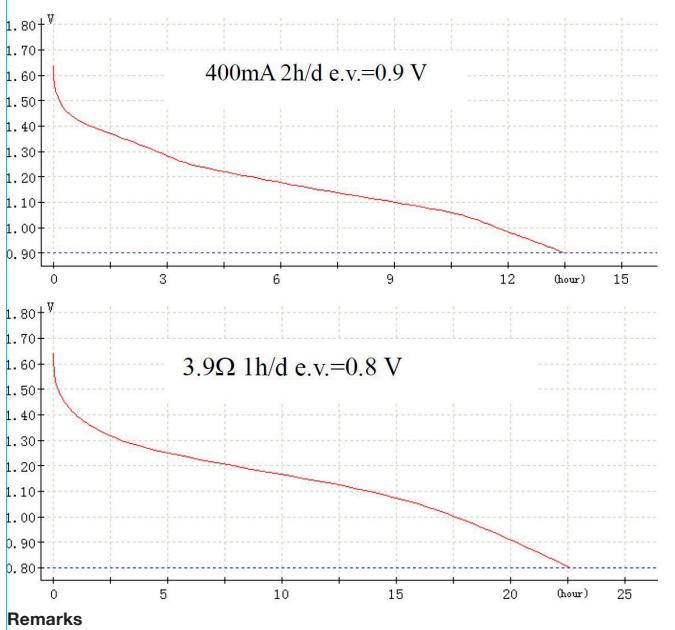
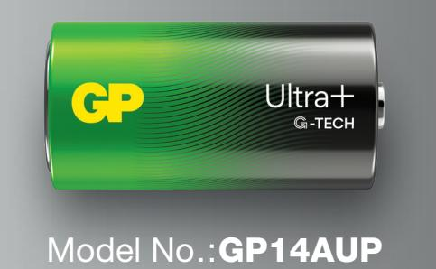
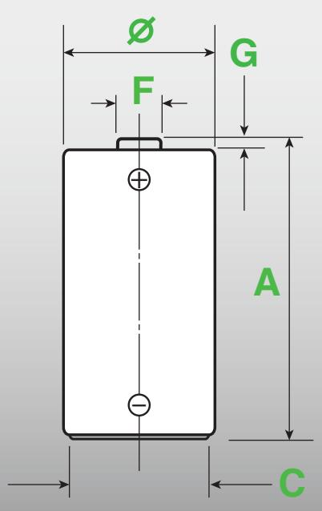

## **DATA SHEET**

## **NO MERCURY ADDED**

| Description                  | Mercury & Cadmium Free Alkaline Manganese Battery, C Size                                                                    |  |  |
|------------------------------|---------------------------------------------------------------------------------------------------------------------------------|--|--|
| Chemical System              | Alkaline Manganese                                                                                                              |  |  |
| Nominal Voltage              | 1.5 Volts                                                                                                                       |  |  |
| Nominal Dimensions           | Refer to drawing                                                                                                                |  |  |
| Terminals                    | Protruded positive (+) and flat negative (-) contacts                                                                        |  |  |
| Jacket                       | Foil jacket                                                                                                                     |  |  |
| Applications                 | All electronic devices, e.g. transistor radios, cassette recorders, toys, alarm clocks, lighting & torches, portable fans |  |  |
| Ambient Temperature Range | Operation: -18℃ ~ 50℃ Recommended: 10℃ ~ 25℃ Storage: Not exceed 30℃                                                      |  |  |
| Shelf Life                   | 10 years                                                                                                                        |  |  |
| Approx. Weight               | 70g                                                                                                                             |  |  |

| Cross References: |
|-------------------|
|-------------------|

| GP    | JIS  | IEC  | Energizer | Duracell | Varta |  |
|-------|------|------|-----------|----------|-------|--|
| 14AUP | LR14 | LR14 | E39       | MN1400   | 4014  |  |

## **Discharge curve:**

1) Store period before test shall be under 20±2℃, RH 55±20% within 30 days of manufacture. 2) Batteries shall not leak during the service life test before the end voltage reached.

| /              | min  | max  |  |  |
|----------------|------|------|--|--|
|                | 24.9 | 26.2 |  |  |
| A              | 48.6 | 50.0 |  |  |
| C              | 13.0 | –    |  |  |
| F              | –    | 7.5  |  |  |
| G              | 1.5  | –    |  |  |
| Dimension : mm |      |      |  |  |

The information (subject to change without prior notice) contained in this document is for reference only and should not be used as a basis for product guarantee or warranty. For applications other than those described here, please consult your nearest GP Sales and Marketing Office or Distributors.

Manufacturer reserves the right to alter or amend the design, model and specification without prior notice. Copyright@ GPI International Ltd. - All rights reserved

