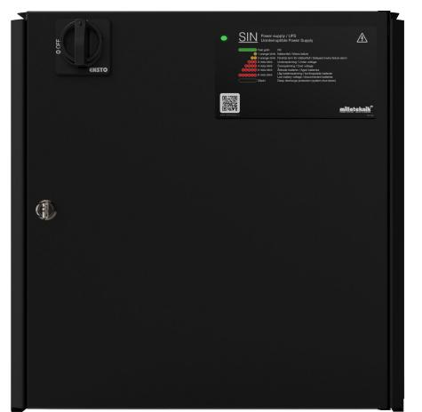

# PRODUKTBLAD - STRÖMFÖRSÖRJNING FRÅN MILLETEKNIK

## SIN namn, artikelnummer och e-nummer

| Namn                     | Artikelnummer  | E-nummer |
|--------------------------|----------------|----------|
| SINUS UPS 1500W FLX L | FL01U0031FP015 | 5213662  |

# Offline UPS från Milleteknik

# Beskrivning

SINUS UPS med den senaste switchtekniken och avancerad självtest för bästa driftsäkerhet.

# Användningsområde

SINUS UPS används mest för att strömförsöja säkerhetsapplikationer allt från nödöppning av dörrar i offentliga miljöer till portar och grindar för industri.

Lång livslängd, energieffektiv och support finns tillgänglig om något skulle krångla, nu eller om 10 år.

#### Spänning, ström och effekt

# MÄRKEFFEKT

| Maximal märkeffekt | Kontinuerlig effekt |
|--------------------|---------------------|
| SIN 1500W FLX L    | 1500 W              |

#### Batteri och batterityp

Två 45 Ah batterier.

Batterityp: 12 V, AGM blysyra batteri, underhållsfritt. Batterier ingår ej.

## Lastutgångar

Utgång för anslutning till nödljus/ledljus. Utgång för anslutning till pictogram.

## Larm

Larm för låg batterispänning, nätbortfall, självdiagnos och summalarm.

## Skydd

Kontrollerad laddning av batterier skyddar mot överladdning och förlänger livslängden på batterier. Batterier laddas med som mest 0,5 A.

Skydd UPS-standard 62040-1-1. Elektronisk strömbegränsning och övertemperaturskydd samt automatiskt avstängning vid kraftig överbelastning eller kortslutning efter 3-5 sekunder enligt UPS-STANDARD EN62040-1-1. Växelriktaren är därmed kortslutningsskyddad.

## Säkringar

Batterisäkring: 10 A.

Batteriladdare: T16A.

Kontaktor: T0,5A

# Indikeringar och kommunikation

Lysdiod visar information och larm på kretskort och på kapslingens dörr.

# Kapsling, utförande

Plåtskåp för väggmontering eller i 19" rackskåp (10 HE). Pulverlackat svart. Fyra kabelgenomföringar på ovansidan och utslagshål på baksidan. Buntbandshållare i kapsling. Låsbar, två nycklar följer med.

| Mått, höjd x bredd x djup | IP-klass |
|---------------------------|----------|
| 444 x 437 x 212 mm        | IP32     |

# Vikt

| Namn                  | Nettovikt | Vikt m förp. |
|-----------------------|-----------|--------------|
| UPS SINUS 1500W FLX L | 20,9 kg   | 22 kg        |

### Installationskrav

Enheten är avsedd för fast installation. Enheten skall installeras inomhus, miljöklass 1, omgivningstemperatur: +5°C – 40°C. Rekommenderad omgivningstemperatur är +15°C - 25°C.

#### Krav som produkten uppfyller

| El: | Lågspänningsdirektivet: 2014/35/EU |
|-----|------------------------------------|
|     | EN 62368-1                         |
| CE: | CE direktivet enligt:765/2008      |

| Emission: | EN61000-6-:2001 EN55022:1998:-A1:2000, A2:2003 Klass B, EN61000-3-2:2001 |
|-----------|-----------------------------------------------------------------------------|
| Immunity: | EN61000-6-2:2005, EN61000-4-2, -3, 4, -5, -6, -11                        |
| LVD       | EN60950                                                                     |
|           |                                                                             |

# Garanti

Produkten har två års garanti för tillverkningsfel. Batterier och förslitningsdelar omfattas ej av garanti.

## Utbyggbar, tillval och tillbehör

Produkten kan inte utökas.

Tillverkning, livslängd, miljöpåverkan och återvinning

Tillverkad av Milleteknik i Partille, Sverige.

Produkten är designad och konstruerad för lång livslängd vilket minskar miljöpåverkan. Produktens livslängd (förutom slitagedelar) är beroende på, bland annat miljöfaktorer, främst omgivningstemperatur, oförutsedd belastning på komponenter som blixtnedslag, yttre åverkan, handhavandefel, med flera. Produkter återvinns, enkelt då de är moduluppbyggda, genom att lämnas till närmaste återvinningsstation eller sändas åter till tillverkare. Kontakta din distributör för mer information. Kostnader som uppkommer i samband med återvinning ersätts ej.

#### Länk till senaste informationen

Produkter är föremål för uppdateringar, du hittar alltid den senaste informationen på [www.milletek](https://www.milleteknik.se/)[nik.se.](https://www.milleteknik.se/)

### [Sinus UPS](https://www.milleteknik.se/produkt-kategori/ups/)

Alla uppgifter publiceras med reservation för eventuella fel.

## Om dessa uppgifter

Alla uppgifter publiceras med reservation för eventuella fel. Uppdateras utan föregående meddelande.