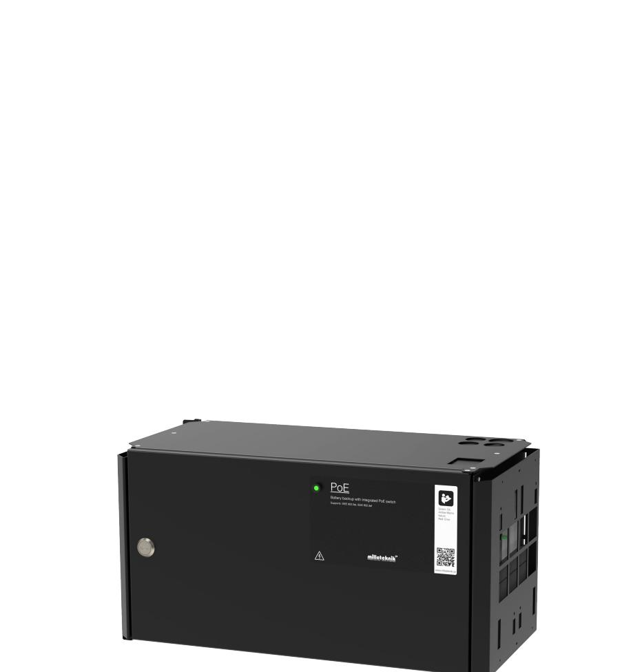

# PoE M-Switch 4p FLX M

Managed PoE-switch och strömförsörjning med batteribackup

350-261 Publiceringsdatum 2023-10-19

| 1. Innan du börjar  4                                         |  |  |  |
|---------------------------------------------------------------|--|--|--|
| 1.1. Information  4                                           |  |  |  |
| 1.1.1. Support  5                                             |  |  |  |
| 1.1.2. Länk till senaste informationen  5                     |  |  |  |
| 1.1.3. Länk till tekniska specifikationer  5                  |  |  |  |
| 1.1.4. Du kan hjälpa oss göra bättre produkter  5             |  |  |  |
| 2. Om PoE från Milleteknik  5                                 |  |  |  |
| 3. Hur PoE driver enheter kopplade till strömförsörjningen  6 |  |  |  |
| 4. Komponentöversikt PoE FLX M  6                             |  |  |  |
| 5. Montering av konsol  7                                     |  |  |  |
| 5.1. Skjut fast konsoler  7                                   |  |  |  |
| 6. Batterier - placering och inkoppling  8                    |  |  |  |
| 6.1. Schema - Inkoppling av batterier, 24 V  8                |  |  |  |
| 7. Moderkort beskrivning  8                                   |  |  |  |
| 7.1. Anslut i denna ordning  8                                |  |  |  |
| 7.2. Anslut larm på P3  10                                    |  |  |  |
| 7.3. Anslut last  10                                          |  |  |  |
| 7.4. Anslut elnät till moderkort med plint  10                |  |  |  |
| 7.5. Styr larmgräns  11                                       |  |  |  |
| 7.6. Säkringar  11                                            |  |  |  |
| 8. Kan min PoE utökas med fler portar?  12                    |  |  |  |
| 9. Kortbeskrivning för PoE switch 4p  12                      |  |  |  |
| 10. Driftsättning - hur enheten skall startas  12             |  |  |  |
| 11. Hur mjukvara nås i PoE-switch  13                         |  |  |  |
| 11.1. Hur mjukvaran nås i PoE-Switch  13                      |  |  |  |
| 11.2. Logga in på Switchen  15                                |  |  |  |
| 11.3. Konfiguration  17                                       |  |  |  |
| 11.3.1. System, konfiguration  17                             |  |  |  |
| 11.3.2. Portar, konfiguration  18                             |  |  |  |
| 11.3.3. VLAN, konfiguration  20                               |  |  |  |
| 11.3.4. Aggregation, konfiguration  20                        |  |  |  |
| 11.3.5. IGMP Snooping, konfiguration  21                      |  |  |  |
| 11.3.6. Mirroring, konfiguration  22                          |  |  |  |
| 11.3.7. LLDP, konfiguration  23                               |  |  |  |
| 11.3.8. QoS, konfiguration  25                                |  |  |  |
| 11.3.9. PoE, konfiguration  26                                |  |  |  |
| 11.4. Övervakning  27                                         |  |  |  |
| 11.4.1. Statistik, översikt  27                               |  |  |  |
| 11.4.2. Statistik, detaljerad  28                             |  |  |  |
| 11.4.3. IGMP status  29                                       |  |  |  |
| 11.4.4. LLDP statistik  30                                    |  |  |  |
| 11.4.5. LLDP table  31                                        |  |  |  |
| 11.4.6. Ping  32                                              |  |  |  |
| 11.5. Underhåll  32                                           |  |  |  |
| 11.5.1. Omstart  33                                           |  |  |  |
| 11.5.2. Fabriksåterställning  34                              |  |  |  |
| 11.5.3. Ladda upp ny mjukvara  35                             |  |  |  |
| 11.5.4. Ladda och och spara konfigurationsfil  36             |  |  |  |
| 11.5.5. Logga ut  37                                          |  |  |  |
| 12. Larm som visas på skåplucka / indikeringsdiod  37         |  |  |  |
| 13. Underhåll  38                                             |  |  |  |
| 13.1. Batteribyte  38                                         |  |  |  |
| 14. Produktblad - strömförsörjning / batteribackup  39        |  |  |  |

| 14.1. Produktblad - strömförsörjning från Milleteknik  39           |  |
|---------------------------------------------------------------------|--|
| 14.1.1. Namn, artikelnummer och e-nummer  39                        |  |
| 14.1.2. PoE  39                                                     |  |
| 14.1.3. Beskrivning  39                                             |  |
| 14.1.4. Användningsområde  39                                       |  |
| 14.1.5. Spänning, ström och effekt  39                              |  |
| 14.1.6. Reservdrifttid på batterier  40                             |  |
| 14.1.7. Batteri och batterityp  40                                  |  |
| 14.1.8. Lastutgångar  40                                            |  |
| 14.1.9. Larm  40                                                    |  |
| 14.1.10. Skydd  40                                                  |  |
| 14.1.11. Säkringar  40                                              |  |
| 14.1.12. Indikeringar och kommunikation  40                         |  |
| 14.1.13. Kapsling, utförande  40                                    |  |
| 14.1.14. Vikt  41                                                   |  |
| 14.1.15. Installationskrav  41                                      |  |
| 14.1.16. Krav som produkten uppfyller  41                           |  |
| 14.1.17. Garanti  41                                                |  |
| 14.1.18. Utbyggbar, tillval och tillbehör  41                       |  |
| 14.1.19. Tillverkning, livslängd, miljöpåverkan och återvinning  41 |  |
| 14.1.20. Länk till senaste informationen  41                        |  |
| 14.1.21. Länk till tekniska specifikationer  42                     |  |
| 14.1.22. Övrigt  42                                                 |  |
| 14.1.23. Om dessa uppgifter  42                                     |  |
| 15. Produktens livslängd, miljöpåverkan och återvinning  42         |  |
| 16. Adress och kontaktuppgifter  42                                 |  |
|                                                                     |  |

# 1. INNAN DU BÖRJAR

## 1.1. Information

### **LÄS DETTA FÖRST!**

Elektronik, oavsett kapsling, är avsett för bruk i kontrollerad inomhusmiljö.

Ventilation får ej övertäckas.

Endast personer med behörighet bör installera och underhålla systemet.

Det är installatörens ansvar att systemet är lämpad för avsett bruk.

Dokument som medföljer systemet skall förvaras i det eller i dess omedelbara närhet.

Nätspänning bör vara bortkopplad under installation.

Alla uppgifter med reservation för ändringar.

Vid installation av denna produkt erkänner och accepterar installatören denna produkts begränsningar som de är beskrivna i denna manual.

Bruksanvisning på svenska i original1 .

### 1.1.1. Support

Behöver du hjälp med installation eller inkoppling?

Du hittar svar på många frågor på: www.milleteknik.se/support

Telefon: 031- 340 02 30, e-post: [support@milleteknik.se.](mailto:support@milleteknik.se)

Support har öppet: måndag-torsdag 08:00-16:00, fredagar 08:00-15:00. Stängt 11:30-13:15.

1.1.2. Länk till senaste informationen

Produkter är föremål för uppdateringar, du hittar alltid den senaste informationen på [www.milleteknik.se.](https://www.milleteknik.se/)

[PoE](https://www.milleteknik.se/produkt-kategori/poe-batteribackuper/)

1.1.3. Länk till tekniska specifikationer

[PoE M-switch 4p FLX M+ Svenska](https://www.milleteknik.se/Manualer/PoE/TD/PoE_M_Switch_4p_FLX_M_TecSpec-sv.pdf)

[PoE M-switch 4p FLX M+ English](https://www.milleteknik.se/Manualer/PoE/TD/PoE_M_Switch_4p_FLX_M_TecSpec-en.pdf)

### 1.1.4. Du kan hjälpa oss göra bättre produkter

Med din hjälp kan vi utveckla och producera bättre produkter, fyll gärna vår [kundnöjdhetsundersökning](https://forms.office.com/e/8n5R7Pa5Mv).

# 2. OM POE FRÅN MILLETEKNIK

Serien är framtagen för att kunna driva PoE-enheter som passersystem, övervakningskameror och annan utrustning som kan drivas med Power over Ethernet.

PoE M-switch 4p FLX M, PoE M-switch 8p FLX M och PoE M-switch 16p FLX M uppfyller 802.3at typ2 klass 4. PoE switchen är managed, dvs det går att styra switchen via dess mjukvaru-interface. Produkterna har något vi kallar "controlled charging" vilket är en säkerhetsfunktion som innebär att batterier inte laddas med mer än 4,5 A. Genom att kontrollera laddningen av batterier förlängs livslängden på batterier betydligt. Produkten har 24 V batterispänning som boostas upp till 48 V för att driva PoE-switchen. Det finns en lastutgång på moderkortet som ger 24 V, det gör att enheten kan användas för att driva andra applikationer som dörrlås, etc på den ena lastutgången. Viktigt är att noggrant beräkna belastning så att enhetens specifikationer ej överskrids. Batteribox kan anslutas för utökad reservdrifftid.

1Översättning på annat språk än svenska är endast vägledande och ej säkert granskade. Översättning skall alltid kontrolleras mot det svenska originalet för att säkerställa korrekt information.

# 3. HUR POE DRIVER ENHETER KOPPLADE TILL STRÖMFÖRSÖRJNINGEN

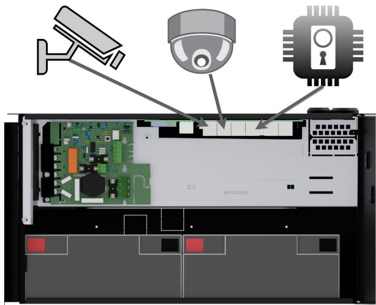

PoE kan driva exempelvis övervakningskameror, dörrmiljlöer med mera.

Enheter som skall strömmatas via PoE kopplas i portar för PoE.

Enheter som ej behöver drivas med PoE i portar för LAN kan kopplas in på switchen.

# 4. KOMPONENTÖVERSIKT POE FLX M

Figur 1. PoE M-switch 4p FLX M+

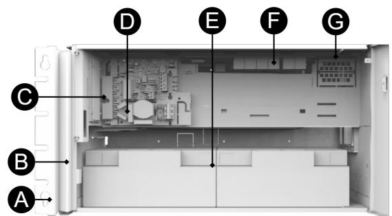

Tabell 1. Komponentöversikt

| Symbol | Förklaring                                                    |  |
|--------|---------------------------------------------------------------|--|
| A      | Konsoler, vändbara.                                           |  |
| B      | Kapsling i pulverlackad plåt.                                 |  |
| C      | Nätaggregat, (sitter under moderkort).                        |  |
| D      | Moderkort.                                                    |  |
| E      | Plats för batterier.                                          |  |
| F      | PoE switch, antal kort och portar varierar med konfiguration. |  |
| G      | Kabelgenomföringar.                                           |  |

# 5. MONTERING AV KONSOL

Konsol är vändbar och kan monteras på två sätt. Det följer med konsoler i till enheten.

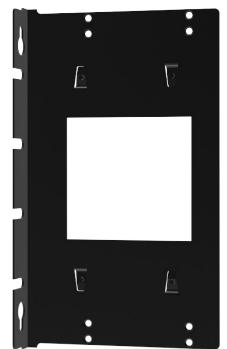

## 5.1. Skjut fast konsoler

Enheten kan monteras i 19" rack eller på vägg. Medföljande konsoler kan fästas på två sätt: Vid montering på vägg skall konsolerna sitta bakåt, mot vägg. Vid montering i 19" rack skall konsolens sitta i framkant på enheten.

Figur 2. Montera konsoler på kapsling

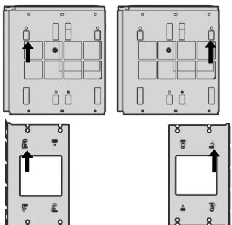

Vänster konsol: vänd mot framsidan för montering i 19" rack.

Höger konsol vänd mot baksidan för montering på vägg.

#### **VIKTIGT**

Lämna 100 mm fritt kring luftgaller.

# 6. BATTERIER - PLACERING OCH INKOPPLING

# 6.1. Schema - Inkoppling av batterier, 24 V

Batterikablage är monterat på moderkortet vid leverans. Bilder nedan visar endast hur kablage skall kopplas.

- 1. Placera batterierna i skåpet med batteripolerna utåt, mot skåpluckan.
- 2. Anslut batterikablaget till batteriet. Röd kabel på plus och svart kabel på minus.
- Bryt, om möjligt, nätspänning vid inkoppling och batteribyte.

Figur 3. Kopplingsschema för batterier i batteribackup

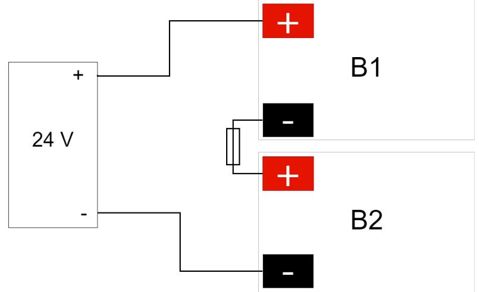

Anslut batterikablage på rätt poler. Vid felkoppling kan utrustning skadas.

# 7. MODERKORT BESKRIVNING

# 7.1. Anslut i denna ordning

För att minimera risken för fel som kan uppstå i samband med kortslutning skall anslutningar till moderkort ske i denna ordning.

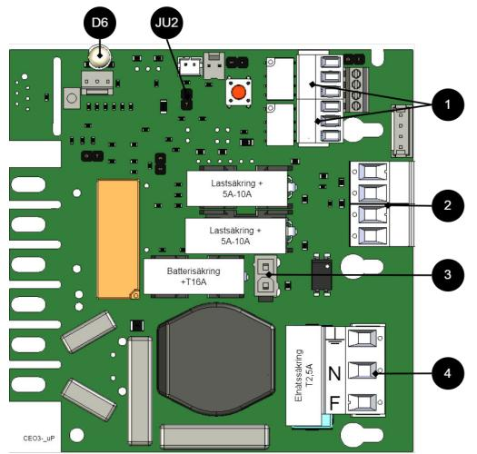

#### Tabell 2. Anslut i denna ordningen

| Nr | Förklaring       |
|----|------------------|
| 1  | Anslut larm.     |
| 2  | Anslut last.     |
| 3  | Anslut batterier |
| 4  | Anslut elnät.    |

#### Figur 4. Kortbeskrivning: CEO3 uP

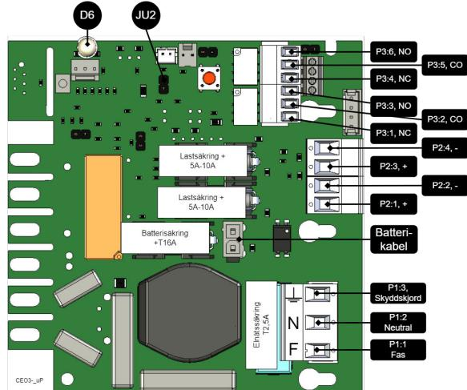

| På Kretskort | Förklaring                                            |  |
|--------------|-------------------------------------------------------|--|
| D6           | Indikeringsdiod.                                      |  |
| JU2          | Bygel för larmstyrning. Sänker larmgräns vid bygling. |  |
| P1:1-3       | Anslutning elnät.                                     |  |
| P2:1-2       | Lastutgång, + / -.                                    |  |
| P2:3-4       | Lastutgång, + / -. Intern anslutning till PoE-switch. |  |
| P3:1-3       | Larmutgång, NC, CO, NO.                               |  |
| P3:4-6       | Larmutgång, NC, CO, NO.                               |  |

# 7.2. Anslut larm på P3

#### Larm ansluts på plint P3

Tabell 3. Anslut larm P3

| P3:1-6          | Förklaring |  |
|-----------------|------------|--|
| Nätavbrottslarm |            |  |
| P3:1            | NC         |  |
| P3:2            | Com        |  |
| P3:3            | NO         |  |
| Summlarm*       |            |  |
| P3:4            | NC         |  |
| P3:5            | Com        |  |
| P3:6            | NO         |  |

Summalarm: Trasig säkring på last, trasig säkring från externt fördelningskort, trasig batterisäkring, låg batterispänning i batteridrift, ej anslutna batterier, överspänning.

## 7.3. Anslut last

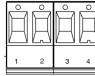

Tabell 4. Lastanslutningar

| Nummer på kretskort | Förklaring                                                 |
|---------------------|------------------------------------------------------------|
| P2:1                | Anslutning för last 1 +.                                   |
| P2:2                | Anslutning för last 1 -.                                   |
| P2:3                | Anslutning för last 2 +. Intern anslutning för PoE-switch. |
| P2:4                | Anslutning för last 2 -. Intern anslutning för PoE-switch. |

#### **MAXSTRÖM**

Maxström får ej överskridas. Maxström står angiven på [märkskylt](https://milleteknik.zendesk.com/hc/sv/articles/5785143875090-CE-märkning-märkskylt) på enheten.

#### **FARA**

Nätspänning skall vara frånkopplad vid arbete med skalade kablar. Det är installatörens ansvar att tillse att korrekt kompetens finns för inkoppling av 230 V till enheten. Maximal kabelarea är 4 mm2

# 7.4. Anslut elnät till moderkort med plint

För elnätskablage genom kabelgenomföringen på skåpet.

Säkra F och N med buntband.

Elnätskablage skall hållas åtskilt annat kablage för att undvika EMC-störningar.

Figur 5. Anslut elnät på moderkort

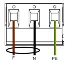

Anslut elnätskablage på plint innan den sätts tillbaka på moderkort. Säkra F och N med buntband.

Tabell 5. Anslutningar elnät

| Bokstav | Förklaring |
|---------|------------|
| F       | Fas        |
| N       | Noll       |
| PE      | Skyddsjord |

#### **ANSLUTNING ELNÄT 230 V AC PÅ KRETSKORT**

Kontrollera så att markeringen på kretskortet stämmer överens med kabelordningen på plinten.

## 7.5. Styr larmgräns

Larm för låg batterispänning i batteridrift kan styras.

Larmgränsen styrs genom att ta bort eller skapa slutning på JU2.

Larm ges när batterispänningen i batteridrift sjunker under gränsen.

Tabell 6. Larmgränser

| Larmgräns vid låg batterispänning   | 12 V   | 24 V   |
|-------------------------------------|--------|--------|
| JU2 med bygel*                      | 12,0 V | 24,0 V |
| JU2 utan bygel                      | 13,2 V | 26,5 V |
| *Enheten levereras med bygel på JU2 |        |        |

# 7.6. Säkringar

| Enhet                  | Säkring | Typ   | Förklaring     |
|------------------------|---------|-------|----------------|
| Samtliga               | F1      | T2,5A | Elnätssäkring  |
| PoE M-switch 4p FLX M+ | F2, F6  | T10A  | Lastsäkring +  |
| Samtliga               | F7      | T16A  | Batterisäkring |

### **VARNING FÖR BYTE AV SÄKRINGAR (A)**

Skaderisk föreligger om säkring byts till en större än vad enheten levereras med. Säkringens funktion är att skydda ansluten last och dess lastkablage mot skada och brand. Det går inte att byta säkring till en större för att öka strömuttag.

# 8. KAN MIN POE UTÖKAS MED FLER PORTAR?

| Produkt               | PoE-switch installerad       | Kan ytterligare PoE-switch installeras? |
|-----------------------|------------------------------|-----------------------------------------|
| PoE M-switch 4p FLX M | En fyra 4 portars PoE Switch | Nej                                     |

# 9. KORTBESKRIVNING FÖR POE SWITCH 4P

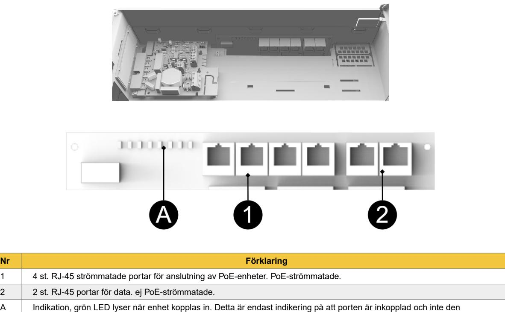

inkopplade enhetens status.

# 10. DRIFTSÄTTNING - HUR ENHETEN SKALL STARTAS

- 1. Koppla in batterier.
- 2. Anslut / slå till säkringar.
- 3. Koppla in PoE och annat last.
- 4. Skruva fast elnätkabel i plint och sätt fast plint på moderkort.
- 5. Slå till nätspänning.

Enheten fungerar normalt då indikeringsdiod på skåpluckans utsida lyser med fast grönt sken. Se frontpanel / skåplucka, för övriga statusindikationer.

Det kan ta upp till 72 timmar innan batterier är fullt laddade.

# 11. HUR MJUKVARA NÅS I POE-SWITCH

# 11.1. Hur mjukvaran nås i PoE-Switch

Det här avsnittet visar hur du loggar in på switchens konfigurationswebbsida.

För att konfiguera mjukvaran i switchen behöver åtkomsten till switchen behöver rätt IP-adress ställas in på datorn.

Åtkomst till switchens mjukvara sker genom en webbläsare, (Chrome, Edge, Firefox).

Följ stegen för att komma nå switchens inställningar.

#### **NOTERA**

Inställningarna som visas är inställningar för PC, (Windows 7 - Windows 11). Fönster och namn kan variera mellan olika versioner av Windows. Vi kan tyvärr inte ge support för inställningar av din dator.

#### **OBS!**

Adressen till PoE-switchen är: **192.168.2.1** och användarnamn och lösenord är: **admin/admin** IP-adressen i switchen är statisk (fast) och därför måste datorns IP-adress och sub-nät mask vara statiska.

- 1. Öppna inställningar och gå till **Nätverk och Internet** -> **Avancerade nätverksinställningar**. Öppna **fler nätverkskortsalternativ**.

| Bluetooth Device (Personal Are (think)                                                     |                 |
|-----------------------------------------------------------------------------------------------|-----------------|
| Wi-Fi Inte ansluten   Intel(R) Wi-Fi GE AX210 160N                                         | Inaktivera > |
| Ethernet millebaknik.se   Intel(R) Ethernet Controller [5) 1225-V                          | Inaktivera > |
| Fler inställningar                                                                            |                 |
| Avancerade delningsinställningar Ändra instållningar för nätverksidentifiering och delning | >               |
| Dataanvändning                                                                                | >               |
| Maskinvaru- och anslutningsegenskaper                                                         | >               |
| Nätverksåterstållning Återställ alla nätverkskort till fabriksinställningarna              | >               |
| Relaterade inställningar                                                                      | 2               |
| Fler nätverkskortsalternativ                                                                  | 6               |
| Windows-brandväggen                                                                           | రో              |
| Få hjälp C                                                                                 |                 |

- 2. Ett fönster för nätverksanslutningar dyker upp och visar alla tillgängliga nätverksanslutningar på datorn. Dubbelklicka på nätverksanslutningen du använder för att ansluta till switchen.
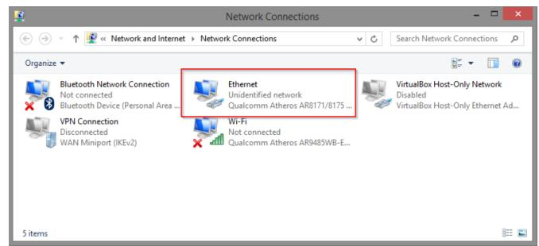

- 3. Ethernet-statusfönster dyker upp. Klicka på knappen **Egenskaper** som visas i figuren nedan.

| 0                  | Ethernet Status |                   | × |
|--------------------|-----------------|-------------------|---|
| General            |                 |                   |   |
| Connection         |                 |                   |   |
| IPv4 Connectivity: |                 | No network access |   |
| IPv6 Connectivity: |                 | No network access |   |
| Media State:       |                 | Enabled           |   |
| Duration:          |                 | 00:03:17          |   |
| Speed:             |                 | 1.0 Gbps          |   |
|                    |                 |                   |   |
| Activity           |                 |                   |   |
|                    | Sent            | Received          |   |
| Bytes:             | 81,247          | 234,299           |   |
| es                 | Disabl          | Diagnose          |   |
|                    |                 | Close             |   |

- 4. Dubbelklicka på Internet Protocol Version 4 (TCP / IPv4).

| Ethernet Properties                                                                                                                                                                                                                                   |  |
|-------------------------------------------------------------------------------------------------------------------------------------------------------------------------------------------------------------------------------------------------------|--|
| Networking Sharing                                                                                                                                                                                                                                 |  |
| Connect using:                                                                                                                                                                                                                                        |  |
| Qualcomm Atheros AR8171/8175 PCI-E Gigabit Ethemet                                                                                                                                                                                                    |  |
| Configure                                                                                                                                                                                                                                             |  |
| This connection uses the following items:                                                                                                                                                                                                             |  |
| QoS Packet Scheduler .4. Microsoft Network Adapter Multiplexor Protocol Microsoft LLDP Protocol Driver .4. Link-Laver Topology Discovery Mapper I/O Driver Link-Layer Topology Discovery Responder Internet Protocol Version 4 (TCP/IP |  |
| Uninstall Install Properties                                                                                                                                                                                                                    |  |
| Description Transmission Control Protocol/Intemet Protocol. The default wide area network protocol that provides communication across diverse interconnected networks.                                                                       |  |
| ОК Cancel                                                                                                                                                                                                                                          |  |

- 5. Ställ in datorns IP-adress och subnätmask som visas i figuren nedan. Som standard ska produktens **IP-adress vara 192.168.2.1.** Du kan ställa in vilken IP-adress som helst så länge den inte är densamma med din switchs IP-adress och ligger i samma nätverkssegment med din switchs IP-adress. Tryck på **OK** för att tillämpa de TCP/IPv4-inställningar du just gjort. Nu kan du ansluta till din switch med en webbläsare (Chrome, Edge eller Firefox).

| Internet Protocol Version 4 (TCP/IPv4) Properties                                                                                                                                     | ×                                       |  |  |  |  |
|---------------------------------------------------------------------------------------------------------------------------------------------------------------------------------------|-----------------------------------------|--|--|--|--|
| General                                                                                                                                                                               |                                         |  |  |  |  |
| You can get IP settings assigned automatically if your network supports this capability. Otherwise, you need to ask your network administrator for the appropriate IP settings. |                                         |  |  |  |  |
| Obtain an IP address automatically                                                                                                                                                    |                                         |  |  |  |  |
| · Use the following IP address:                                                                                                                                                       |                                         |  |  |  |  |
| IP address:                                                                                                                                                                           | 192 . 168 . 2 . 33                      |  |  |  |  |
| Subnet mask:                                                                                                                                                                          | 255 . 255 . 255 0                    |  |  |  |  |
| Default gateway:                                                                                                                                                                      |                                         |  |  |  |  |
|                                                                                                                                                                                       | Obtain DNS server address automatically |  |  |  |  |
| · Use the following DNS server addresses:                                                                                                                                             |                                         |  |  |  |  |
| Preferred DNS server:                                                                                                                                                                 | 8 8 8 8                        |  |  |  |  |
| Alternate DNS server:                                                                                                                                                                 |                                         |  |  |  |  |
| Validate settings upon exit                                                                                                                                                           | Advanced                                |  |  |  |  |
|                                                                                                                                                                                       | OK Cancel                            |  |  |  |  |

- 6. Anslut en RJ-45 kabel och anslut till PoE-switchen.
### 11.2. Logga in på Switchen

#### **NOTERA**

Adress till switchen (fabriksinställning): **192.168.2.1**

Lösenord (fabriksinställning): **admin**

- 1. Starta webbläsaren på din dator.
- 2. Inloggning på PoE-switch.

| 1                                            | 2 3                                                 |
|----------------------------------------------|--------------------------------------------------------|
| 12 0 0 10 P                         | + rts Gigabit Switch                                |
| ← C A Ej säker                         | 192.168.2.1                                            |
| POWER                                        | EDEN SU MADE                                     |
| Configuration Monitoring Maintenance   | password to login Please ente Password: Apply |
| 4                                            |                                                        |
| 13 0 0 10 Ports Gigabit Switch D | + ×                                                 |
| ← C A Ej säker                         | 192.168.2.1                                            |
| POWER SUPPLIE                                |                                                        |
| Configuration                                | Password Successfully Entered                          |
| Monitoring                                   |                                                        |
| Maintenance                                  |                                                        |

| Nummer | Förklaring                               |
|--------|------------------------------------------|
| 1      | IP-adress till PoE-Swithcen: 192.168.2.1 |
| 2      | Lösenord: admin                          |
| 3      | Apply = Ok                               |
| 4      | Meny i PoE-switchen                      |

# 11.3. Konfiguration

### 11.3.1. System, konfiguration

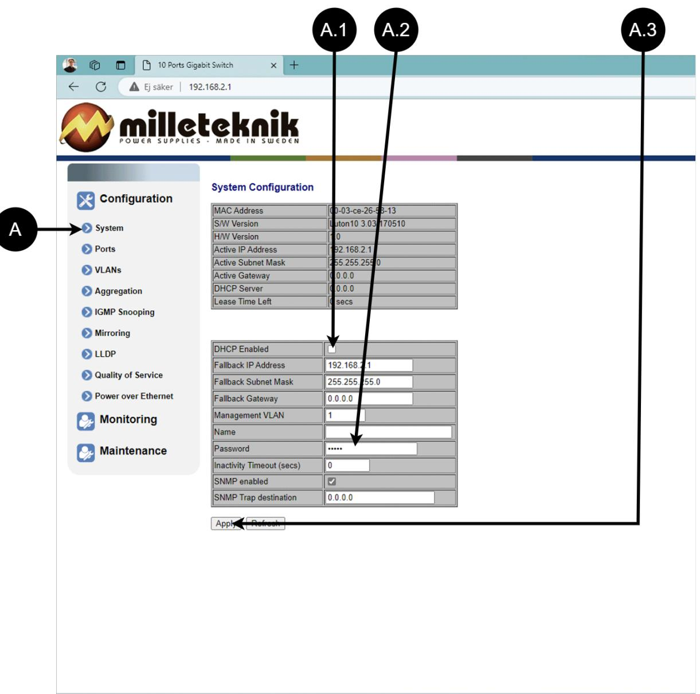

| Bokstav, nummer | Förklaring                                                                              |
|-----------------|-----------------------------------------------------------------------------------------|
| A               | PoE-switchens sida för systemkonfiguration                                              |
| A.1             | Kryssa i här om du skall använda DHCP, se varning nedan.                                |
| A.2             | Ändrar det fabriksinställda lösenordet, (admin).                                        |
| A.3             | Om du har gjort några ändringar behöver du klicka på "Apply" för att spara ändringarna. |

#### **VARNING**

Inställningarna på denna sidan behöver normalt inte ändras. Ändra bara inställningarna om du absolut vet vad du gör.

Fabriksåterställ PoE-enheten om den inte uppför sig som förväntat efter det att du justerad inställningar på denna sidan.

#### 11.3.2. Portar, konfiguration

#### **VARNING**

Inställningarna på denna sidan behöver normalt inte ändras. Ändra bara inställningarna om du absolut vet vad du gör.

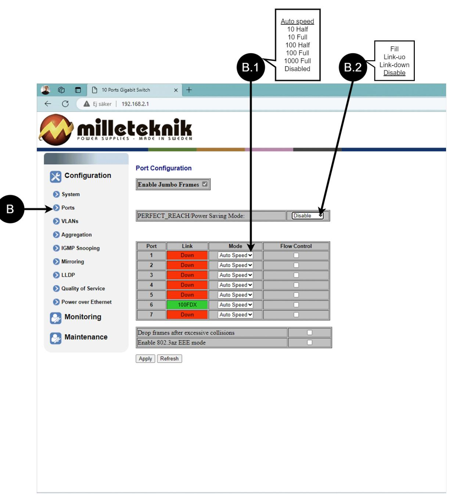

| Bokstav, nummer | Förklaring                                                                             |  |  |  |  |  |  |
|-----------------|----------------------------------------------------------------------------------------|--|--|--|--|--|--|
| B               | Portar                                                                                 |  |  |  |  |  |  |
| B.1             | Denna inställning behöver normalt inte ändras. Välj hastighet på PoE-switchens portar. |  |  |  |  |  |  |
| B.2             | Denna inställning behöver normalt inte ändras.                                         |  |  |  |  |  |  |

#### **VARNING**

Inställningarna på denna sidan behöver normalt inte ändras. Ändra bara inställningarna om du absolut vet vad du gör.

Fabriksåterställ PoE-enheten om den inte uppför sig som förväntat efter det att du justerad inställningar på denna sidan.

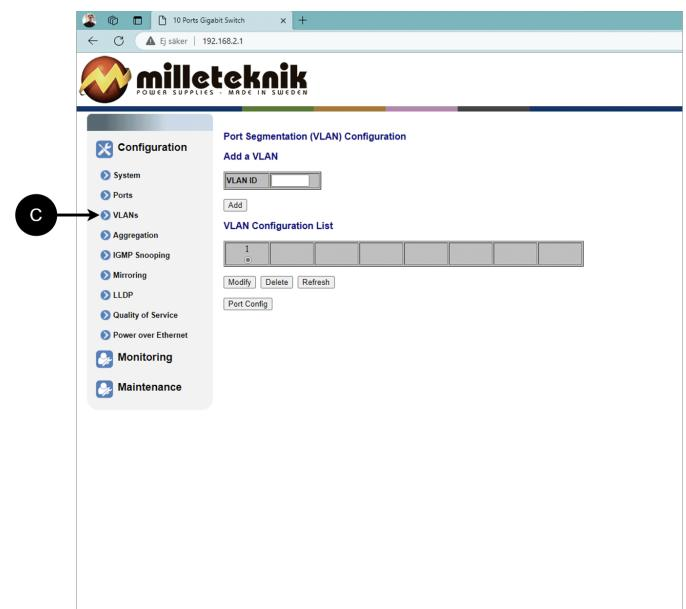

Konfiguration av Viruellt LAN.

11.3.4. Aggregation, konfiguration

#### **VARNING**

Inställningarna på denna sidan behöver normalt inte ändras. Ändra bara inställningarna om du absolut vet vad du gör.

| 0 ల్రి                       | 10 Ports Gigabit Switch 19                        | + ×  |        |   |   |   |  |  |
|---------------------------------|------------------------------------------------------|---------|--------|---|---|---|--|--|
| C ←                          | A Ej säker   192.168.2.1                             |         |        |   |   |   |  |  |
|                                 |                                                      |         |        |   |   |   |  |  |
|                                 |                                                      |         |        |   |   |   |  |  |
| Configuration                   | Aggregation/Trunking Configuration GrouplPort   1 | N 3  | 4      | ર | 6 | 7 |  |  |
| System                          | Normal                                               | O O  | O O | O | O | O |  |  |
| > Ports                         | Group 1                                              | O O  | O O | O | C |   |  |  |
| VLANs                           | Group 2                                              |         |        |   |   |   |  |  |
| D Aggregation                | Group 3                                              |         |        |   |   |   |  |  |
| IGMP Snooping                   | Group 4                                              |         |        |   |   |   |  |  |
| > Mirroring                     | Group 5                                              |         |        |   |   |   |  |  |
| > LLDP                          | Group 6                                              |         |        |   |   |   |  |  |
| Quality of Service              | Group 7                                              |         |        |   |   |   |  |  |
| > Power over Ethernet           | Group 8                                              |         |        |   |   |   |  |  |
| Monitoring                      | Apply                                                | Refresh |        |   |   |   |  |  |
| Maintenance                     |                                                      |         |        |   |   |   |  |  |
|                                 |                                                      |         |        |   |   |   |  |  |
|                                 |                                                      |         |        |   |   |   |  |  |
|                                 |                                                      |         |        |   |   |   |  |  |
|                                 |                                                      |         |        |   |   |   |  |  |
|                                 |                                                      |         |        |   |   |   |  |  |
|                                 |                                                      |         |        |   |   |   |  |  |
|                                 |                                                      |         |        |   |   |   |  |  |
|                                 |                                                      |         |        |   |   |   |  |  |
|                                 |                                                      |         |        |   |   |   |  |  |
|                                 |                                                      |         |        |   |   |   |  |  |
| 192.168.2.1/aggr?submit=Refresh |                                                      |         |        |   |   |   |  |  |

Lastbalansering mellan portarna.

11.3.5. IGMP Snooping, konfiguration

### **VARNING**

Inställningarna på denna sidan behöver normalt inte ändras. Ändra bara inställningarna om du absolut vet vad du gör.

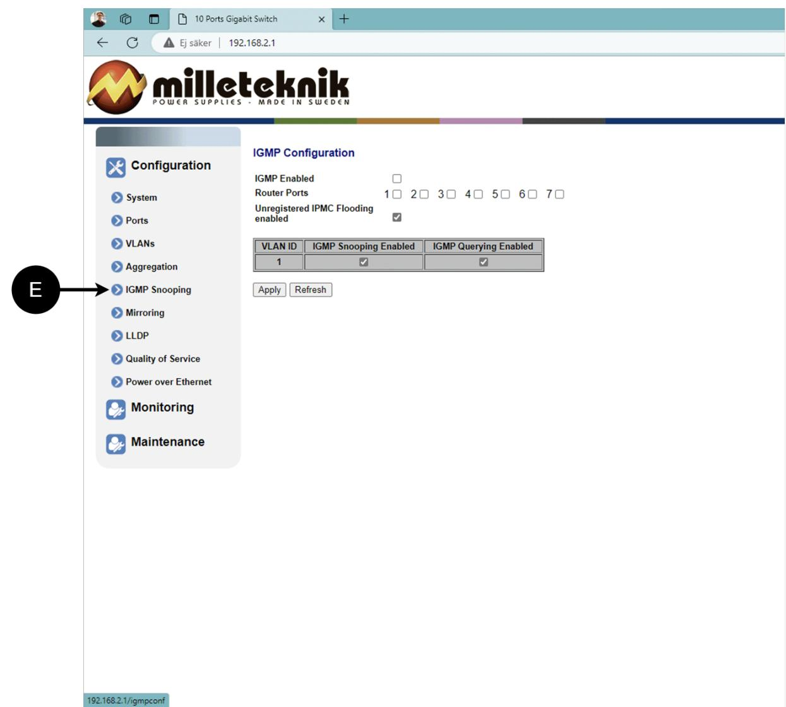

Omkopplare som styr mottagningen.

11.3.6. Mirroring, konfiguration

### **VARNING**

Inställningarna på denna sidan behöver normalt inte ändras. Ändra bara inställningarna om du absolut vet vad du gör.

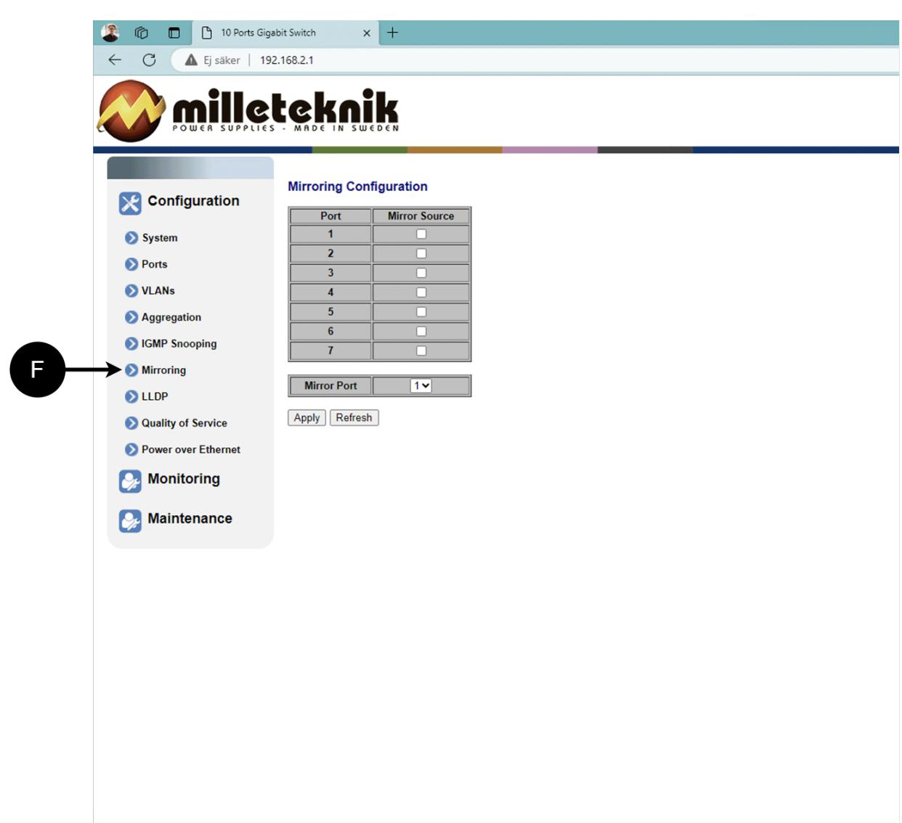

Spegling av portar.

11.3.7. LLDP, konfiguration

#### **VARNING**

Inställningarna på denna sidan behöver normalt inte ändras. Ändra bara inställningarna om du absolut vet vad du gör.

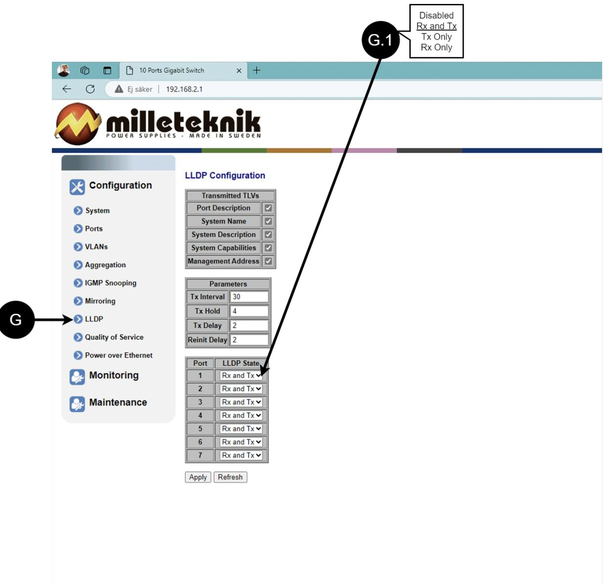

| Bok stav, num mer | Förklaring                                                                                                                                                                                                                                                                                                                                                                                                                                                                                                                                                                                                                                                                                                                                                                                                                                                                                                                                      |
|----------------------------|-------------------------------------------------------------------------------------------------------------------------------------------------------------------------------------------------------------------------------------------------------------------------------------------------------------------------------------------------------------------------------------------------------------------------------------------------------------------------------------------------------------------------------------------------------------------------------------------------------------------------------------------------------------------------------------------------------------------------------------------------------------------------------------------------------------------------------------------------------------------------------------------------------------------------------------------------|
| G                          | LLDP står för "Link Layer Discovery Protocol", vilket är en nätverksprotokollstandard som används för att upptäcka och kommunicera information om nätverksenheter som är anslutna till samma Ethernet-nätverk. Protokollet tillåter enheter som switchar och routrar att skicka och ta emot meddelanden som innehåller information om enheternas identifiering, kapabiliteter och anslutningstopologi.                                                                                                                                                                                                                                                                                                                                                                                                                                                                                                                                 |
| G.1                        | RX och TX är förkortningar som används inom elektronik, kommunikation och datanätverk för att indikera riktningen av dataflödet mellan enheter. RX: Förkortningen "RX" står för "Receive" eller "Reception". Det indikerar att enheten tar emot data eller signaler från en annan enhet. När en enhet har en RX-ingång, innebär det att den är konstruerad för att ta emot data eller information från en sändande enhet. TX: Förkortningen "TX" står för "Transmit" eller "Transmission". Den indikerar att enheten sänder ut data eller signaler till en annan enhet. Om en enhet har en TX-utgång betyder det att den är utformad för att sända data eller information till en mottagande enhet. Dessa förkortningar är särskilt vanliga när det gäller datakommunikation, som till exempel i samband med nätverkskablar där det finns specifika RX och TX-ledningar som möjliggör tvåvägskommunikation mellan enheter. |

### 11.3.8. QoS, konfiguration

#### **VARNING**

Inställningarna på denna sidan behöver normalt inte ändras. Ändra bara inställningarna om du absolut vet vad du gör.

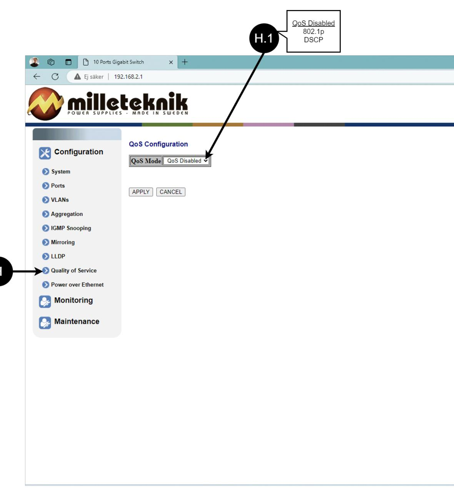

| Bokstav, nummer | Förklaring                                                                                                                                                                                                                           |
|--------------------|--------------------------------------------------------------------------------------------------------------------------------------------------------------------------------------------------------------------------------------|
| H                  | QoS ger olika nätverkstrafik olika prioritet beroende på dess vikt och krav, vilket hjälper till att säkerställa att viktiga tjänster levereras med tillräcklig bandbredd och minimal fördröjning även när nätverket är belastat. |
| H.1                | Ställer om QoS är aktivt.                                                                                                                                                                                                            |

### 11.3.9. PoE, konfiguration

### **VARNING**

Inställningarna på denna sidan behöver normalt inte ändras. Ändra bara inställningarna om du absolut vet vad du gör.

| 10 10 0 C A Ej säker ←     | ල 10 Ports Gigabit Switch 192.168.2.1 | + ×                                  |                               |                         |                                                         |  |
|-------------------------------------------|------------------------------------------|-----------------------------------------|-------------------------------|-------------------------|---------------------------------------------------------|--|
| Configuration                             |                                          | PoE (Power over Ethernet) Configuration |                               |                         |                                                         |  |
| System > > Ports                    | Port                                     | PoE Enabled                             | PD Class                      | Delivering Power [W] | Power Budget [%] (total power = (total power = 130W) |  |
| > VLANs Aggregation                    | 4 5                                   | X D 2                             | Unknown Unknown Unknown | 0 0 0             | 0%                                                      |  |
| IGMP Snooping > Mirroring > LLDP    | 6 Apply                               | 0 Refresh                            | Unknown                       | 0                       |                                                         |  |
| Quality of Service Power over Ethernet |                                          |                                         |                               |                         |                                                         |  |
| Monitoring Maintenance                 |                                          |                                         |                               |                         |                                                         |  |
|                                           |                                          |                                         |                               |                         |                                                         |  |
|                                           |                                          |                                         |                               |                         |                                                         |  |
|                                           |                                          |                                         |                               |                         |                                                         |  |
|                                           |                                          |                                         |                               |                         |                                                         |  |
|                                           |                                          |                                         |                               |                         |                                                         |  |

| Bokstav, nummer | Förklaring                                                                       |  |  |  |  |  |  |
|-----------------|----------------------------------------------------------------------------------|--|--|--|--|--|--|
| I               | Power over Ehternet                                                              |  |  |  |  |  |  |
| I.1             | Slår på eller av PoE-port. Glöm inte att trycka "Apply" för att spara ändringar. |  |  |  |  |  |  |

# 11.4. Övervakning

### 11.4.1. Statistik, översikt

|                                 | 10 Ports Gigabit Switch × + |           |                                   |           |                    |           |
|---------------------------------|-----------------------------------|-----------|-----------------------------------|-----------|--------------------|-----------|
| C ▲ Ej säker ←            | 192.168.2.                        |           |                                   | P         | ଓ 0 13 Au | ு പ്പെ |
|                                 |                                   |           |                                   |           |                    |           |
|                                 |                                   |           |                                   |           |                    |           |
|                                 |                                   |           | Statistics Overview for all ports |           |                    |           |
| Configuration                   | Refresh Clea                   |           |                                   |           |                    |           |
|                                 | Tx Bytes Port                  | Tx Frames | Rx Bytes                          | Rx Frames | Tx Errors          |           |
| Monitoring                      | 1 0 2 o                  | 0 0    | 0 0                            | 0 0    | 0 0             |           |
| Statistics Overview             | 3 o 4 0                  | o o    | 0 0                            | 0 0    | o o             |           |
| S Detailed Statistics           | ર 0 ം 3568888            | o 238  | 0 1934629                      | 0 35   | 0 o             |           |
| IGMP Status                     | 7 o                            | 0         | 0                                 | 0         | o                  |           |
|                                 |                                   |           |                                   |           |                    |           |
| S LLDP Statistics LLDP Table |                                   |           |                                   |           |                    |           |
| > Ping                          |                                   |           |                                   |           |                    |           |
| Maintenance                     |                                   |           |                                   |           |                    |           |
|                                 |                                   |           |                                   |           |                    |           |
| Warm Restart                    |                                   |           |                                   |           |                    |           |
| Factory Default                 |                                   |           |                                   |           |                    |           |
| Software Upload                 |                                   |           |                                   |           |                    |           |
|                                 |                                   |           |                                   |           |                    |           |
| Configuration File Transfer  |                                   |           |                                   |           |                    |           |

| Bokstav, nummer | Förklaring          |
|-----------------|---------------------|
| J               | Statistik, översikt |
| J.1             | Trafik per port.    |

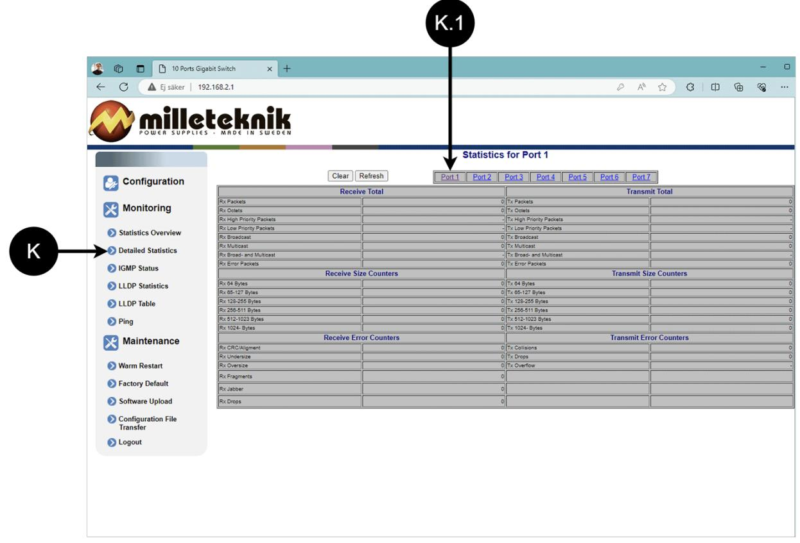

| Bokstav, nummer | Förklaring                           |
|-----------------|--------------------------------------|
| K               | Detaljerad statistik                 |
| K.1             | Välj port som du vill statistik för. |

### 11.4.3. IGMP status

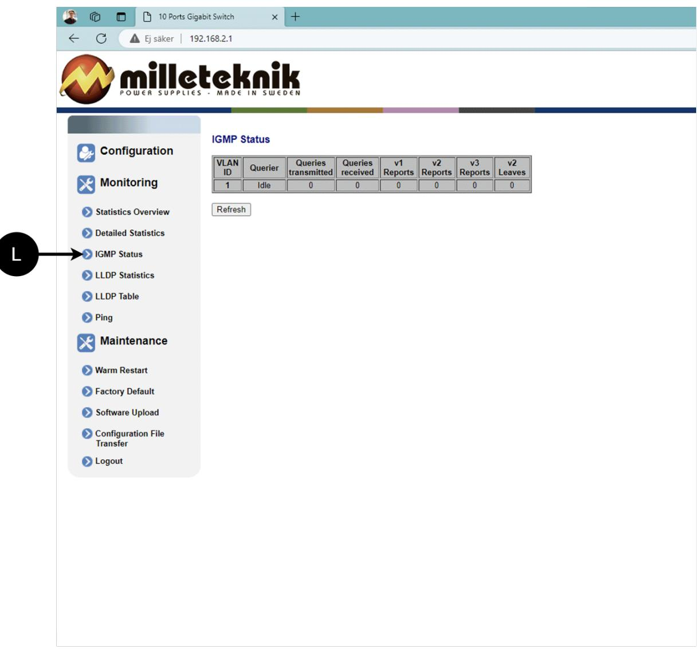

#### L: Status för IGMP

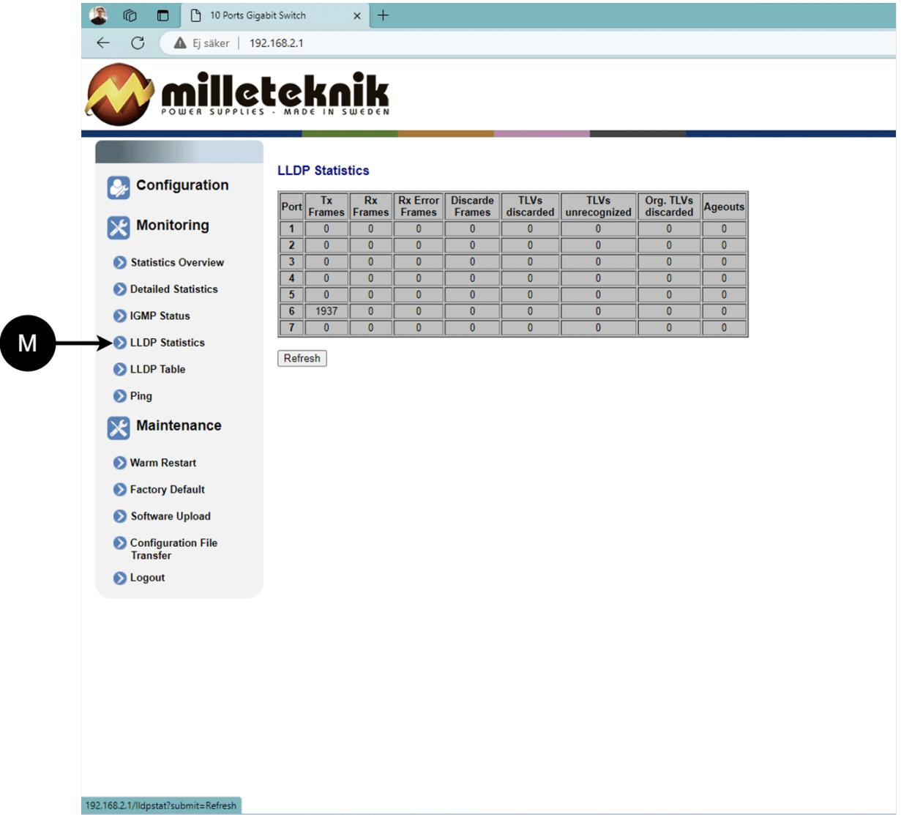

M: LLDP statistik

### 11.4.5. LLDP table

|   | 命 0 10 Ports Gigabit Switch 19 C A Ej säker ← | + × 192.168.2.1                            |                |                     |                  | Air ಿ            | 8 ్రా ි      | - டூ ୟନ୍ତ |
|---|-----------------------------------------------------------------|--------------------------------------------------|----------------|---------------------|------------------|---------------------|--------------------|-----------------|
|   | Configuration                                                   | LLDP Neighbour Table Chassis Id Local Port | Remote Port ID | System Name         | Port description | System Capabilities | Management Address |                 |
|   | Monitoring Statistics Overview                               | Refresh                                          |                | No entries in table |                  |                     |                    |                 |
|   | Detailed Statistics                                             |                                                  |                |                     |                  |                     |                    |                 |
|   | IGMP Status                                                     |                                                  |                |                     |                  |                     |                    |                 |
|   | S LLDP Statistics                                               |                                                  |                |                     |                  |                     |                    |                 |
| Z | LLDP Table                                                      |                                                  |                |                     |                  |                     |                    |                 |
|   | P Ping                                                          |                                                  |                |                     |                  |                     |                    |                 |
|   | Maintenance                                                     |                                                  |                |                     |                  |                     |                    |                 |
|   | Warm Restart                                                    |                                                  |                |                     |                  |                     |                    |                 |
|   | F Factory Default                                               |                                                  |                |                     |                  |                     |                    |                 |
|   | Software Upload                                                 |                                                  |                |                     |                  |                     |                    |                 |
|   | Configuration File Transfer                                  |                                                  |                |                     |                  |                     |                    |                 |
|   | Logout                                                          |                                                  |                |                     |                  |                     |                    |                 |
|   |                                                                 |                                                  |                |                     |                  |                     |                    |                 |
|   |                                                                 |                                                  |                |                     |                  |                     |                    |                 |
|   |                                                                 |                                                  |                |                     |                  |                     |                    |                 |
|   |                                                                 |                                                  |                |                     |                  |                     |                    |                 |

N: LLDP översikt.

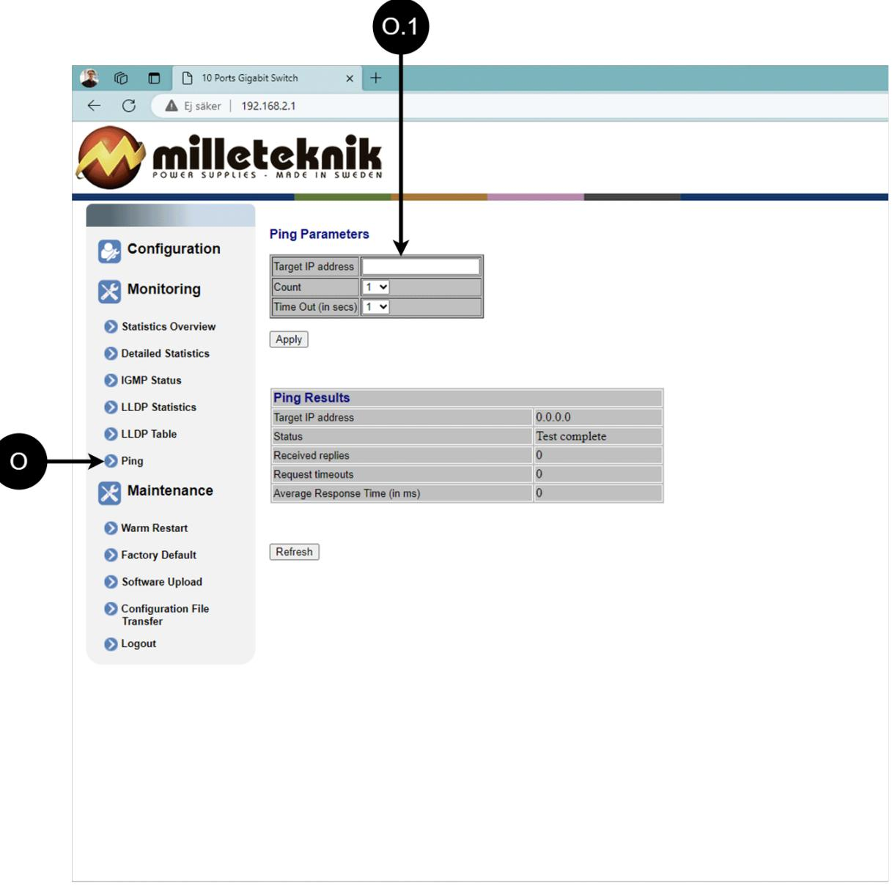

| Bokstav, nummer | Förklaring                                             |
|-----------------|--------------------------------------------------------|
| O               | Ping                                                   |
| 0.1             | Ange adress för att testa anslutningen och svarstiden. |

## 11.5. Underhåll

### 11.5.1. Omstart

#### **VARNING**

Omstart görs av PoE-switch, batteribackup startas inte om. Vid omstart kommer anslutna enheter att tappa kontakten. Larm kan sättas till batteribackup, men det försvinner när PoE-switchen är igång igen.

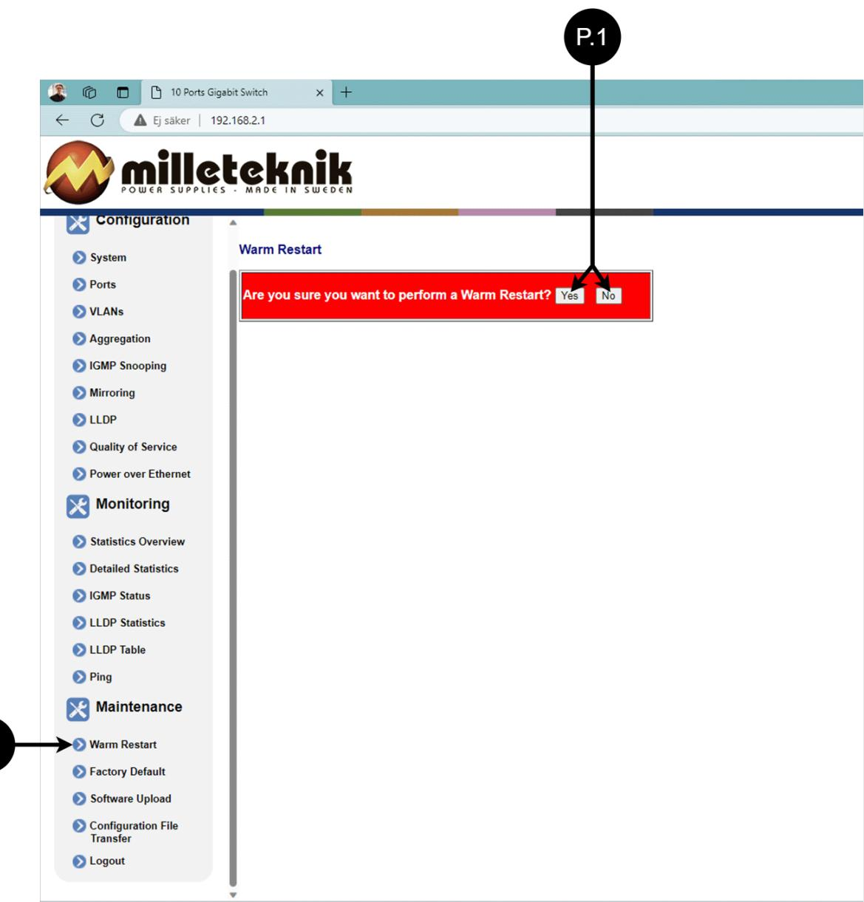

| Bokstav, nummer | Förklaring                             |
|-----------------|----------------------------------------|
| P               | Omstart av PoE-switchen.               |
| P.1             | Välj "Yes" för att starta om switchen. |

#### **VARNING**

Fabriksåterställning görs av PoE-switch. Batteribackup återställs inte. Vid återställning kommer anslutna enheter att tappa kontakten. Larm kan sättas till batteribackup, men det försvinner när PoE-switchen är igång igen.

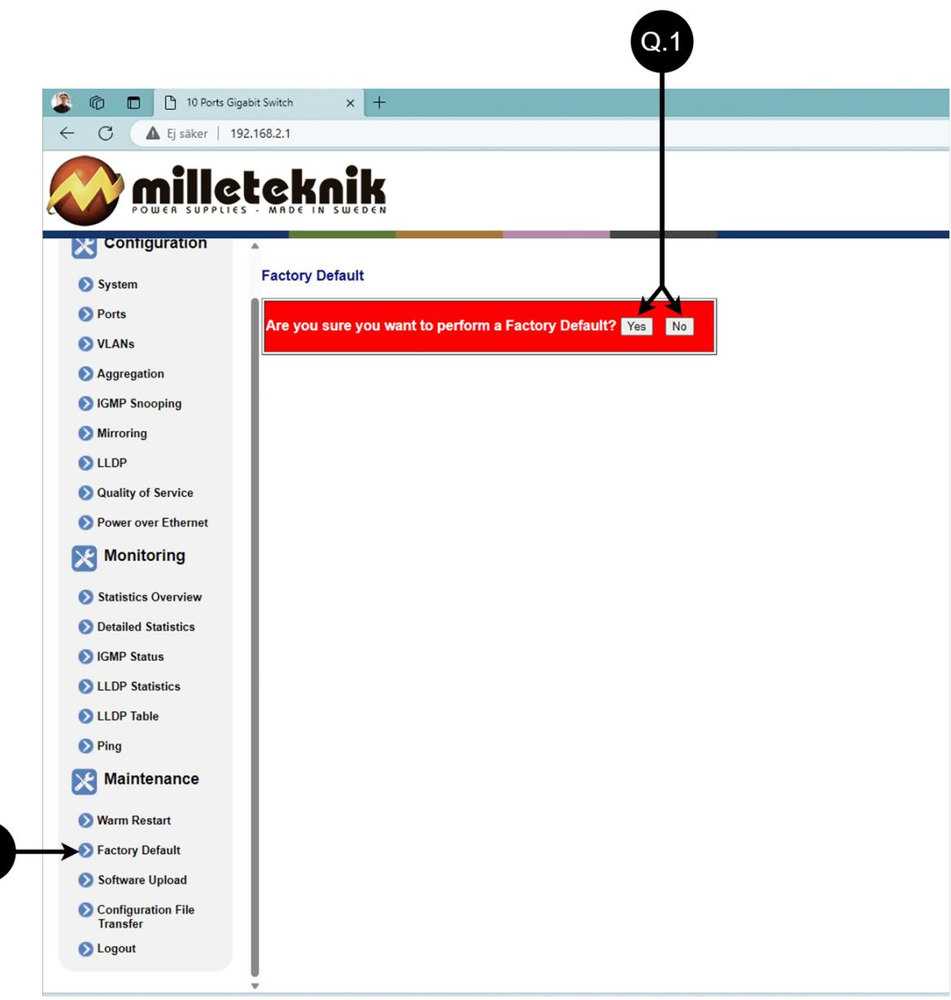

| Bokstav, nummer | Förklaring                                         |  |
|-----------------|----------------------------------------------------|--|
| Q               | Fabriksåterställ PoE-switchen.                     |  |
| Q.1             | Välj "Yes" för att fabriksåterställa PoE-switchen. |  |

### 11.5.3. Ladda upp ny mjukvara

#### **VARNING**

Använd enbart mjukvara du fått av Milletekniks support. Milleteknik tar inget ansvar för mjukvara eller följder som skada på enhet eller kringutrusning eller annan skada som kan uppstår av uppladdning av ej godkänd mjukvara.

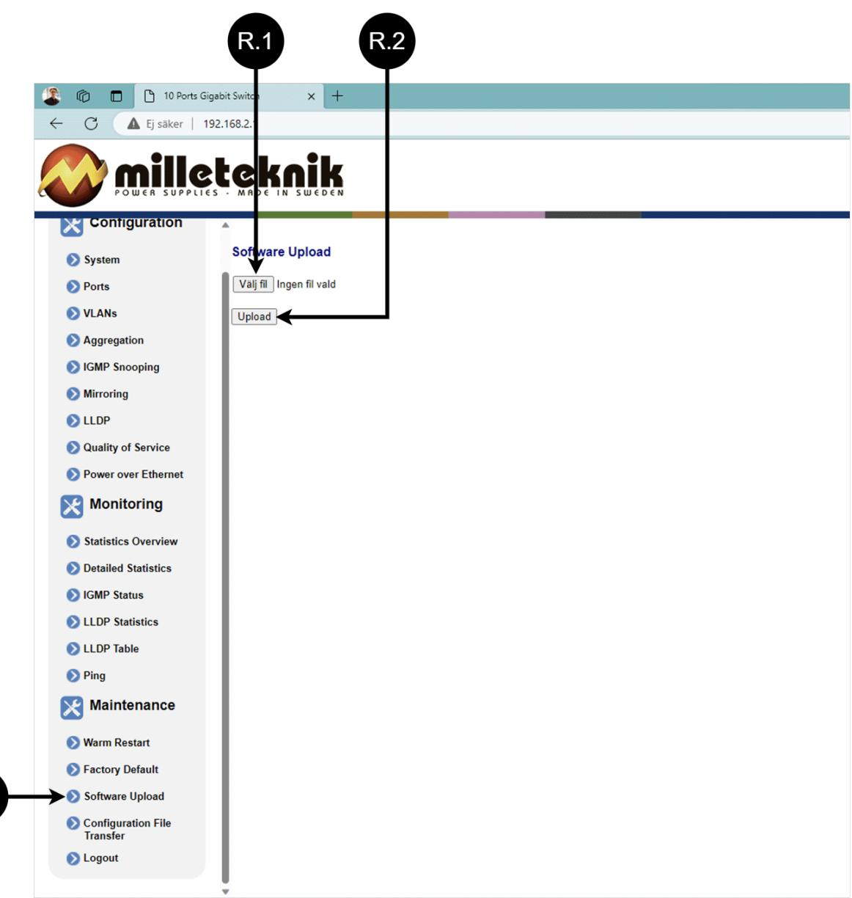

| Bokstav, nummer | Förklaring                                      |
|-----------------|-------------------------------------------------|
| R               | Ladda upp ny mjukvara till Switchen.            |
| R.1             | Navigera till datorn där du sparat filen.       |
| R.2             | Klicka på "Upload" för att ladda upp mjukvaran. |

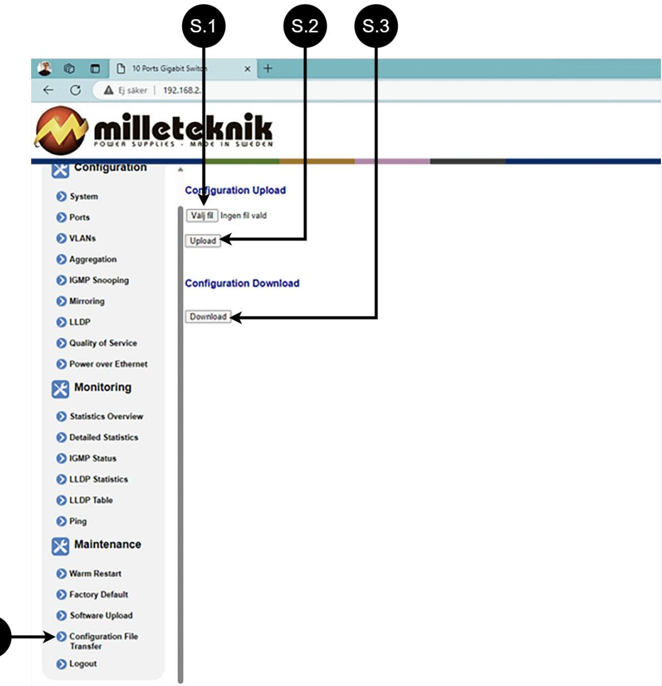

| Bokstav, nummer | Förklaring                                   |
|-----------------|----------------------------------------------|
| S               | Ladda upp eller ner switchens konfiguration. |
| S.1             | Välj ny konfigurationsfil.                   |
| S.2             | Ladda upp ny konfigurationsfil.              |
| S.3             | Ladda ner konfigurationsfil till datora.     |

a.Nyare windowsdatorer tillåter inte att *.cfg-filer laddas ner utan extra godkännande i webbläsaren vid nedladdning. Det kan hända att antivirusprogram rensar bort filen vid nedladdning.

### 11.5.5. Logga ut

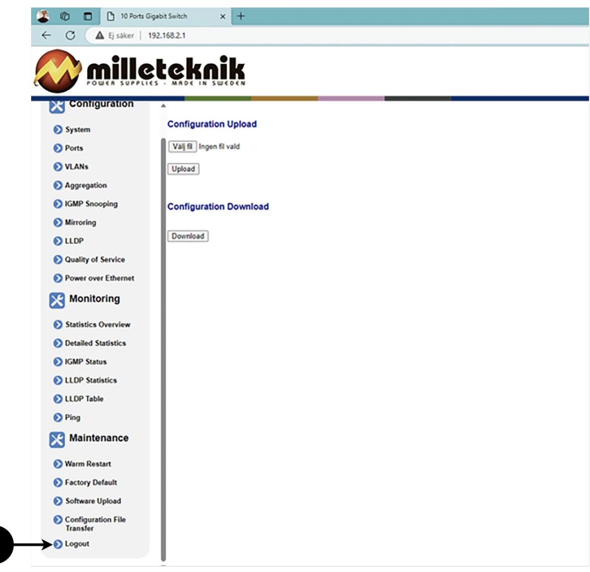

T: Logga ut från switchen. Detta påverkar inte driften av switchen.

# 12. LARM SOM VISAS PÅ SKÅPLUCKA / INDIKERING-SDIOD

I normalläge visar indikeringsdioden ett fast grönt sken.

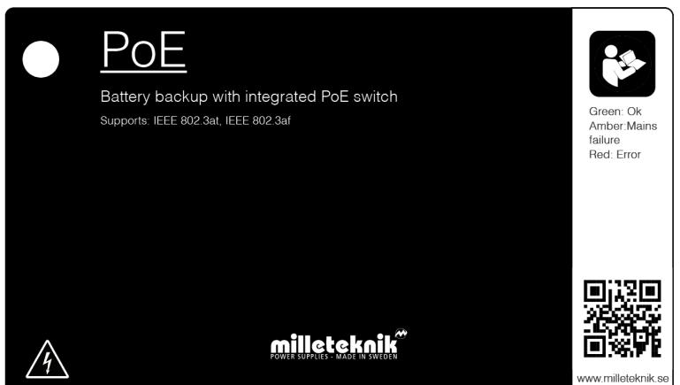

| Indikeringsdioden visar | Förklaring                                    |
|-------------------------|-----------------------------------------------|
| Fast grönt sken         | Normaldrift.                                  |
| Fast gult sken          | Nätavbrott.                                   |
| Fast rött sken          | Batteri är ej anslutet / säkring har löst ut. |

Vid driftsatt system: Är indikeringsdioden släckt har djupurladdningsskydd trätt i kraft.

# 13. UNDERHÅLL

Systemet, med undantag för batterier, är underhållsfritt vid installation i inomhusmiljö.

# 13.1. Batteribyte

- Bryt, om möjligt, nätspänning vid batteribyte.
- Koppla bort batterikablar. Notera hur batterikablar är monterade innan de avlägsnas.
- Tag bort batterisäkring mellan batterier.
- Sätt in fast de nya batterierna.
- Anslut batterikablarna på samma sätt som tidigare.
- Sätt fast batterisäkring mellan batterier.
- Slå till nätspänning. Eventuellt kan indikeringsdioden lysa för låg batterispänning / nätbortfall tills batterier är laddade. Det kan ta upp till 72 timmar innan batterierna är fulladdade.
- Testa systemet genom att kortvarigt koppla bort nätspänning, (= lasten skall drivas vidare av batterierna), och därefter slå till nätspänningen igen.

# 14. PRODUKTBLAD - STRÖMFÖRSÖRJNING / BATTERI-BACKUP

# 14.1. Produktblad - strömförsörjning från Milleteknik

### 14.1.1. Namn, artikelnummer och e-nummer

| Namn                  | Artikelnummer      | E-nummer  |
|-----------------------|--------------------|-----------|
| PoE M-switch 4p FLX M | FM01N10224P01004PM | 51 728 96 |

### 14.1.2. PoE

Figur 6. PoE M-switch 4p FLX M+.

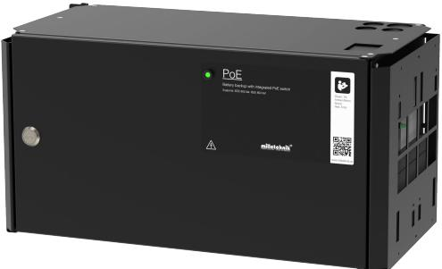

Managed PoE-switch med 4 PoE Portar.

### 14.1.3. Beskrivning

Primärswitchad fyra, åtta eller 16 portars PoE strömförsörjning med batteribackup 24 V, 30,8 W/port, med plats för två 20 Ah batteri.

### 14.1.4. Användningsområde

Strömförsörjning med reservkraft för att driva PoE-enheter som övervakningskameror och andra PoE drivna enheter. En extra lastugång för att driva andra 24 V applikationer.

Batterier driver, exempelvis passersystemet, vidare när elnätet går ner.

Lång livslängd, energieffektiv och support finns tillgänglig om något skulle krångla, nu eller om 10 år.

### 14.1.5. Spänning, ström och effekt

Spänning ut: 27,3 VDC, (24 V).

Laddström: 10 A.

Strömuttag: 30,8 W/ PoE-port, 5 A på 24 V lastutgång .

#### 14.1.6. Reservdrifttid på batterier

Reservdrifttiden i batteridrift beror på hur stor belastning som är inkopplad på strömförsörjningen. Varierar belastningen, som vid frekvent öppning av dörrlås, sjunker tiden som batterier kan driva vidare säkerhetssystemet. För att få en uppskattning av reservdriffterser se: [www.milleteknik.se/Manualer/FaQ/](https://www.milleteknik.se/Manualer/FaQ/Reservdrifttider/) [Reservdrifttider/](https://www.milleteknik.se/Manualer/FaQ/Reservdrifttider/)

#### 14.1.7. Batteri och batterityp

Två 7 Ah, Två 14 Ah, eller två 20 Ah batterier.

Batterityp: 12 V, AGM blysyra batteri, underhållsfritt. Batterier ingår ej.

#### 14.1.8. Lastutgångar

PoE-switch kan driva last till PoE-enheter och moderkort kan driva en (1) 24 V lastutgång för att driva andra applikationer .

14.1.9. Larm

Larm ges för: Fördröjt nätavbrottslarm eller låg batterispänning, bortkopplade batterier, säkringsfel och överladdning av batterier.

#### 14.1.10. Skydd

Skydd mot överbelastning, överspänning, övertemperatur, kortslutning och djupurladdning.

Kontrollerad laddning av batterier skyddar mot överladdning och förlänger livslängden på batterier. Batterier laddas med som mest 4,5 A.

#### 14.1.11. Säkringar

Elnätssäkring: 2,5 A.

Lastsäkring: Säkring på matning till PoE-switch : 10 A. Säkring på lastutgång: 10 A.

Batterisäkring: 30 A.

14.1.12. Indikeringar och kommunikation

Lysdiod visar information och larm på kretskort och på kapslingens dörr.

PoE strömförsörjning kan ej kommunicera via protokoll (RS-485/I2C) mot UC.

14.1.13. Kapsling, utförande

Plåtskåp för väggmontering eller i 19" rackskåp (5 HE). Pulverlackat svart. Fyra kabelgenomföringar på ovansidan och utslagshål på baksidan. Buntbandshållare i kapsling.

| Mått, höjd x bredd x djup | IP-klass |
|---------------------------|----------|
| 224 x 437 x 212 mm        | IP32     |

### 14.1.14. Vikt

| Namn                   | Nettovikt | Vikt m förp. |
|------------------------|-----------|--------------|
| PoE M-switch 4p FLX M+ | 7,8 kg    | 8,55 kg      |

### 14.1.15. Installationskrav

Enheten är avsedd för fast installation. Enheten skall installeras inomhus, miljöklass 1, omgivningstemperatur: +5°C – 40°C. Rekommenderad omgivningstemperatur är +15°C - 25°C.

#### 14.1.16. Krav som produkten uppfyller

| EMC: | EMC Direktivet 2014/30EU                                  |
|------|-----------------------------------------------------------|
| El:  | Lågspänningsdirektivet: 2014/35/EU                        |
| PoE: | IEEE 802.3af, IEEE 802.3at/30,8 W upp till typ2, klass 4. |
| CE:  | CE direktivet enligt:765/2008                             |

### 14.1.17. Garanti

Produkten har två års garanti för tillverkningsfel. Batterier och förslitningsdelar omfattas ej av garanti.

#### 14.1.18. Utbyggbar, tillval och tillbehör

#### [Sabotagekontakt](https://www.milleteknik.se/produkt/tamperswitch/)

#### 14.1.19. Tillverkning, livslängd, miljöpåverkan och återvinning

Tillverkad av Milleteknik i Partille, Sverige.

Produkten är designad och konstruerad för lång livslängd vilket minskar miljöpåverkan. Produktens livslängd (förutom slitagedelar) är beroende på, bland annat miljöfaktorer, främst omgivningstemperatur, oförutsedd belastning på komponenter som blixtnedslag, yttre åverkan, handhavandefel, med flera. Produkter återvinns, enkelt då de är moduluppbyggda, genom att lämnas till närmaste återvinningsstation eller sändas åter till tillverkare.2Kontakta din distributör för mer information.

#### 14.1.20. Länk till senaste informationen

Produkter är föremål för uppdateringar, du hittar alltid den senaste informationen på [www.milleteknik.se.](https://www.milleteknik.se/)

[PoE](https://www.milleteknik.se/produkt-kategori/poe-batteribackuper/)

2Kostnader som uppkommer i samband med återvinning ersätts ej.

### 14.1.21. Länk till tekniska specifikationer

[PoE M-switch 4p FLX M+ Svenska](https://www.milleteknik.se/Manualer/PoE/TD/PoE_M_Switch_4p_FLX_M_TecSpec-sv.pdf)

[PoE M-switch 4p FLX M+ English](https://www.milleteknik.se/Manualer/PoE/TD/PoE_M_Switch_4p_FLX_M_TecSpec-en.pdf)

#### 14.1.22. Övrigt

#### Skillnaden på PoE, PoE+ och PoE++.

| -               | PoE          | Poe+         | PoE++        |
|-----------------|--------------|--------------|--------------|
| Officiellt namn | IEEE 802.3af | IEEE 802.3at | IEEE 802.3bt |
| Maxeffekt       | 13 W         | 25 W         | 71 W         |
| Kompatibela.    | -            | PoE          | PoE, PoE+    |

a.Strömmatningen följer med "uppåt", men inte "ned". En PoE kan aldrig driva en PoE+/PoE++ enhet som kräver mer än 13 W.

#### 14.1.23. Om dessa uppgifter

Alla uppgifter publiceras med reservation för eventuella fel. Uppdateras utan föregående meddelande.

# 15. PRODUKTENS LIVSLÄNGD, MILJÖPÅVERKAN OCH ÅTERVINNING

Produkten är designad och konstruerad för lång livslängd vilket minskar miljöpåverkan. Produktens livslängd (förutom slitagedelar) är beroende på, bland annat miljöfaktorer, främst omgivningstemperatur, oförutsedd belastning på komponenter som blixtnedslag, yttre åverkan, handhavandefel, med flera. Produkter återvinns genom att lämnas till närmaste återvinningsstation eller sändas åter till tillverkare. Kontakta din distributör för mer information. Kostnader som uppkommer i samband med återvinning ersätts ej.

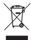

# 16. ADRESS OCH KONTAKTUPPGIFTER

Milleteknik AB Ögärdesvägen 8 B 433 30 Partille Sverige 031-340 02 30 info@milleteknik.se www.milleteknik.se

Den här sidan är avsiktligt lämnad tom.