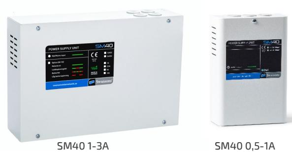
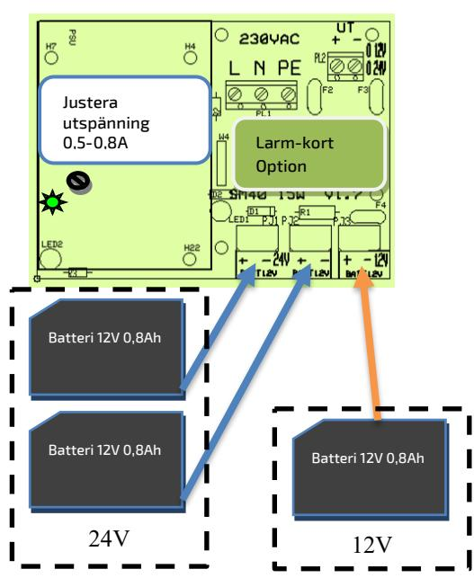
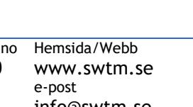

# SM40 0,5-10A STRÖMFÖRSÖRJNING MED PLATS FÖR BATTERIER

#### Tillbehör att montera i likriktaren

| Larmkort |                          |
|----------|--------------------------|
| SM102    | Funktioner:              |
|          | Batterifel               |
|          | Lågspänningslarm         |
|          | Laddningsfel             |
|          | Potentialfri larmkontakt |

#### SPM900-serien

|                      | 1st modulplats (VMC) i kapslingen                            |
|----------------------|--------------------------------------------------------------|
| SPM900               | Avsäkringskort, 5 grupper                                    |
| SPM901               | Huvudsäkringskort med jordfelsövervakning                 |
| SPM902               | DC/DC omv. 2A, justerbar utsp. Upp till 60VDC inspänning. |
| SPM902               | Prioritetskort med 3st styrbara och avsäkrade utgångar    |
| Skalskydd Sab. 40 | Sabotagekontakt.                                             |

### BESKRIVNING

Strömförsörjningsaggregat med kompakta dimensioner och enkel inkoppling. Perfekt för drift av alla typer av svagströmsanläggningar som elektronikutrustningar, telecom, larm, styr, och passagesystem. SM40 är primärwitchad, högeffektiv och har stabiliserad och filtrerad utspänning

Utförande: Aggregatet är utfört i robust vit plåtkapsling med nätindikering på fronten. Kan enkelt förses med larmkort för olika typer av fellarm. Fyra genomföringar uppåt.

Skydd: Aggregatet är skyddad mot överbelastning och kortslutning. Nät, last och batteri skyddas av säkringar. Indikeringar och larm: Nätspänning indikeras med grön lysdiod på fronten och larm med röd. Larmrelä för nätavbrottslarm med växlande, spänningsfria kontakter.

### TEKNISKA DATA

| Inspänning                      | 230VAC +/- 15%        |
|---------------------------------|-----------------------|
|                                 | 1 fas 50-60Hz         |
| Rippelspänning.                 | 150mV                 |
| Förbrukning vid batteridrift 1W |                       |
| Temp. omr.                      | -15 – 40 °C           |
| Utgångar                        | 2st (1st 0,5/0,8A) |
| Modulplatser (VMC)              | 2st (ej 0,5/0,8A)  |
| Laddströmsreglering             | Ja                    |
| Djupurladdningsskydd            | Ja                    |
| IP- klassning                   | IP-20                 |
| CE-märkt                        | Ja                    |
|                                 |                       |

| E: nummer | Modell                    | Utspänning              | Utström          | Batteriplats    | Verkningsgrad | HxBxD           |
|-----------|---------------------------|-------------------------|------------------|-----------------|---------------|-----------------|
| 52 570 41 | SM40 / 12-3               | 13,6VDC                 | 3A               | 2 x 9Ah         | 0,87          | 210 x 310 x 80  |
| 52 570 42 | SM40 / 12-5               | 13,6VDC                 | 6,5A             | 2 x 20Ah        | 0,86          | 300 x 360 x 110 |
| 52 570 44 | SM40 / 12-10              | 13,6VDC                 | 13A              | 2 x 20Ah        | 0,86          | 300 x 360 x 110 |
| 52 570 39 | SM40 / 24-0,5             | 27,3VDC                 | 0,5A             | 2 x 0,8Ah       | 0,83          | 200 x 110 x 60  |
| 52 570 45 | SM40 / 24-1               | 27,3VDC                 | 1A               | 2 x 9Ah         | 0,84          | 210 x 310 x 80  |
| 52 570 46 | SM40 / 24-3               | 27,3VDC                 | 3A               | 2 x 9Ah         | 0,87          | 210 x 310 x 80  |
| 52 570 47 | SM40 / 24-5               | 27,3VDC                 | 6A               | 2 x 20Ah        | 0,84          | 300 x 360 x 110 |
| 52 570 48 | SM40 / 24-10              | 27,3VDC                 | 13A              | 2 x 20Ah        | 0,88          | 300 x 360 x 110 |
| 52 570 30 | SM40 / 24-5-45            | 27,3VDC                 | 6A               | 2 x 45Ah        | 0,84          | 320 x 420 x 180 |
| 52 570 31 | SM40 / 24-10-45           | 27,3VDC                 | 13A              | 2 x 45Ah        | 0,88          | 320 x 420 x 180 |
| 52 570 99 | SM40 / 24-0,5A B          | 27,3VDC                 | 0,5A             | Inkl. 2 x 0,8Ah | 0,83          | 200 x 110 x 60  |
| 52 570 49 | SM40 / 48-5               | 54,6VDC                 | 5A               | 4 x 9Ah         | 0,84          | 300 x 360 x 110 |
| 52 569 91 | Sab.40                    | Sabotagekontakt         |                  |                 |               |                 |
| 52 569 93 | SM102                     | Larmkort. låg batt sp   | Laddspänningsfel | Batterikretsfel |               |                 |
| 52 670 39 | SM40 / 24-1A UBMINI       | 27,3VDC                 | 1A               | max. 2 x 0,8Ah  | 0,83          | 200 x 110 x 60  |
| 52 670 99 | SM40 / 24-1A MBMINI       | 27,3VDC                 | 1A               | Inkl. 2 x 0,8Ah | 0,83          | 200 x 110 x 60  |
|           | Postadress/Postal address | Telefon nr/Telephone no |                  | Hemsida/Webb    | VAT.NO        |                 |

Postadress/Postal address Swansons Telemekanik AB Osbackevägen 5 SE-449 44 Nol

Telefon nr/Telephone no +46(0)303-746 320

www.swtm.se

e-post info@swtm.se SE556289017701

 

# SM40 0,5-10A STRÖMFÖRSÖRJNING MED PLATS FÖR BATTERIER

## SÄKERHET

Endast auktoriserad och erfaren personal inom AC och DC får använda, arbeta, serva/underhålla, installera denna enhet.

Endast isolerade verktyg får användas i enheten. Observera att farliga spänningar och strömmar förekommer i apparaten både när interna säkringarna är av eller på.

Denna instruktion skall läsas igenom grundligt och förstås av all handhavande personal. Vid minsta tveksamhet om systemets uppbyggnad, funktion, komponenter samt säkerhet skall leverantören kontaktas.

Kontrollera att kretskort sitter fast och inte är transportskadade.

Om batterier används är dessa alltid elektrokemiskt aktiva.

Kortslut inte batteripolerna.

#### INKOPPLING

- Montera aggregatet fritt. Minst 100mm på varje sida.
- Anslut först 230V AC.
- Lysdiod för nätspänning tänds.
- Kontrollera att utspänningen är riktig.
- Spänningen är justerad vid leverans. Ev. justering görs direkt på likriktarmodulen. (Batteriladdning kräver 27.3V/13.7V)
- Om lysdiod för nätindikering ej tänds kontrollera inspänning och säkringarna.

Nätfel

- Anslut batterierna och därefter lasten.
- Löser utgångssäkringarna, kontrollera inkoppling och inkopplade apparater.

| AVSÄKRING |          |           |         |            |
|-----------|----------|-----------|---------|------------|
| Modell    | Säkring  | Säkring   | Säkring | Säkring F6 |
| SM40      | F1       | F2-F3     | F4-F5   | Batteri    |
|           | Nät      | OUT1      | OUT2    |            |
| 12V 0,8A  | 1A       | 1A Auto   | -       | 1A Auto    |
| 12V 1A    | 1AT Cer. | 1AS       | 1AS     | 2AS        |
| 12V 3A    | 2AT Cer. | 3,15A     | 3,15A   | 4A         |
| 12V 5A    | 2AT Cer. | 5AS       | 5AS     | 6,3AS      |
| 12V 10A   | 2AT Cer, | 10AS      | 10AS    | 15AS       |
| 24V 0,5A  | 1A       | 0,5A Auto | -       | 0,5A Auto  |
| 24V 1A    | 1AT Cer. | 1AS       | 1AS     | 2AS        |
| 24V 3A    | 2AT Cer. | 3,15A     | 3,15A   | 4A         |
| 24V 5A    | 2AT Cer. | 5AS       | 5AS     | 6,3AS      |
| 24V 10A   | 4AT Cer. | 10AS      | 10AS    | 15AS       |

Postadress/Postal address Swansons Telemekanik AB Osbackevägen 5 SE-449 44 Nol

Telefon nr/Telephone no +46(0)303-746 320

info@swtm.se

VAT.NO SE556289017701

V1 justering utspänning 1-3A

Larmkort Option

