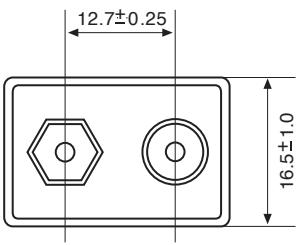
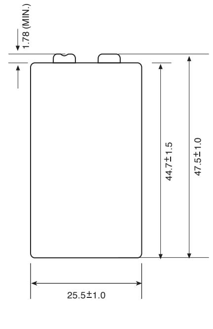

# **Model No.:GP1604AUP**

| NO MERCURY ADDED    |                                                                                             |  |  |  |
|---------------------|---------------------------------------------------------------------------------------------|--|--|--|
| Description         | : Alkaline Manganese 9V Battery                                                             |  |  |  |
| Chemical System     | : Alkaline Manganese Dioxide                                                                |  |  |  |
| Nominal Voltage     | : 9.0 Volts                                                                                 |  |  |  |
| Nominal Dimensions  | : 25.5 (L)mm x 16.5 (W)mm x 47.5 (H)mm                                                      |  |  |  |
| Operating Temp.     | : -20 - 60 °C , 65 % RH Max                                                                 |  |  |  |
| Storage Temp.       | : 15 - 25 °C , 45 - 75 % RH                                                                 |  |  |  |
| Terminal            | : Nickel plated miniature snap fasteners                                                    |  |  |  |
| Jacket              | : Printed metal jacket                                                                      |  |  |  |
| Internal Connection | : Welding                                                                                   |  |  |  |
| Application         | : All electronics devices                                                                   |  |  |  |
| Nominal Weight      | : 48g                                                                                       |  |  |  |
| Date Code           | : Unless otherwise specified, every battery will carry a 6 digits (MM-YYYY) expiry code. |  |  |  |
| Special Feature     | : World class explosion proof                                                               |  |  |  |
| Shelf Life          | : 5 years as below conditions                                                               |  |  |  |

| 1604A | 6LP3146 | 6LP3146 | 522 | MN1604 |
|-------|---------|---------|-----|--------|

## **Electrical Characteristics**

| Test Items | Test Conditions 25 ± 2˚C 60 ± 15%RH | Specification (Volt), min |        |             |             |
|---------------|-------------------------------------------|---------------------------|--------|-------------|-------------|
|               |                                           | 3 months               | 1 year | 3 years* | 5 years* |
| OCV           |                                           | 9.55V                     | 9.30V  | 9.10V       | 8.90V       |
| CCV           | 47Ω, 0.3 s                                | 8.65V                     | 8.00V  | 7.70V       | 7.30V       |

## **Discharge Capacity**

| Test Items | Test Conditions                                              | Specification (Hours), mean |           |             |             |
|---------------|--------------------------------------------------------------|-----------------------------|-----------|-------------|-------------|
|               | 25 ± 2°C 60 ± 15%RH (EV=End Voltage)                   | 3 months                 | 1 year | 3 years* | 5 years* |
| Duration      | 270 Ω Intermittent 1 h/d EV=5.40V                      | 20.5                        | 20.2      | 18.7        | 16.7        |
|               | 620 Ω Intermittent 2 h/d EV=5.40V                      | 49.0                        | 47.5      | 45.0        | 44.0        |
|               | 10 kΩ background 24 h/d, 620 Ω 1 s/h pulse EV=7.50V | Specification (Days), mean  |           |             |             |
|               |                                                              | 20.0                        | 19.5      | 18.5        | 17.5        |

* Storage performance is estimated.

12140I11056

