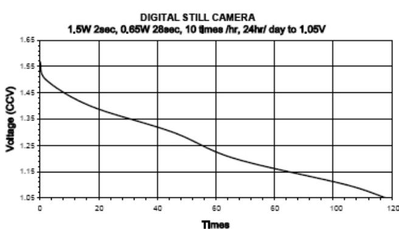
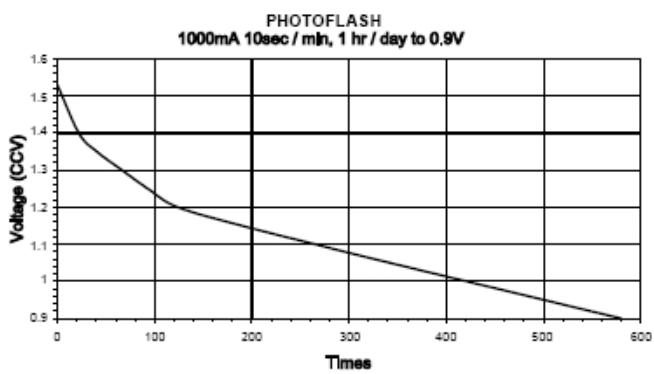
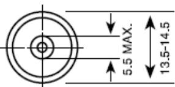
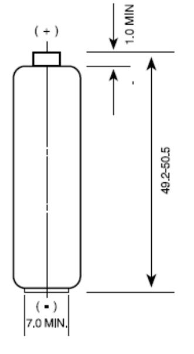
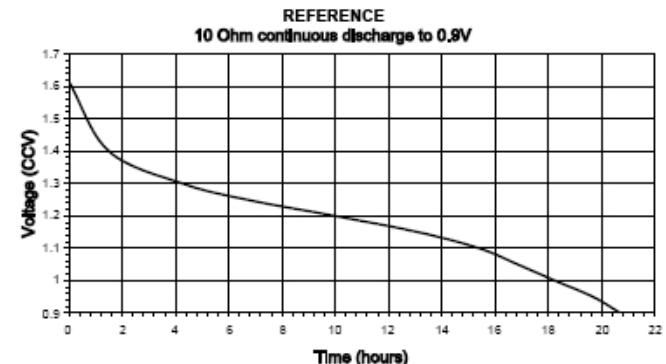
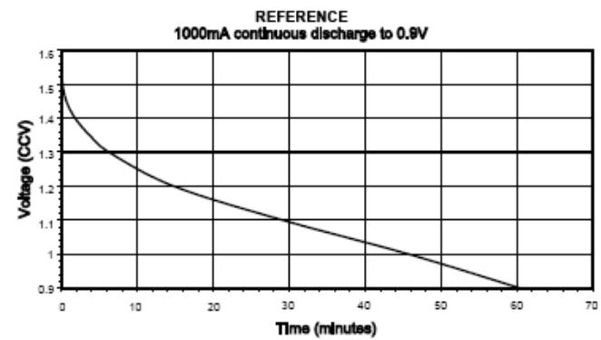

## NO MERCURY ADDED

| Description        | : Mercury Free Alkaline Manganese Battery, AA Size                                                                                                                                    |  |  |  |
|--------------------|------------------------------------------------------------------------------------------------------------------------------------------------------------------------------------------|--|--|--|
| Chemical System    | : Alkaline Manganese                                                                                                                                                                     |  |  |  |
| Nominal Voltage    | : 1.5 Volts                                                                                                                                                                              |  |  |  |
| Nominal Dimensions | : Ø14.5 mm x 50.5 mm                                                                                                                                                                     |  |  |  |
| Terminals          | : Protruded positive(+) and flat negative(-) contacts                                                                                                                                 |  |  |  |
| Jacket             | : Foil jacket                                                                                                                                                                            |  |  |  |
| Applications       | : All electronic devices, e.g. toys, digital camera, mobile phone, PDA, photographic equipment, data banks, calculators, audio appliances, remote controls, paging machines. |  |  |  |
|                    |                                                                                                                                                                                          |  |  |  |
| Average Welght     | : 23.8g                                                                                                                                                                                  |  |  |  |

#### Cross References:

| GP   | ીક  | IEC | Energizer | Duracell |
|------|-----|-----|-----------|----------|
| 15AU | LR6 | LR6 | E91       | MX1500   |

### Typical Service Life:

| Discharge  | Discharge  | End Point | Service |
|------------|------------|-----------|---------|
| Resistance | Condition  | Voltage   | Life    |
| 10 Ohms    | 24 Hrs/Day | 0 9V      | 20.5Hrs |

#### www.gpbatteries.com

DATA SHEET

# Model No : Gl

The information (subject to change without prior notice) contained in this document is for reference only and should not be used as a basis for product guarantee or warranty. For applications other than those described here, please consult your nearest GP Sales and Marketing Office or Distributors

Unit : mm

Manufacturer reserves the right to alter or amend the design, model and specification without prior notice. Copyright@ GP| International Ltd. - All rights reserved